# Spaghetti LAB firmware architecture

[← Project README](README.md)

This document explains the firmware architecture without prescribing a specific
sensor, protocol, Core model, or product feature.

> [!IMPORTANT]
> SHT40, Relay, USB, MQTT, and switched power are examples used to make the
> diagrams concrete. They are not mandatory parts of the architecture.

## The idea in one minute

A Spaghetti LAB **Core** controls external **Modules** connected to physical
**Ports**. The firmware must keep three things separate:

1. the hardware physically built into the Core;
2. the modules connected while the Core is running;
3. the product behavior applied to the values produced by those modules.

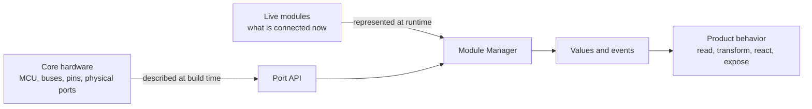

For example:

- the Core has an I2C controller wired to Port 0: **static hardware**;
- a temperature sensor is assigned to Port 0: **runtime state**;
- when temperature exceeds a threshold, an actuator is commanded: **product
  behavior**.

The same architecture must still work if the example sensor, actuator,
transport, or microcontroller changes.

## Required concepts and optional capabilities

The small central model is generic. Everything product-specific is attached at
its edges.

| Concept | Required? | Meaning | Practical example |
|---|:---:|---|---|
| Core | Yes | Coordinates startup and reports overall state | Initialize the common firmware layers |
| Port | Yes | Represents one physical connector and its capabilities | Port 0 offers I2C |
| Module | Yes | Represents one live peripheral instance | Sensor instance assigned to Port 0 |
| Module driver | Yes | Implements one module type | Read a temperature sensor over I2C |
| Driver Registry | Yes | Finds a compiled driver by type | Resolve `temperature-sensor` to its driver |
| Module Manager | Yes | Owns module instances and lifecycle | Create, read, and remove the instance on Port 0 |
| Config | When configuration exists | Holds validated desired state | Assign a module and a sample interval |
| Data | When values/events exist | Defines values independently of their producer | Temperature with source and timestamp |
| Runtime | When autonomous behavior exists | Applies product rules | If temperature is high, command an actuator |
| Input/output adapter | Optional | Connects the firmware to another interface | USB shell, local UI, REST, MQTT |
| Discovery strategy | Optional | Proposes module identity | Manual assignment, EEPROM, electrical probe |
| Shared-resource coordinator | Optional | Coordinates a real shared resource | A switchable rail used by two Ports |

### Why MQTT is not a core concept

MQTT is one possible **output adapter**. It may be useful when a product must
send values to a remote broker, but the firmware architecture does not depend on
it. A product could instead use USB, Bluetooth, HTTP, a display, a log file, or
no external output at all.

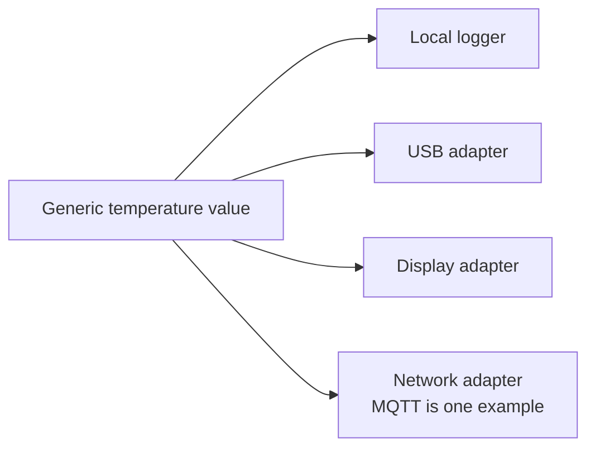

Removing MQTT must not change the sensor driver, Module Manager, Data contract,
or Runtime rules. It removes only one adapter.

### Why Power is not always present

Power coordination is useful only when the hardware exposes a controllable
shared resource—for example, a switchable 3.3 V rail feeding two Ports. If the
board has no controllable rail, there is nothing for a Power component to own.

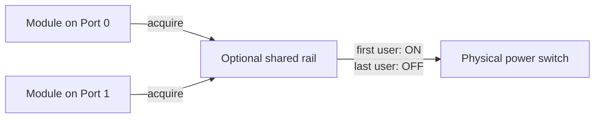

This is an optional shared-resource pattern, not a requirement that every Core
must implement power management.

## Static hardware and runtime state

This separation is the most important architectural rule.

### Static hardware

Static hardware is physically part of a specific Core and cannot change while
the firmware runs. Zephyr represents it with a board definition and Devicetree.

Examples:

- MCU and memory;
- I2C, SPI, UART, and GPIO controllers;
- pin routing;
- physical Port count;
- a presence pin or controllable rail, if it really exists;
- flash partitions.

### Runtime state

Runtime state can change without rebuilding the firmware.

Examples:

- which module is assigned to Port 0;
- whether that module is ready or in error;
- its current measurements;
- user configuration;
- an active automation rule.

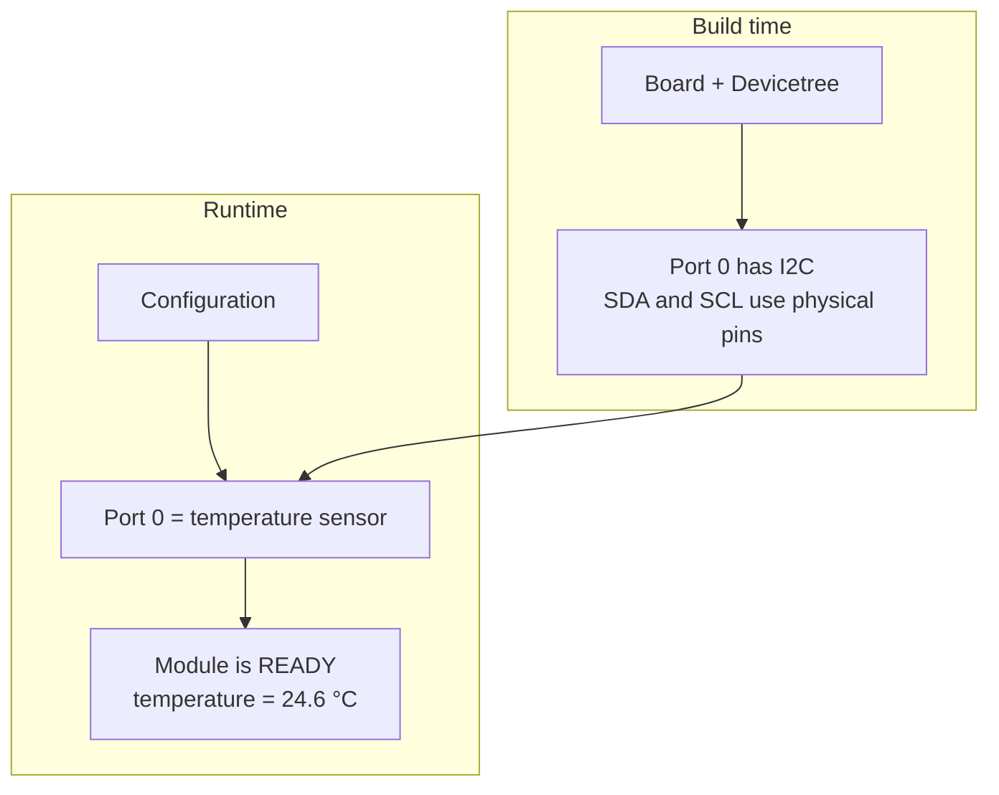

The Devicetree describes that Port 0 can access I2C. It must not permanently
claim that a removable temperature sensor is connected there.

## Core

The Core is the startup coordinator. It initializes required components in a
known order and exposes a small overall state such as initializing, ready, or
failed.

It does not implement sensor protocols, decide module types, or contain product
rules.

### Practical example

At boot, Core initializes Port and Module Manager. If Port cannot obtain a
required hardware controller, Core reports failure instead of claiming that the
system is ready.

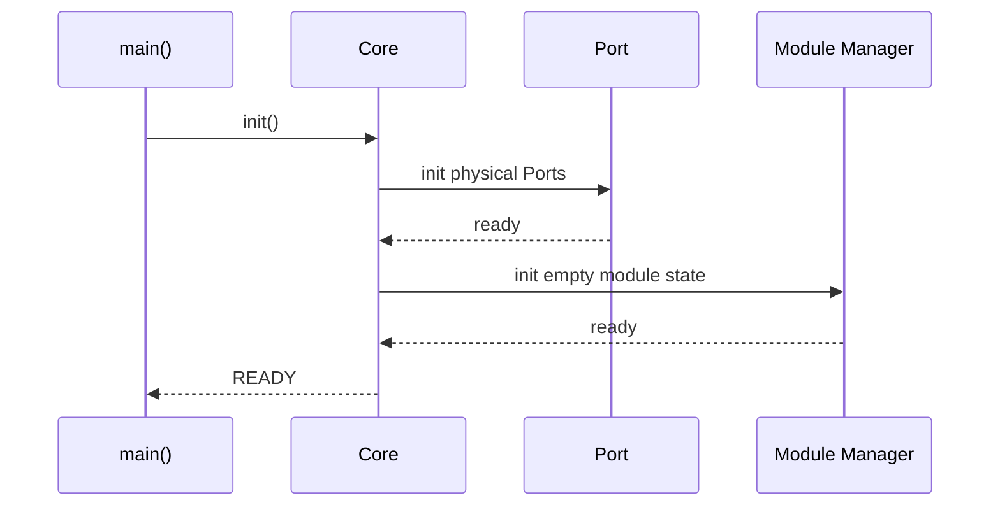

## Port

A Port represents one physical external-module connection. It hides
board-specific controllers, pins, and Core variants behind capabilities.

A Port answers questions such as:

- does this connector support I2C, SPI, or a digital output?
- is its underlying controller ready?
- which stable bus handle may a driver use?

A Port does not know which removable module is attached and does not implement a
sensor protocol.

### Practical example

The temperature driver asks Port 0 for its I2C controller. On one Core that may
be `i2c0`; on another Core it may be `i2c1`. The driver sees only the Port API.

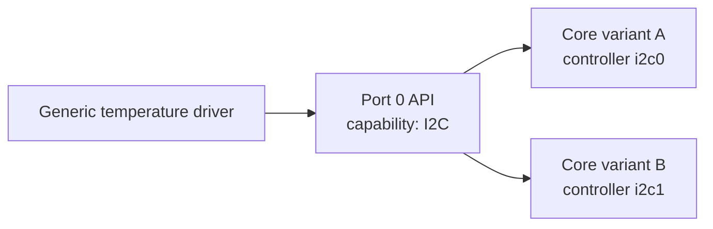

## Module and module driver

A **Module** is one runtime instance. A **module driver** is the reusable
implementation of one module type.

The distinction is the same as an object and its class:

- instance: “temperature sensor on Port 0, address 0x44, currently READY”;
- driver: “code capable of initializing and reading this sensor family.”

Several instances may use the same immutable driver while keeping separate
runtime state.

### Practical example

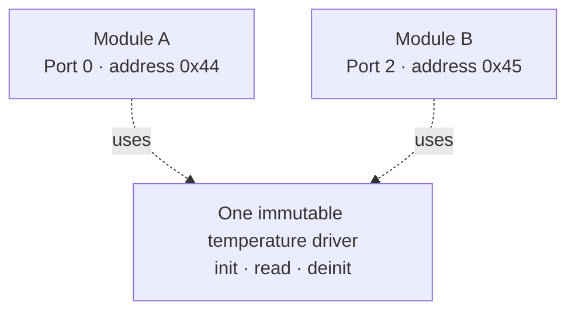

The operation table keeps callers generic: the Manager calls `init`, `read`,
`command`, or `deinit` without including a concrete driver implementation.

## Driver Registry and Module Manager

The Registry and Manager have different jobs:

- **Driver Registry:** owns no live module; it maps a type identifier to an
  immutable driver descriptor compiled into the firmware.
- **Module Manager:** owns every live module instance, its state, its Port
  assignment, and all lifecycle transitions.

### Practical example: assign a module

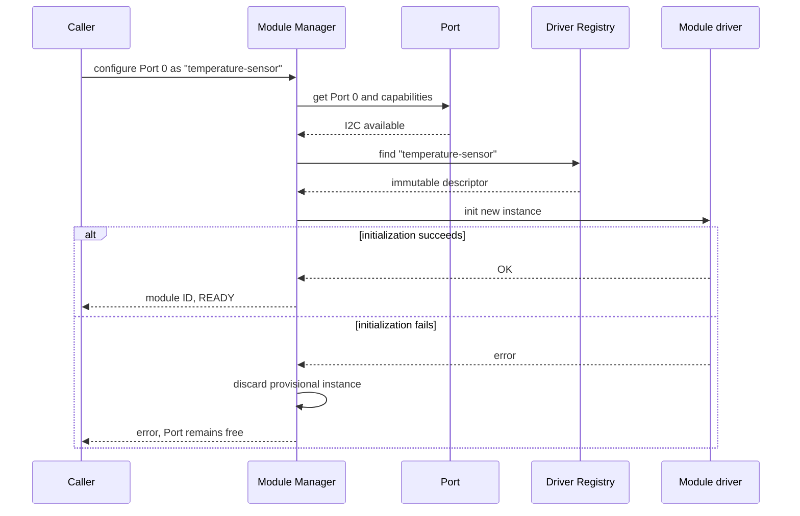

Only the Manager may create, replace, or destroy module instances. This makes
rollback and ownership predictable.

## Config

Config represents the **desired state** after validation. It is independent of
how configuration arrives and how it is stored.

Possible sources include:

- a compiled default;
- a local command;
- a file or flash record;
- a network request.

Those sources must all produce the same internal Config model.

### Practical example

A request asks for a temperature sensor on Port 0 with a 1000 ms sample period.
Config first validates the complete request. Only then does it ask the Manager
to apply the assignment. Invalid input must not leave half-applied live state.

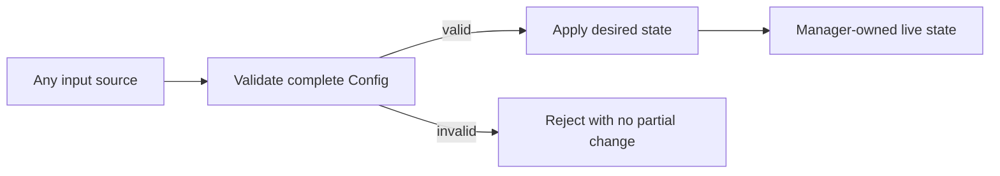

Persistence is optional. If configuration must survive reboot, a storage adapter
saves and restores the same Config model; persistence rules do not belong in
module drivers.

## Data

Data defines application-level values and events independently of a specific
driver or output protocol.

A useful measurement contains enough context to stand on its own:

- source module ID;
- value and unit or fixed representation;
- timestamp;
- sequence number;
- validity or quality flags.

### Practical example

The sensor driver returns a raw result. The application turns it into a generic
temperature value. A logger, a local display, and an optional network adapter
can consume the same value without knowing how the sensor speaks I2C.

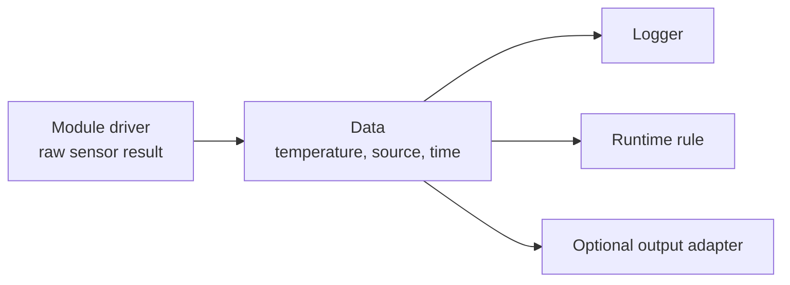

Data is not a database and does not decide product behavior.

## Runtime

Runtime owns autonomous product behavior: when something should be sampled and
how values should cause actions. It depends on generic Module Manager and Data
contracts, not on a concrete sensor implementation.

### Practical example

Every second, Runtime requests a value from one module. When the temperature is
above 25 °C, it commands another module.

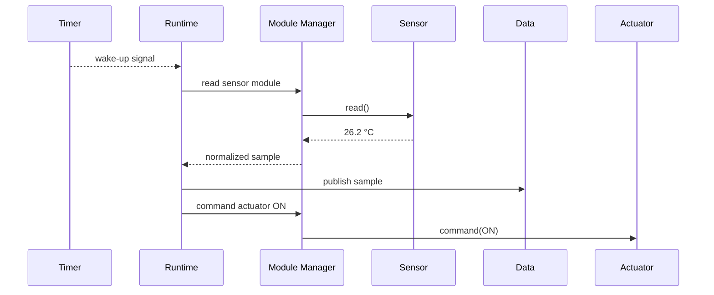

The timer callback only wakes Runtime. Blocking bus access and rule evaluation
run in thread context.

## Input and output adapters

Adapters translate between the generic firmware contracts and an external
interface. They must remain replaceable.

### Input adapter example

A USB command and a network request may both ask for the same assignment. Each
adapter parses its transport format and produces the same Config request.

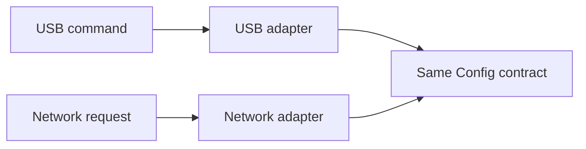

### Output adapter example

A Data value may be formatted for a serial console, a display, or a network
protocol. MQTT belongs here if the product chooses it.

An adapter does not own modules, modify Manager internals, or define the common
Data representation.

## Discovery strategies

Discovery is optional. It answers one question: “what module identity is being
proposed for this Port?” It does not create the module itself.

Possible strategies include:

- manual assignment from configuration;
- reading an identity memory;
- a verified electrical detection method;
- no discovery at all.

### Practical example

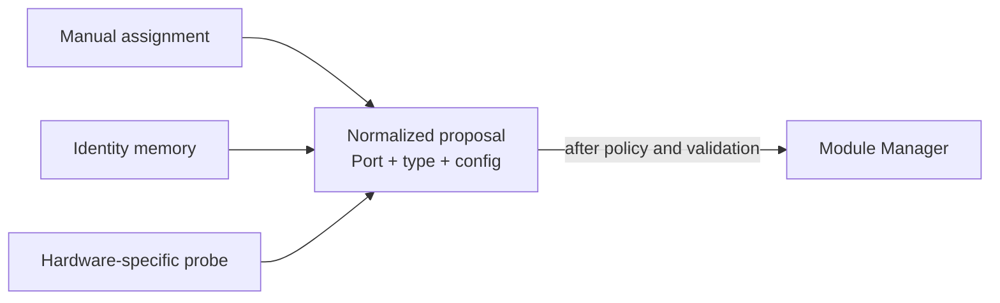

The Manager must not care which strategy produced the proposal.

## Choosing calls, queues, and publish/subscribe

Use the simplest mechanism that satisfies the real behavior.

| Need | Mechanism | Practical example |
|---|---|---|
| Immediate result or error | Direct call | Manager asks a driver to initialize |
| Protect short shared state | Mutex | Serialize one Port transaction |
| Wake a worker without doing work in a callback | Semaphore or work item | Timer wakes Runtime |
| Preserve ordered commands with bounded capacity | Message queue | Queue actuator commands |
| Send one value to several independent consumers | Publish/subscribe | Temperature reaches logger and UI |

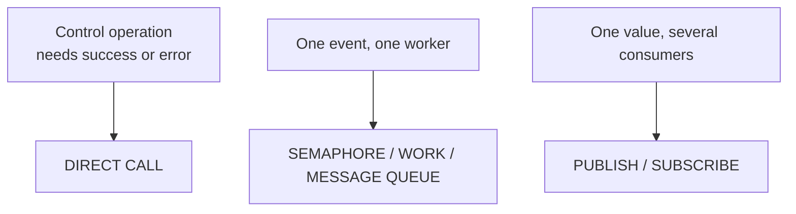

Do not introduce asynchronous messaging merely to make components look
decoupled. A queue adds capacity limits, overflow policy, memory use, and more
states to debug.

## Execution-context rules

- **Thread:** may perform bounded blocking work such as I2C access.
- **Timer callback:** signals work and returns; it does not access a sensor.
- **ISR:** captures the hardware event, signals deferred work, and returns.
- **Workqueue:** performs deferred work that is short enough for the selected
  queue; long-lived state machines deserve a dedicated thread.

### Practical example

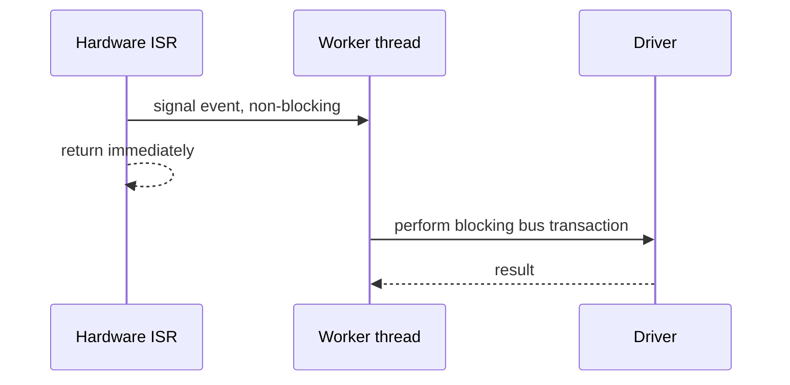

## Supporting multiple Core variants

Board definitions and Devicetree absorb physical differences. Higher layers
query Port capabilities instead of branching on MCU or board names.

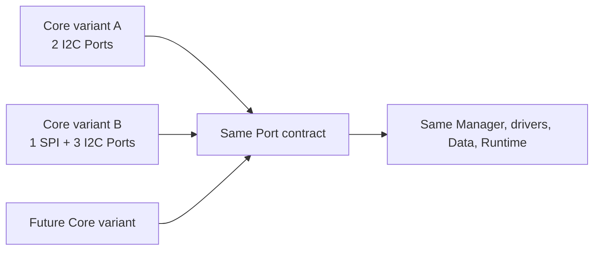

Adding a new Core variant should primarily add static board description. It
should not add `if (board == ...)` branches to Module Manager or Runtime.

## End-to-end example

This example combines the pieces without making any concrete technology a
requirement.

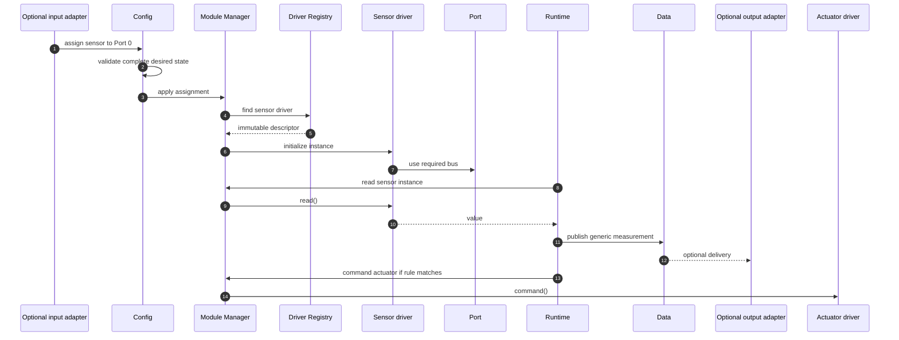

Replace the sensor, actuator, input transport, output transport, or Core board:
the central ownership and data flow stay the same.

## Architectural rules

1. Describe physical Core hardware at build time; represent removable modules
   at runtime.
2. Keep board details below the Port contract.
3. Let Module Manager be the sole owner of live module instances.
4. Keep driver descriptors immutable and runtime state per instance.
5. Validate desired Config completely before changing live state.
6. Keep Data independent of concrete drivers and transports.
7. Keep product rules in Runtime, not inside drivers or adapters.
8. Treat discovery, persistence, networking, and shared-resource coordination as
   optional capabilities.
9. Prefer direct calls until real concurrency requires a queue or pub/sub.
10. Never perform blocking work in ISR or timer callback context.

## Detailed component documentation

- [Public interfaces](include/spaghetti/README.md)
- [Board support](boards/spaghettilab/README.md)
- [Devicetree bindings](dts/bindings/spaghetti/README.md)
- [Core](subsys/core/README.md)
- [Port](subsys/port/README.md)
- [Driver Registry](subsys/driver_registry/README.md)
- [Module Manager](subsys/module_manager/README.md)
- [Config](subsys/config/README.md)
- [Data](subsys/data/README.md)
- [Runtime](subsys/runtime/README.md)
- [Communication adapters](subsys/communication/README.md)
- [External module drivers](spaghetti_modules/README.md)
