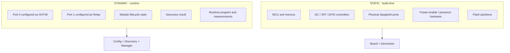
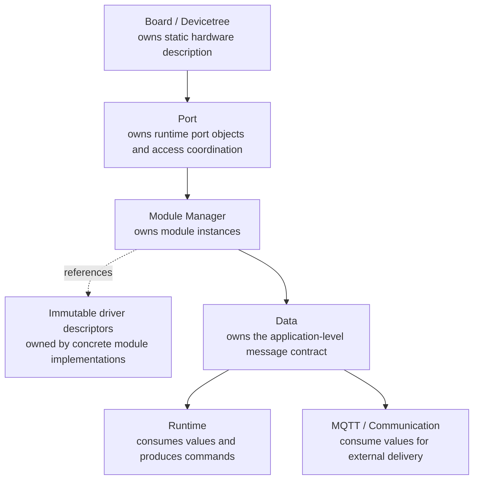
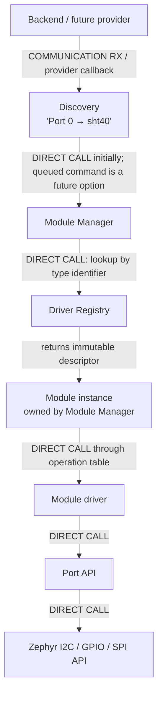
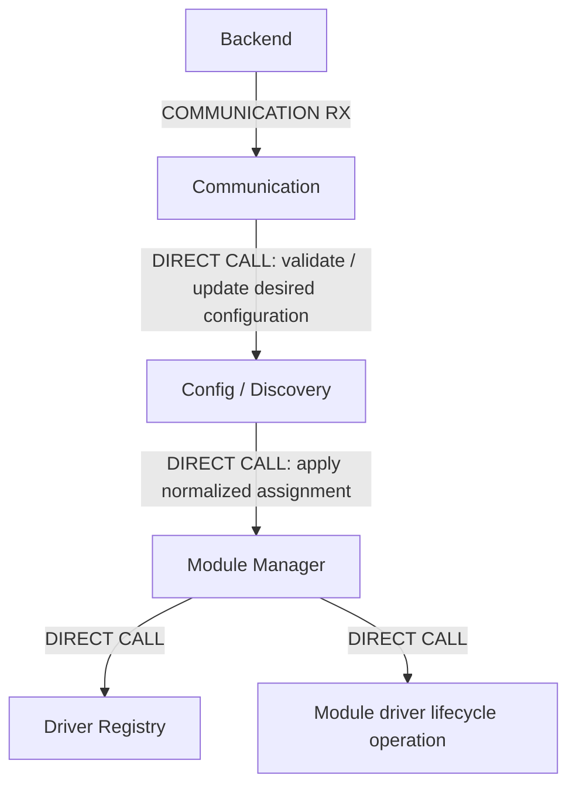
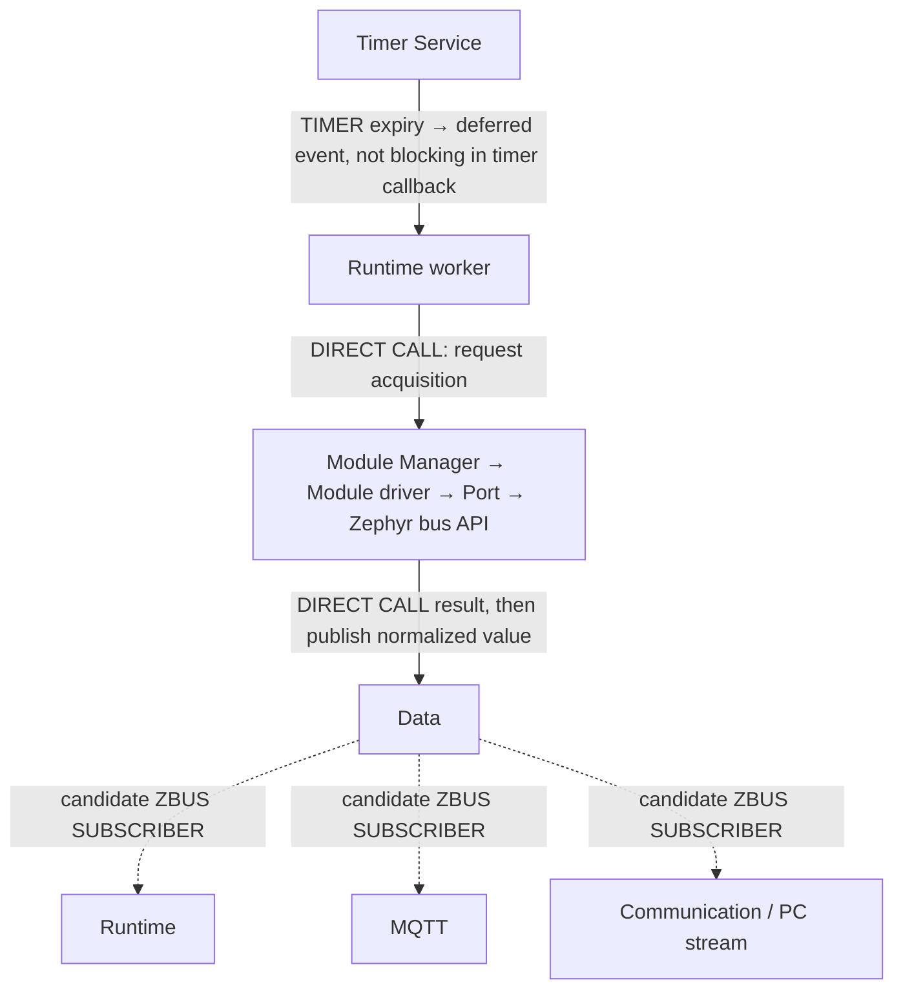
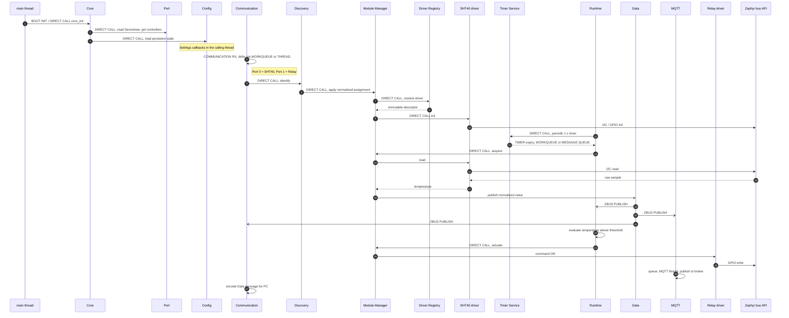
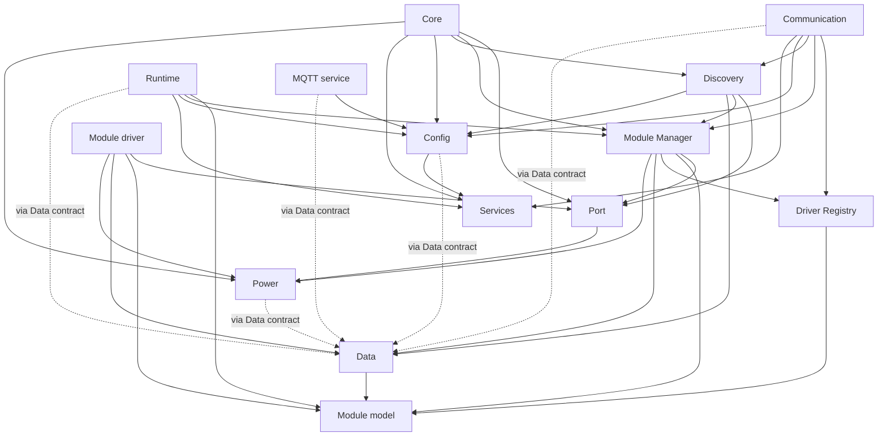
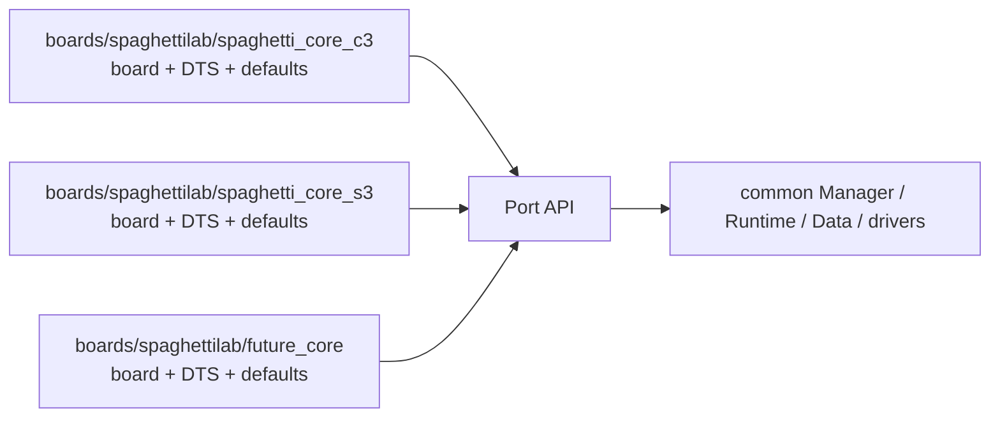

# Spaghetti LAB firmware architecture

[← Project README](README.md) · [Implementation roadmap](IMPLEMENTATION_ROADMAP.md)

This document is the global map of the firmware. Detailed contracts, planned
APIs, execution contexts, tests, and implementation steps live in the README
beside each subsystem.

## Contents

- [Zephyr and RTOS primer](#zephyr-and-rtos-primer)
- [Glossary](#glossary)
- [Product model](#product-model)
- [Static hardware versus runtime state](#static-hardware-versus-runtime-state)
- [Ownership and boundaries](#ownership-and-boundaries)
- [Module and port relationships](#module-driver-registry-manager-discovery-and-port)
- [Control plane and data plane](#control-plane-and-data-plane)
- [Invocation examples](#complete-example-with-invocation-mechanisms)
- [Allowed dependencies](#allowed-dependency-matrix)
- [Multiple Core variants](#multiple-core-variants)
- [Local documentation](#local-documentation)
- [Implementation roadmap](#implementation-roadmap)

## Zephyr and RTOS primer

This document uses Zephyr terminology throughout. If you have never worked with
Zephyr, this section gives you the minimum mental model needed to follow the
rest; the [glossary](#glossary) below defines individual terms one by one.

**What Zephyr is.** Zephyr is an open-source real-time operating system (RTOS)
for microcontrollers. Unlike a desktop operating system, it is compiled together
with the application into a single firmware image that is flashed onto the chip.
There is no filesystem of separate programs and no dynamic loading by default:
what runs on the device is decided mostly at build time.

**Build time versus runtime.** This split is the single most important idea for
reading the document. Two separate mechanisms decide what the firmware *is*
before it ever runs:

- **Devicetree** describes the hardware that physically exists on a board — which
  MCU, which buses, which pins. It is a text description compiled into C
  constants. It cannot change while the device runs.
- **Kconfig** decides which software features are compiled into the image (for
  example "include the MQTT client" or "include zbus").

Everything that can change while the device is powered — which module is plugged
into which port, the current temperature, whether a relay is on — is *runtime
state*, held in ordinary program variables and, when it must survive a reboot, in
persistent storage. Much of this architecture is about keeping those two worlds
cleanly separated.

**Boards and bindings.**

- A **board** is Zephyr's definition of one concrete hardware target: its
  Devicetree, its default Kconfig, and its pin routing. Spaghetti LAB has one
  board per Core variant.
- A **binding** is a small schema stating which properties a Devicetree node must
  have, so an invalid hardware description fails the build instead of
  misbehaving on the device.

**Execution contexts.** Code in Zephyr runs in one of a few contexts, and the
rules differ between them:

- A **thread** is an independently scheduled unit of execution. `main()` runs in
  the main thread. Threads are allowed to block (wait for something).
- An **ISR** (interrupt service routine) runs when hardware signals an event. It
  must be very short and must never block; heavy work is handed off elsewhere.
- A **workqueue** is the standard way to hand work off from an ISR or a short
  callback to a thread that is allowed to block. This is why the document
  repeatedly says "defer to a workqueue."

**Talking between parts.** Independent parts of the firmware coordinate through
kernel primitives:

- **Mutex** — a lock ensuring only one thread touches a shared resource at a time.
- **`k_msgq`** — a bounded first-in-first-out message queue; when full it pushes
  back on the sender (backpressure) instead of losing data.
- **`k_timer`** — a kernel timer whose callback fires in a restricted context, so
  it only signals a thread rather than doing real work itself.
- **zbus** — a publish/subscribe message bus that delivers one message to many
  independent subscribers.

The [messaging decision](#messaging-decision) section weighs these against each
other.

**Persistence and networking.**

- **Settings** is Zephyr's subsystem for saving small key/value configuration to
  flash and reloading it at boot; it hands records back through callbacks while
  loading.
- Flash memory is divided into **partitions** that are fixed at build time.
- For networking, Zephyr provides BSD-style sockets, an MQTT client, and TLS.

**Control plane versus data plane.** These are two recurring phrases borrowed
from networking:

- The **control plane** is the path that *changes* configuration or state (for
  example "assign SHT40 to port 0"). These operations need a clear
  success/failure answer, so they use direct synchronous calls.
- The **data plane** is the path that carries the continuous stream of
  measurements and events to whoever consumes them. It favors decoupled delivery
  so that one slow consumer cannot stall acquisition.

## Glossary

The domain objects (Core, Port, Module, Module driver, Driver Registry, Module
Manager, Discovery, Data, Runtime, Config, Communication, Services, Power) are
defined under [Product model](#product-model). This glossary covers the Zephyr,
operating-system, and networking terms used elsewhere in the document.

- **Asynchronous** — an operation whose result arrives later, through a queue or
  callback, rather than immediately when the call returns.
- **Backpressure** — behavior where a full queue forces the producer to slow down
  or wait, instead of silently dropping data or growing without bound.
- **Binding** — a schema that validates a Devicetree node's required properties at
  build time.
- **Board** — Zephyr's definition of one hardware target: its Devicetree, default
  configuration, and pin routing.
- **Broker** — the MQTT server that receives published messages and forwards them
  to subscribers.
- **Control plane** — the code paths that change desired or live configuration;
  they use synchronous calls that report success or failure.
- **Data plane** — the code paths that distribute measurements and events to
  consumers, optimized for decoupling rather than an immediate answer.
- **Descriptor (immutable)** — a read-only record describing a driver (its type
  name and function pointers), shared by all instances and never modified.
- **Devicetree / DTS** — a text description of the hardware that physically exists
  on a board, compiled into C constants at build time.
- **Direct call** — a plain function call from one subsystem to another, as
  opposed to going through a queue or a bus.
- **EEPROM** — a small non-volatile memory chip; here, a possible future source of
  automatic module identity.
- **ESP32-C3 / ESP32-S3** — the microcontrollers behind two Core variants.
- **Fan-out** — delivering one produced value to several independent consumers.
- **FIFO** — first-in, first-out ordering, the behavior of a plain message queue.
- **Flash partition** — a fixed region of the chip's flash memory, defined at
  build time (for example, one for firmware and one for settings).
- **GPIO** — general-purpose input/output pin; used here to switch the relay.
- **I2C / SPI** — two common serial buses for talking to sensors and peripherals.
- **ISR (interrupt service routine)** — code that runs in interrupt context when
  hardware signals an event; it must be short and must not block.
- **`k_msgq`** — a Zephyr bounded FIFO message queue with explicit backpressure.
- **`k_timer`** — a Zephyr kernel timer; its callback runs in a restricted context
  and should only signal a thread.
- **Kconfig** — the build-time system that selects which software features are
  compiled into the firmware image.
- **Loopback transport** — a fake communication channel that feeds sent messages
  straight back, used for testing without real hardware.
- **MCU** — microcontroller unit, the programmable chip at the heart of a Core.
- **MQTT** — a lightweight publish/subscribe network protocol used to send
  measurements to a backend.
- **Mutex** — a lock that lets only one thread access a shared resource at a time.
- **Normalized value** — a measurement converted into the common representation
  the Data layer defines, independent of the specific sensor.
- **Operation table** — a struct of function pointers (init/read/deinit/command)
  through which a driver is called; the C equivalent of an interface.
- **OTA (over-the-air)** — updating firmware remotely over the network. Out of
  scope for now.
- **Power management (PM)** — Zephyr facilities for suspending and resuming the
  system or individual devices to save energy.
- **Reference-counted resource** — a shared resource kept active as long as at
  least one user holds it, released only when the last user lets go.
- **Relay** — an electrically controlled switch, used as the example actuator
  module.
- **RTOS** — real-time operating system; a small OS that runs the firmware with
  predictable timing.
- **RX** — received data (for example, a command arriving from the backend), as
  opposed to TX (transmitted).
- **Settings** — Zephyr's subsystem for persisting small key/value configuration
  to flash and reloading it at boot via callbacks.
- **SHT40** — a temperature/humidity sensor, used as the first example module.
- **`struct device`** — Zephyr's runtime handle for a hardware device, normally
  created from Devicetree at boot.
- **Synchronous** — an operation that completes and returns its result before the
  caller continues.
- **Thread** — an independently scheduled unit of execution that may block;
  `main()` runs in one.
- **TLS** — transport-layer security; encryption for network connections. Planned,
  not part of the initial implementation.
- **UART / USB** — serial interfaces used for the PC/backend communication link.
- **Workqueue** — a mechanism to move work out of an ISR or short callback into a
  thread that is allowed to block.
- **zbus** — a Zephyr publish/subscribe message bus delivering one message to many
  subscribers.
- **ztest** — Zephyr's unit-testing framework.

## Product model

Zephyr runs only on a Spaghetti LAB Core. External Spaghetti Modules are
peripherals controlled by the Core; they do not run Zephyr. A Core variant can
change MCU, memory, connectivity, power features, and the number or capabilities
of its ports without changing the application architecture.

The fundamental objects are:

- **Core**: abstract representation of the programmable host.
- **Port**: one physical external-module connection on a Core.
- **Module**: one runtime instance associated with a port.
- **Module driver**: implementation for one module type.
- **Driver Registry**: drivers compiled into this firmware.
- **Module Manager**: owner of module instances and their lifecycle.
- **Discovery**: determines or receives the proposed module identity for a port.
- **Data**: common representation and distribution of values and events.
- **Runtime**: executes user logic and automations.
- **Config**: validates and persists desired configuration.
- **Communication**: protocol boundary toward PC/backend/frontend.
- **Services**: reusable MQTT, timer, and storage capabilities.
- **Power**: coordinates power requirements and transitions.

## Static hardware versus runtime state

Devicetree describes physical Core hardware and its initial configuration.
Kconfig controls software compiled into the image. A removable SHT40 assignment
is runtime information and must not be encoded as a Devicetree child device.

## Ownership and boundaries

Discovery owns observations/proposals, never module instances. Config owns the
desired persistent state, while Module Manager owns the applied live state.

## Module, driver, registry, manager, discovery, and port

The Spaghetti module driver is an application-level abstraction. It is not
automatically a Zephyr `struct device`: Zephyr devices and their underlying bus
controllers are normally established from static build-time hardware. The Port
object bridges dynamic Spaghetti instances to those static Zephyr devices.

## Control plane and data plane

### Control plane

The control plane changes desired or live state. Commands require explicit
success/failure and therefore normally use synchronous calls.

If parsing occurs inside an ISR-like transport callback, it must first defer to
a workqueue or dedicated communication thread. Long lifecycle operations must
not execute in an ISR.

### Data plane

The data plane distributes measurements and events to multiple independent
consumers.

### Messaging decision

**OPTION A — Direct callbacks/calls.** Lowest memory and simplest control flow,
but producers become coupled to consumers and one slow callback blocks all.

**OPTION B — `k_msgq`.** Bounded FIFO behavior and explicit backpressure; ideal
when every command/event must be retained, but one queue naturally has one
consumption stream and fan-out needs additional queues.

**OPTION C — zbus.** Natural one-to-many channels and loose coupling; introduces
channel/observer configuration, copies, queue sizing, and more debugging state.
Some observer forms can miss intermediate publications.

**RECOMMENDATION.** Keep lifecycle/control calls synchronous. Define a small Data
contract first. Use zbus only for measurements/events that genuinely need
multiple subscribers. Use bounded `k_msgq` for reliable command queues. Avoid a
dedicated thread per subsystem on ESP32-C3; add one only for a blocking state
machine such as networking or Runtime. This decision remains revisable until the
Data milestone.

## Complete example with invocation mechanisms

1. **Boot:** Zephyr calls `main()` in the main thread. `main` makes a **BOOT INIT
   / DIRECT CALL** to Core.
2. **Static hardware:** Core makes **DIRECT CALLS** to Port, which reads generated
   Devicetree data and gets Zephyr controller devices.
3. **Persistent state:** Core makes a **DIRECT CALL** to Config. Zephyr Settings
   may deliver records using **SETTINGS CALLBACKS** in the calling thread.
4. **Backend assignment:** `Port 0 = SHT40`, `Port 1 = Relay` arrives via
   **COMMUNICATION RX**. If RX is a driver callback, Communication defers parsing
   through **WORKQUEUE** or a communication **THREAD**.
5. **Identification:** Communication makes a **DIRECT CALL** to the manual
   Discovery provider. Discovery emits normalized assignments.
6. **Apply assignment:** Discovery makes a **DIRECT CALL** to Module Manager.
   **DECISION REQUIRED:** a `k_msgq` command queue becomes preferable if multiple
   callers can reconfigure modules concurrently.
7. **Resolve driver:** Module Manager makes a **DIRECT CALL** to Driver Registry.
8. **Create module:** Manager allocates from its owned pool and makes a **DIRECT
   CALL** to each driver's `init`, which calls Port and then Zephyr I2C/GPIO APIs.
9. **Schedule:** Runtime asks Timer Service by **DIRECT CALL** for a periodic
   one-second timer.
10. **Expiry:** `k_timer` expires in timer context; the callback only submits a
    **WORKQUEUE** item or sends a **MESSAGE QUEUE** event to Runtime.
11. **Acquire:** Runtime makes a **DIRECT CALL** through Manager to the SHT40
    driver, then Port, then Zephyr I2C.
12. **Distribute:** The returned temperature is normalized by Data. Candidate
    mechanism: **ZBUS PUBLISH** because Runtime, MQTT, and PC streaming are three
    independent consumers. Final queue and loss semantics are **DECISION
    REQUIRED**.
13. **Evaluate:** Runtime receives via **ZBUS SUBSCRIBER** or its reliable message
    queue and evaluates `temperature > 25 C` in its dedicated thread.
14. **Actuate:** Runtime makes a **DIRECT CALL** to Manager; Manager calls the
    Relay driver's command operation; the driver calls Port/Zephyr GPIO.
15. **Publish:** MQTT subscriber receives the temperature, queues it to the MQTT
    thread, and publishes through the Zephyr MQTT client.
16. **Observe:** Communication subscriber encodes the same Data message for the
    PC. Slow I/O never executes in the Data publisher's context.

## Allowed dependency matrix

Rows may depend on columns marked `X`. `Z` means only through the shared Data
event contract, not by calling private implementation APIs.

| From / To | Core | Port | Module model | Registry | Manager | Discovery | Data | Config | Services | Power |
|---|---:|---:|---:|---:|---:|---:|---:|---:|---:|---:|
| Core | - | X |  |  | X | X |  | X | X | X |
| Port |  | - |  |  |  |  |  |  |  | X |
| Module driver |  | X | X |  |  |  | X |  |  | X |
| Driver Registry |  |  | X | - |  |  |  |  |  |  |
| Module Manager |  | X | X | X | - |  | X |  |  | X |
| Discovery |  | X |  |  | X | - | X | X |  |  |
| Data |  |  | X |  |  |  | - |  |  |  |
| Runtime |  |  | X |  | X |  | Z | X | X |  |
| Config |  |  |  |  |  |  | Z | - | X |  |
| Communication |  |  |  | X | X | X | Z | X | X |  |
| MQTT service |  |  |  |  |  |  | Z | X | - |  |
| Power |  | X |  |  |  |  | Z |  |  | - |

The same allowed edges as a graph. Solid arrows are direct dependencies (`X`);
dotted arrows are permitted only through the shared Data contract (`Z`).

Dependencies must point downward toward stable contracts. Runtime must not call
an SHT40 implementation directly; Communication must not modify Manager-owned
objects; Discovery must not depend on a specific EEPROM provider.

## Multiple Core variants

Board and Devicetree vary MCU, pin routing, controllers, port count, flash,
connectivity, and static power capabilities. Kconfig selects software features.
Higher layers query capabilities instead of branching on `CORE_C3` or `CORE_S3`.
See [board documentation](boards/spaghettilab/README.md) and [binding
documentation](dts/bindings/spaghetti/README.md).

## Local documentation

- [Public contracts](include/spaghetti/README.md)
- [Core](subsys/core/README.md)
- [Port](subsys/port/README.md)
- [Module Manager](subsys/module_manager/README.md)
- [Discovery](subsys/discovery/README.md)
- [Driver Registry](subsys/driver_registry/README.md)
- [Data](subsys/data/README.md)
- [Runtime](subsys/runtime/README.md)
- [Config](subsys/config/README.md)
- [Communication](subsys/communication/README.md)
- [Power](subsys/power/README.md)
- [Services](subsys/services/README.md)
- [External modules](spaghetti_modules/README.md)

## Implementation roadmap

Each milestone must leave a small observable result and must not pull later
features forward.

### 1. Core abstraction

- **GOAL:** explicit boot coordinator and error reporting.
- **FILES:** `core.h`, `core.c`, `main.c` only when implementation begins.
- **WHAT TO IMPLEMENT:** minimal init/state/info contract.
- **WHAT TO LEARN IN ZEPHYR:** main thread, logging, error conventions.
- **CONTROL FLOW:** `main --DIRECT CALL--> core_init`.
- **EXPECTED RESULT:** one structured `Core ready` diagnostic.
- **TEST:** success and forced dependency failure.
- **DO NOT IMPLEMENT YET:** ports, network, module lifecycle.

### 2. Board and Devicetree fundamentals

- **GOAL:** represent one Core's static hardware without runtime modules.
- **FILES:** future board definition and binding files documented under `boards/`
  and `dts/`.
- **WHAT TO IMPLEMENT:** one conceptual port node and build-time validation.
- **WHAT TO LEARN IN ZEPHYR:** board model, DTS, bindings, Kconfig distinction.
- **CONTROL FLOW:** build tools generate C macros; no runtime callback.
- **EXPECTED RESULT:** valid DTS builds; invalid required property fails build.
- **TEST:** inspect `build/zephyr/zephyr.dts`.
- **DO NOT IMPLEMENT YET:** `Port 0 = SHT40` in DTS.

### 3. Port abstraction

- **GOAL:** enumerate and query one physical port.
- **FILES:** `port.h`, `port.c`.
- **WHAT TO IMPLEMENT:** descriptor, capability query, readiness validation.
- **WHAT TO LEARN IN ZEPHYR:** Device Model, GPIO/I2C DT specs, mutex basics.
- **CONTROL FLOW:** `core --DIRECT CALL--> port_init`.
- **EXPECTED RESULT:** log static port ID/capabilities.
- **TEST:** valid lookup, missing port, unavailable device.
- **DO NOT IMPLEMENT YET:** module identity or generic bus framework.

### 4. Module and Module Driver model

- **GOAL:** distinguish runtime instance from immutable implementation.
- **FILES:** `module.h`, `module_driver.h`.
- **WHAT TO IMPLEMENT:** minimal contracts plus fake driver.
- **WHAT TO LEARN IN ZEPHYR:** fixed pools and ztest.
- **CONTROL FLOW:** test `--DIRECT CALL--> fake operation table`.
- **EXPECTED RESULT:** fake init/read/deinit calls are observable.
- **TEST:** operation counters and injected errors.
- **DO NOT IMPLEMENT YET:** registry auto-registration.

### 5. First SHT40 module

- **GOAL:** prove a concrete driver can use Port.
- **FILES:** `spaghetti_modules/sht40/`.
- **WHAT TO IMPLEMENT:** minimal init and synchronous temperature/humidity read.
- **WHAT TO LEARN IN ZEPHYR:** I2C API, timing, logging.
- **CONTROL FLOW:** test `--DIRECT CALL--> driver --DIRECT CALL--> Port/I2C`.
- **EXPECTED RESULT:** plausible sample or precise hardware error.
- **TEST:** present, absent, malformed-response cases.
- **DO NOT IMPLEMENT YET:** periodic thread, zbus, MQTT.

### 6. Driver Registry

- **GOAL:** resolve `sht40` without Manager knowing its implementation.
- **FILES:** `driver_registry.h`, `driver_registry.c`.
- **WHAT TO IMPLEMENT:** fixed registry and lookup.
- **WHAT TO LEARN IN ZEPHYR:** optional iterable sections later.
- **CONTROL FLOW:** Manager/test `--DIRECT CALL--> registry_find`.
- **EXPECTED RESULT:** known/unknown/duplicate behavior.
- **TEST:** fake registry unit test.
- **DO NOT IMPLEMENT YET:** dynamic plugin loading.

### 7. Module Manager

- **GOAL:** own add/remove/replace lifecycle with rollback.
- **FILES:** `module_manager.h`, `module_manager.c`.
- **WHAT TO IMPLEMENT:** fixed pool, mapping, lifecycle serialization.
- **WHAT TO LEARN IN ZEPHYR:** mutex versus command queue.
- **CONTROL FLOW:** caller `--DIRECT CALL--> Manager --> Registry/driver`.
- **EXPECTED RESULT:** `Port 0 = SHT40` reaches READY.
- **TEST:** add/remove/init failure/occupied port.
- **DO NOT IMPLEMENT YET:** persistent config or AUTO discovery.

### 8. Configuration and Storage

- **GOAL:** validated desired configuration survives reboot.
- **FILES:** `config.*`, `services/storage/`.
- **WHAT TO IMPLEMENT:** versioned minimal assignment and atomic save/load.
- **WHAT TO LEARN IN ZEPHYR:** Settings and flash partitions.
- **CONTROL FLOW:** Core `--DIRECT CALL--> Config --> Storage`; Settings uses
  callbacks while loading.
- **EXPECTED RESULT:** restored assignment or safe default on corruption.
- **TEST:** reboot and corrupt-record tests.
- **DO NOT IMPLEMENT YET:** secrets, cloud schema, measurement history.

### 9. Data layer

- **GOAL:** normalized measurement with explicit ownership/backpressure.
- **FILES:** `data.h`, `data.c`.
- **WHAT TO IMPLEMENT:** one temperature message and two fake consumers.
- **WHAT TO LEARN IN ZEPHYR:** zbus versus `k_msgq`, timestamps.
- **CONTROL FLOW:** producer `--ZBUS PUBLISH or MESSAGE QUEUE-->` consumers;
  **DECISION REQUIRED** after measuring memory/loss requirements.
- **EXPECTED RESULT:** deterministic delivery semantics are documented and tested.
- **TEST:** burst and full-queue behavior.
- **DO NOT IMPLEMENT YET:** unbounded payloads.

### 10. Communication

- **GOAL:** versioned PC/backend command boundary.
- **FILES:** `communication.h`, `communication.c`.
- **WHAT TO IMPLEMENT:** loopback transport, list ports, manual assignment.
- **WHAT TO LEARN IN ZEPHYR:** UART/USB callbacks, workqueue, framing.
- **CONTROL FLOW:** transport `--CALLBACK/WORKQUEUE--> Communication --DIRECT
  CALL--> Config/Discovery`.
- **EXPECTED RESULT:** backend can configure a fake module.
- **TEST:** valid, malformed, oversized, duplicate request.
- **DO NOT IMPLEMENT YET:** OTA.

### 11. Runtime and Timer

- **GOAL:** execute one periodic threshold rule deterministically.
- **FILES:** `runtime.*`, `services/timer/`, relay implementation.
- **WHAT TO IMPLEMENT:** one worker, one-second trigger, threshold action.
- **WHAT TO LEARN IN ZEPHYR:** `k_timer`, workqueue/thread, message queues.
- **CONTROL FLOW:** timer `--MESSAGE QUEUE--> Runtime --DIRECT CALL--> Manager`.
- **EXPECTED RESULT:** synthetic temperature above threshold commands relay ON.
- **TEST:** below/equal/above threshold and missing module.
- **DO NOT IMPLEMENT YET:** general language or parallel rule engine.

### 12. MQTT service

- **GOAL:** publish Data without blocking acquisition/runtime.
- **FILES:** `services/mqtt/`.
- **WHAT TO IMPLEMENT:** network state machine, bounded outbound queue, reconnect.
- **WHAT TO LEARN IN ZEPHYR:** net management, sockets, MQTT, TLS later.
- **CONTROL FLOW:** Data `--ZBUS/QUEUE--> MQTT THREAD --> broker`.
- **EXPECTED RESULT:** temperature appears on a local broker and reconnects.
- **TEST:** broker online/offline/restart and full outbound queue.
- **DO NOT IMPLEMENT YET:** cloud provisioning or unlimited buffering.

### 13. Discovery providers

- **GOAL:** keep identification independent from lifecycle.
- **FILES:** `discovery.h`, `discovery.c`, future provider directories.
- **WHAT TO IMPLEMENT:** manual provider first, one automatic provider only when
  hardware requirements exist.
- **WHAT TO LEARN IN ZEPHYR:** delayed work, callbacks, cancellation.
- **CONTROL FLOW:** provider `--CALLBACK/WORKQUEUE--> Discovery --DIRECT CALL or
  COMMAND QUEUE--> Manager`; final mechanism is **DECISION REQUIRED**.
- **EXPECTED RESULT:** MANUAL and AUTO yield the same normalized result type.
- **TEST:** conflicting, stale, timeout, and removed-module results.
- **DO NOT IMPLEMENT YET:** define AUTO as EEPROM.

### 14. Power management

- **GOAL:** add measured, capability-driven power control.
- **FILES:** `power.h`, `power.c`.
- **WHAT TO IMPLEMENT:** one reference-counted resource and lifecycle hook.
- **WHAT TO LEARN IN ZEPHYR:** system PM, device runtime PM, wake constraints.
- **CONTROL FLOW:** Manager/driver `--DIRECT CALL--> Power --> Port/Zephyr PM`.
- **EXPECTED RESULT:** resource stays active until the final user releases it.
- **TEST:** two users, busy transition, suspend/resume.
- **DO NOT IMPLEMENT YET:** speculative battery policy.