# Spaghetti LAB firmware architecture

[← Project README](README.md)

This document explains the firmware architecture without prescribing a specific
sensor, protocol, Core model, or product feature.

> [!IMPORTANT]
> INA219, Relay, USB, MQTT, and switched power are examples used to make the
> diagrams concrete. They are not mandatory parts of the architecture.

> [!NOTE]
> The current implementation is being generalized into the stable typed plug-in and
> protocol contracts described by the
> [V1 platform closure plan](roadmap/V1-PLATFORM-CLOSURE.md). Phases 300–390 keep the
> ownership model below while removing the remaining electrical-sample, Relay-command,
> single-codec and single-provider assumptions.

> [!NOTE]
> Low-energy BLE, on-demand Wi-Fi, compile-time Core resource profiles, and bounded
> secure-memory ownership are frozen separately in the
> [connectivity, energy, and resource contract](CONNECTIVITY_AND_RESOURCE_CONTRACT.md).
> That document describes target behavior; its implementation tasks have not been
> created yet.

## The idea in one minute

A Spaghetti LAB **Core** controls external **Modules** connected to physical
**Ports**. The firmware must keep three things separate:

1. the hardware physically built into the Core;
2. the modules connected while the Core is running;
3. the product behavior applied to the values produced by those modules.

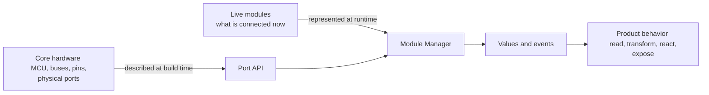

For example:

- the Core has an I2C controller wired to Port 0: **static hardware**;
- two INA219 devices at addresses `0x40` and `0x41` are assigned to Port 0:
  **runtime state**;
- when measured current exceeds a threshold, an actuator is commanded: **product
  behavior**.

The same architecture must still work if the example sensor, actuator,
transport, or microcontroller changes.

## Required concepts and optional capabilities

The small central model is generic. Everything product-specific is attached at
its edges.

| Concept | Required? | Meaning | Practical example |
|---|:---:|---|---|
| Core | Yes | Coordinates startup and reports overall state | Initialize the common firmware layers |
| Port | Yes | Represents one physical connector and its capabilities | Port 0 offers I2C |
| Module | Yes | Represents one live peripheral instance | INA219 at `0x40` on Port 0 |
| Module driver | Yes | Implements one module type | Read an INA219 over I2C |
| Driver Registry | Yes | Finds a compiled driver by type | Resolve `ina219` to its driver |
| Module Manager | Yes | Owns module instances and lifecycle | Create several addressed instances on Port 0 |
| Config | When configuration exists | Holds validated desired state | Assign a module and a sample interval |
| Data | When values/events exist | Defines values independently of their producer | Current with module key, ID, and timestamp |
| Runtime | When autonomous behavior exists | Applies product rules | Sample both INA219 instances independently |
| Input/output adapter | Optional | Connects the firmware to another interface | USB shell, local UI, REST, MQTT |
| Connectivity Manager | When radios exist | Owns low-energy/online policy and link lifecycle | BLE normally, Wi-Fi on demand |
| Wi-Fi Profiles | When Wi-Fi exists | Owns saved credentials and network selection | Preferred Wi-Fi or strongest known fallback |
| Discovery strategy | Optional | Proposes module identity | Manual assignment, EEPROM, electrical probe |
| Shared-resource coordinator | Optional | Coordinates a real shared resource | A switchable rail used by two Ports |
| Update coordinator | When firmware update exists | Owns one bounded upload session and test-boot policy | UART or UDP writes one MCUboot candidate |

### Why MQTT is not a core concept

MQTT is one possible **output adapter**. It may be useful when a product must
send values to a remote broker, but the firmware architecture does not depend on
it. A product could instead use USB, Bluetooth, HTTP, a display, a log file, or
no external output at all.

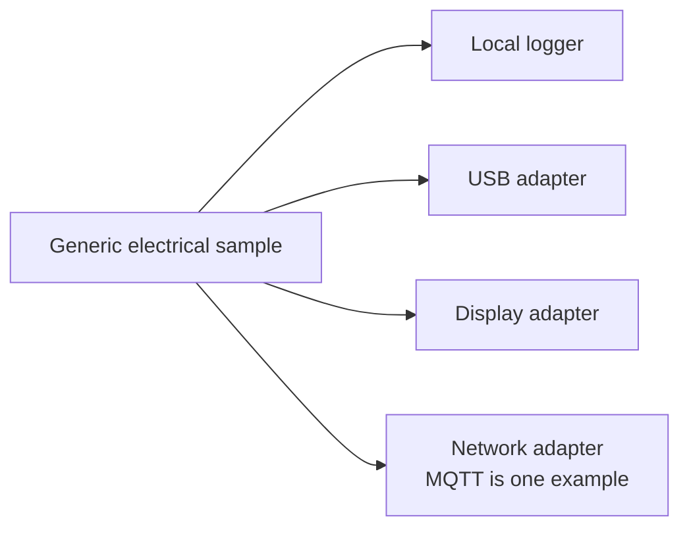

Removing MQTT must not change the sensor driver, Module Manager, Data contract,
or Runtime rules. It removes only one adapter.

For a low-energy Core, BLE may carry the common Spaghetti CBOR protocol directly to
a local Node-RED host or gateway. The gateway may publish MQTT on behalf of the Core.
Direct MQTT remains available to a Core whose connectivity policy explicitly starts
Wi-Fi. See the
[connectivity, energy, and resource contract](CONNECTIVITY_AND_RESOURCE_CONTRACT.md).

### Why Wi-Fi credentials are separate from Config

Wi-Fi credentials configure how this Core reaches a network; they do not describe a
Module connected to a Port. The persistent Wi-Fi Profiles service therefore owns
SSID, password, preferred-network policy, scan, and association. Config continues to
own the desired Module/Runtime/MQTT state without carrying secrets.

Wi-Fi Profiles does not decide when the radio is enabled. The Connectivity Manager
owns that lifecycle: `LOW_ENERGY` keeps Wi-Fi stopped, while `ONLINE` or an
authenticated temporary lease permits association. Enabling Wi-Fi never implicitly
arms OTA or opens Remote Console.

At boot, the service scans known networks. A visible preferred SSID is attempted
first; when it is absent, visible known SSIDs are tried by descending RSSI. The
serial Communication adapter provisions profiles through a hidden prompt and remains
available to the future application. See also:

- [Persistent Wi-Fi Profiles](subsys/services/wifi_profiles/README.md)
- [Communication](subsys/communication/README.md)
- [Optional MQTT adapter](subsys/services/mqtt/README.md)
- [Connectivity, energy, and resource contract](CONNECTIVITY_AND_RESOURCE_CONTRACT.md)

### Why Power is not always present

Power coordination is useful only when the hardware exposes a controllable
shared resource—for example, a switchable 3.3 V rail feeding two Ports. If the
board has no controllable rail, there is nothing for a Power component to own.

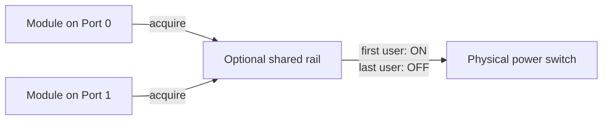

This is an optional shared-resource pattern, not a requirement that every Core
must implement power management.

## Static hardware and runtime state

This separation is the most important architectural rule.

### Static hardware

Static hardware is physically part of a specific Core and cannot change while
the firmware runs. Zephyr represents it with a board definition and Devicetree.

Examples:

- MCU and memory;
- I2C, SPI, UART, and GPIO controllers;
- pin routing;
- physical Port count;
- a presence pin or controllable rail, if it really exists;
- flash partitions.

### Runtime state

Runtime state can change without rebuilding the firmware.

Examples:

- which modules and bus endpoints are configured on Port 0;
- whether that module is ready or in error;
- its current measurements;
- user configuration;
- an active automation rule.

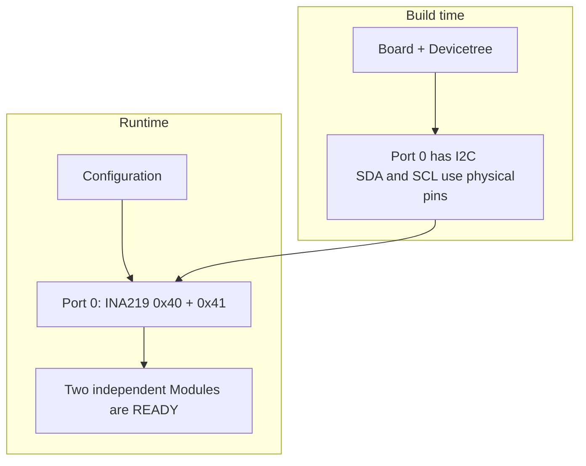

The Devicetree describes that Port 0 can access I2C. It must not permanently
claim that any removable module or I2C address is connected there.

## Core

The Core is the startup coordinator. It initializes required components in a
known order and exposes a small overall state such as initializing, ready, or
failed.

It does not implement sensor protocols, decide module types, or contain product
rules.

### Practical example

At boot, Core initializes Port and Module Manager. If Port cannot obtain a
required hardware controller, Core reports failure instead of claiming that the
system is ready.

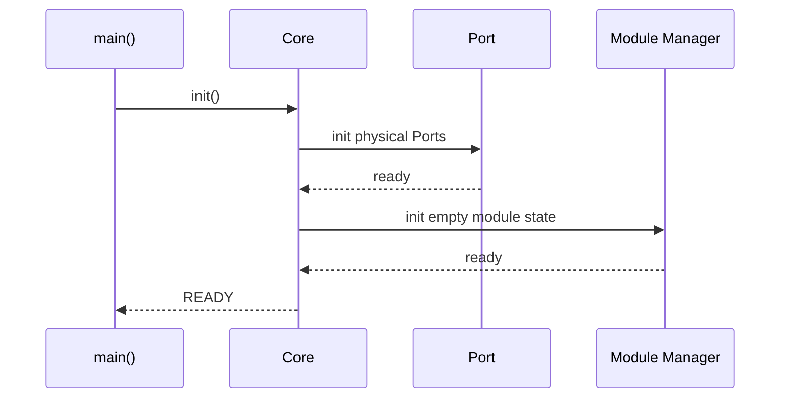

## Port

A Port represents one physical external-module connection. It hides
board-specific controllers, pins, and Core variants behind capabilities.

A Port answers questions such as:

- does this connector support I2C, SPI, or a digital output?
- is its underlying controller ready?
- which stable bus handle may a driver use?

A Port does not know which removable module is attached and does not implement a
sensor protocol.

A Port is not an occupancy slot. When it exposes a shared bus, several Modules may
reference the same Port at the same time. Port owns controller access and transaction
serialization; Module Manager owns the independent instances and their lifecycles.

### Practical example

Each INA219 driver instance asks Port 0 for its I2C controller. On one Core that may
be `i2c0`; on another Core it may be `i2c1`. The driver sees only the Port API.

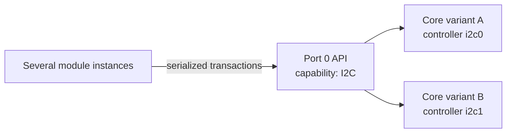

## Module and module driver

A **Module** is one runtime instance. A **module driver** is the reusable
implementation of one module type.

The distinction is the same as an object and its class:

- instance: “INA219 key 10 on Port 0, address `0x40`, currently READY”;
- driver: “code capable of initializing and reading the INA219 family.”

Several instances may use the same immutable driver while keeping separate
runtime state.

The persistent identity of an instance is a Config-owned `module_key`. Its runtime
`spaghetti_module_id_t` is an ephemeral Manager handle. A driver also derives a
normalized endpoint from its configuration—for example I2C address `0x40`. Therefore
two INA219 instances on Port 0 with addresses `0x40` and `0x41` are distinct, while a
second claim for Port 0/address `0x40` is rejected as a hardware collision.

### Practical example

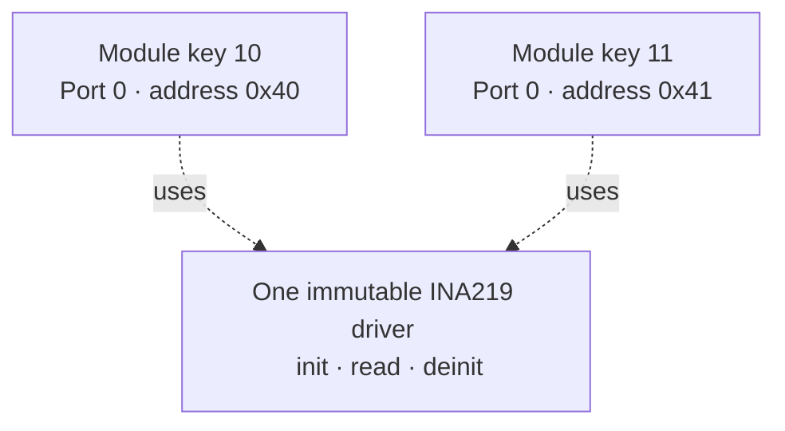

The operation table keeps callers generic: the Manager calls `init`, `read`,
`command`, or `deinit` without including a concrete driver implementation.

## Example: lifecycle of a runtime module

The following example follows one INA219 connected to shared Port 0 from physical
connection to a measurement requested by Runtime. Port 0 is part of the static
Core hardware, while the INA219 type, its I2C address, and the live Module
instance are runtime state. The example uses address `0x40`, the address carried
by this module's validated runtime configuration; it is not a removable INA219
node permanently declared in the Core Devicetree.

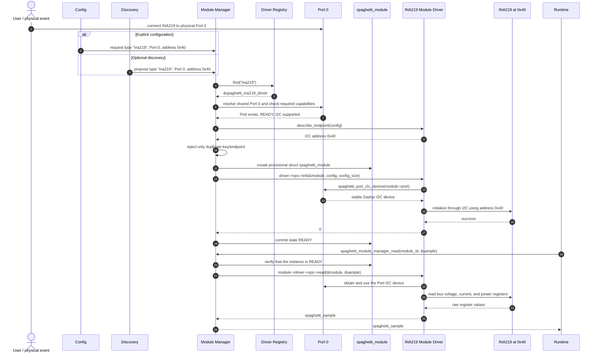

1. **The physical connection uses Port 0.** The user connects the INA219 to the
   I2C lines exposed by Port 0. The Port represents the connector and the bus
   capability already described for this Core; connecting a module does not
   change Devicetree and, by itself, does not imply automatic discovery.

   See also:

   - [Port](subsys/port/README.md)
   - [Board support](boards/spaghettilab/README.md)

2. **Config or Discovery identifies the requested module.** Config can provide
   the validated assignment explicitly. An optional Discovery strategy can
   instead propose the same normalized information: type `"ina219"`, Port 0,
   and I2C address `0x40`. Discovery identifies a candidate; it does not create
   or own the Module. Only one of these paths is needed for a given request.

   See also:

   - [Config](subsys/config/README.md)
   - [Discovery](subsys/discovery/README.md)

3. **Module Manager receives the request.** The Manager is the lifecycle owner.
   It validates the request, rejects an unavailable Port or a duplicate module
   key/endpoint, and coordinates lookup, initialization, commit, later reads, and removal.
   No caller creates a live Module directly.

   See also:

   - [Module Manager](subsys/module_manager/README.md)

4. **Driver Registry resolves the type.** The Manager asks for `"ina219"`.
   Registry returns `&spaghetti_ina219_driver`, a pointer to the immutable
   descriptor compiled into the firmware. Registry owns descriptors, not live
   instances; an unknown type makes configuration fail before hardware access.

   See also:

   - [Driver Registry](subsys/driver_registry/README.md)

5. **Module Manager verifies Port capabilities and endpoint uniqueness.** The INA219 descriptor requires
   I2C. The Manager resolves Port 0, checks that it is ready, and confirms that
   `SPAGHETTI_PORT_CAP_I2C` is present. The driver derives address `0x40` from its
   runtime config; the Manager rejects another claim for Port 0/address `0x40`, but
   permits `0x41` and `0x44` on the same Port. This prevents both incompatible access
   and real bus-address collisions without treating the Port as occupied.

   See also:

   - [Port](subsys/port/README.md)
   - [External module drivers](spaghetti_modules/README.md)

6. **Module Manager creates a provisional Module.** It fills one private
   `struct spaghetti_module` slot with its ID, Port pointer, driver pointer,
   stable key, endpoint, initial state, and per-instance context pointer. The Manager owns this structure for
   the whole connection lifetime; Runtime and other callers refer to it by ID
   and do not retain writable pointers to it.

   See also:

   - [Public Module interfaces](include/spaghetti/README.md)
   - [Module Manager](subsys/module_manager/README.md)

7. **The Module Driver initializes the instance.** The Manager calls
   `driver->ops->init(&module, config, config_size)`. The INA219 driver validates
   its configuration, asks the Port for the stable Zephyr I2C device, and uses
   the runtime address `0x40` for the device transaction. It keeps only
   per-instance protocol state in a driver-specific static slab; it does not own the
   Port or the Zephyr device. Different drivers may therefore use different context
   sizes without a global context buffer or heap.

   See also:

   - [External module drivers](spaghetti_modules/README.md)
   - [Port](subsys/port/README.md)

8. **The Module becomes READY only after successful initialization.** When
   `init()` returns `0`, the Manager commits the provisional slot and publishes
   its ID in state `SPAGHETTI_MODULE_READY`. If initialization fails, it discards
   the provisional instance and releases only its driver context instead of exposing a
   half-initialized Module. Other Modules already using Port 0 remain untouched.

   See also:

   - [Module Manager](subsys/module_manager/README.md)
   - [Public Module interfaces](include/spaghetti/README.md)

9. **Runtime requests one reading through Module Manager.** Runtime schedules
   the product behavior and calls
   `spaghetti_module_manager_read(module_id, &sample)`. It knows the Module ID
   and the generic sample contract, but it does not know INA219 registers or
   which Zephyr I2C controller is behind Port 0.

   See also:

   - [Runtime](subsys/runtime/README.md)
   - [Module Manager](subsys/module_manager/README.md)

10. **The driver reads through Port and returns a generic sample.** The Manager
    verifies that the instance is READY, then calls
    `module->driver->ops->read(&module, &sample)`. The INA219 driver obtains the
    I2C device from `module->port`, reads bus voltage, current, and power, and
    converts the result into `struct spaghetti_sample`. The sample returns
    through the Manager to Runtime and can then enter the generic Data path;
    hardware-specific register details do not escape the driver.

    See also:

    - [External module drivers](spaghetti_modules/README.md)
    - [Port](subsys/port/README.md)
    - [Data](subsys/data/README.md)
    - [Runtime](subsys/runtime/README.md)

## Driver Registry and Module Manager

The Registry and Manager have different jobs:

- **Driver Registry:** owns no live module; it maps a type identifier to an
  immutable driver descriptor compiled into the firmware.
- **Module Manager:** owns every live module instance, its state, its Port
  assignment, and all lifecycle transitions.

The mapping is one Port to zero or more Modules. Registry lookup remains by driver
type; Manager lookup is by runtime ID or stable module key. A Port query returns a
bounded list, never an assumed single instance.

### Practical example: assign a module

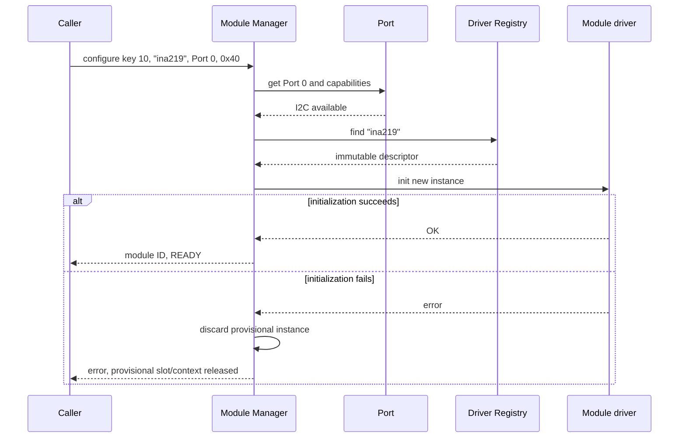

Only the Manager may create, replace, or destroy module instances. A failed creation
rolls back that exact key/endpoint and cannot remove sibling Modules on the same Port.
This makes rollback and ownership predictable.

## Config

Config represents the **desired state** after validation. It is independent of
how configuration arrives and how it is stored.

Possible sources include:

- a compiled default;
- a local command;
- a file or flash record;
- a network request.

Those sources must all produce the same internal Config model.

### Practical example

A request asks for INA219 keys 10 and 11 on Port 0, at `0x40` and `0x41`, with
1000 ms sample periods. Config validates both keys and endpoints before it asks
Manager to reconcile the desired set. Invalid input must not leave half-applied
live state, and removing key 10 must not remove key 11.

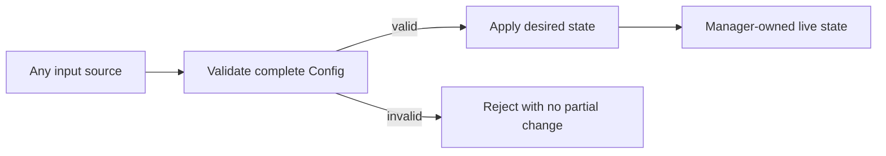

Persistence is optional. If configuration must survive reboot, a storage adapter
saves and restores the same Config model; persistence rules do not belong in
module drivers.

## Data

Data defines application-level values and events independently of a specific
driver or output protocol.

A useful measurement contains enough context to stand on its own:

- stable source module key and current runtime ID;
- value and unit or fixed representation;
- timestamp;
- sequence number;
- validity or quality flags.

### Practical example

The INA219 driver returns bus voltage, current, and power. The application turns
them into a generic electrical sample. A logger, a local display, and an optional
network adapter can consume it without knowing the concrete driver or I2C address.

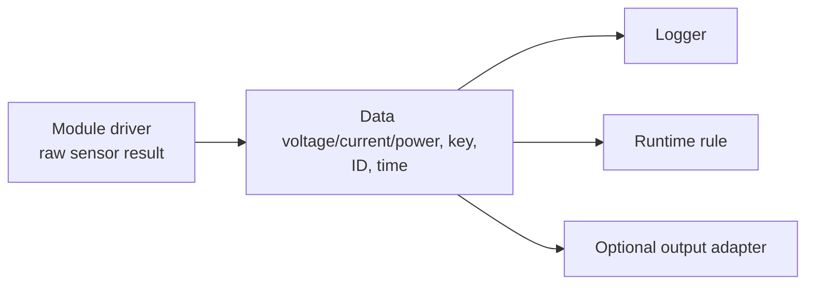

Data is not a database and does not decide product behavior.

## Runtime

Runtime owns autonomous product behavior: when something should be sampled and
how values should cause actions. It depends on generic Module Manager and Data
contracts, not on a concrete sensor implementation.

### Practical example

Every second, Runtime independently requests values from the runtime IDs resolved
from keys 10 and 11. A rule may command another Module when current exceeds a
configured threshold.

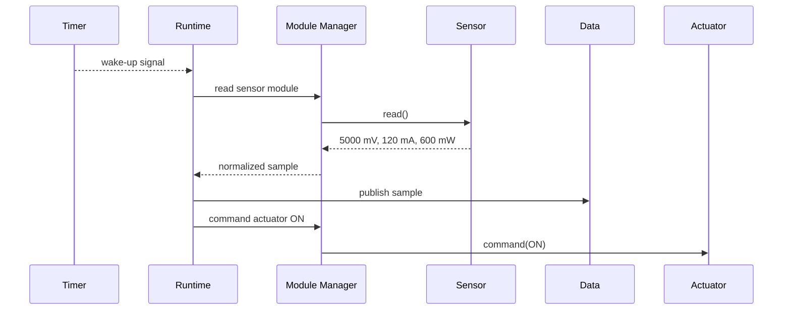

The timer callback only wakes Runtime. Blocking bus access and rule evaluation
run in thread context.

## Input and output adapters

Adapters translate between the generic firmware contracts and an external
interface. They must remain replaceable.

### Input adapter example

A USB command and a network request may both ask for the same assignment. Each
adapter parses its transport format and produces the same Config request.

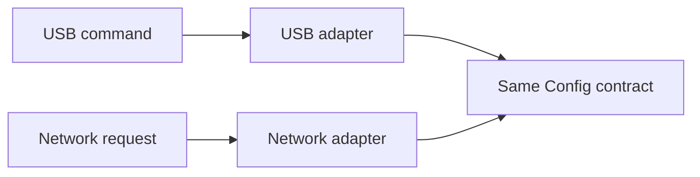

### Output adapter example

A Data value may be formatted for a serial console, a display, or a network
protocol. MQTT belongs here if the product chooses it.

An adapter does not own modules, modify Manager internals, or define the common
Data representation.

## Maintenance and firmware-update boundary

Maintenance is a Core capability, not a property of a runtime Module and not a fixed
GPIO pair in common code. A board/overlay supplies a Maintenance Link that can switch
one physical connection between its normal role and a local maintenance transport.

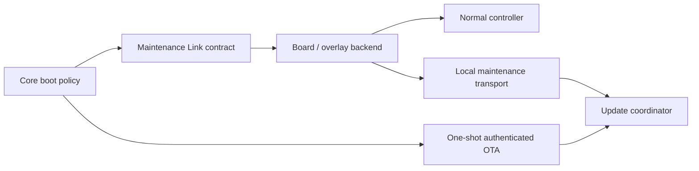

On Core V1 the board mapping is I2C SDA/SCL on GPIO3/GPIO4 in normal operation and
UART RX/TX on the same pins during maintenance. Those numbers remain board facts. A
future Core may use different pins or controllers while preserving the same operations:
initialize, probe for a bounded boot request, enter maintenance and leave maintenance.

Boot policy is distinct from image-upload and image-permanence state:

- no valid Config enters local maintenance directly, while Wi-Fi and network OTA stay
  disabled;
- a valid Config normally starts the Engine after a short receive-only bootstrap probe;
- a valid bootstrap payload may enter maintenance;
- an authenticated running system may save a one-shot marker and reboot into
  maintenance; the marker is consumed before entry;
- entering maintenance does not write flash. Image Management must separately ask the
  Update coordinator to receive into the secondary slot.

Core represents this with two independent values. The operational mode is
`UNPROVISIONED`, `NORMAL` or `MAINTENANCE`; the image state is `TRIAL` or `CONFIRMED`.
Consequently `NORMAL + TRIAL` is valid while a newly installed image runs its bounded
health window. Only Core confirms it, after reaching RUNNING. A reset before that point
leaves MCUboot free to restore the previous image.

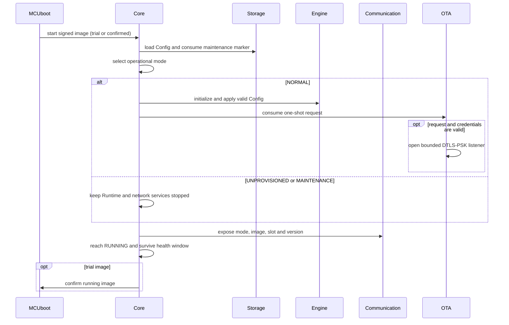

The Update coordinator is implemented as one transport-independent state machine. It
serializes UART and UDP ownership, applies one absolute timeout, erases only the
secondary slot on cancellation and requests only an MCUboot test boot. Both adapters
use Zephyr SMP framing and the restricted Spaghetti management group; neither can
confirm a trial image.

The OTA adapter is initialized only in `NORMAL`. A local active Maintenance Link
provisions a per-device 32-byte PSK and a one-shot bounded request. On the next normal
boot, OTA consumes that request and opens UDP port 1337 with DTLS-PSK. Possession of
the PSK authenticates the peer; MCUboot separately authenticates the signed image.
Remote SMP may read status, upload ordered chunks or cancel, but cannot change Config,
Wi-Fi, credentials or image confirmation. Timeout or network loss closes the socket
and discards only an incomplete secondary candidate. MCUboot, not the running
application, performs the definitive ECDSA verification before executing a candidate.

See also:

- [Update coordinator](subsys/services/update/README.md)
- [Local Maintenance Link](subsys/services/maintenance_link/README.md)
- [Authenticated Wi-Fi OTA](subsys/services/ota/README.md)
- [Authenticated remote console](subsys/communication/README.md#authenticated-remote-console)
- [Maintenance Link contract](UPDATE_HARDWARE_CONTRACT.md)

Remote Console is a separate Communication adapter. In `NORMAL`, and only when its
own PSK has been provisioned locally, it opens TLS 1.2 TCP port 1338 for one client.
It exposes a bounded status/Config/reboot grammar instead of Zephyr Shell, forwards
domain requests through Communication, and copies logs into a static queue. A slow
client loses old log fragments rather than delaying Runtime. Its PSK is independent
from OTA because console access and firmware-upload authorization have different
lifecycles.

The detailed contract is in
[UPDATE_HARDWARE_CONTRACT.md](UPDATE_HARDWARE_CONTRACT.md). Local transport and OTA
and the remote console are active; physical interruption qualification remains in
phase 290.

The target low-energy extension adds BLE as a future Communication and update adapter,
keeps Wi-Fi on demand, and replaces the dedicated always-resident mbedTLS arena with a
bounded secure workspace. These are target contracts, not current implementation. See
[Connectivity, energy, and resource contract](CONNECTIVITY_AND_RESOURCE_CONTRACT.md).

## Discovery strategies

Discovery is optional. It answers one question: “what module identity is being
proposed for this Port?” It does not create the module itself.

Possible strategies include:

- manual assignment from configuration;
- reading an identity memory;
- a verified electrical detection method;
- no discovery at all.

### Practical example

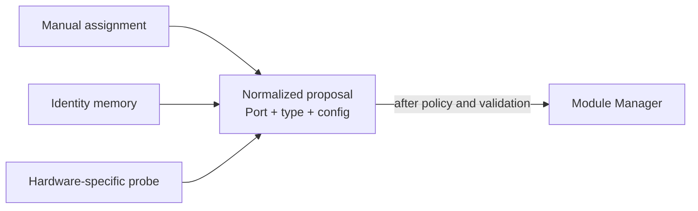

The Manager must not care which strategy produced the proposal.

## Choosing calls, queues, and publish/subscribe

Use the simplest mechanism that satisfies the real behavior.

| Need | Mechanism | Practical example |
|---|---|---|
| Immediate result or error | Direct call | Manager asks a driver to initialize |
| Protect short shared state | Mutex | Serialize one Port transaction |
| Wake a worker without doing work in a callback | Semaphore or work item | Timer wakes Runtime |
| Preserve ordered commands with bounded capacity | Message queue | Queue actuator commands |
| Send one value to several independent consumers | Publish/subscribe | Electrical sample reaches logger and UI |

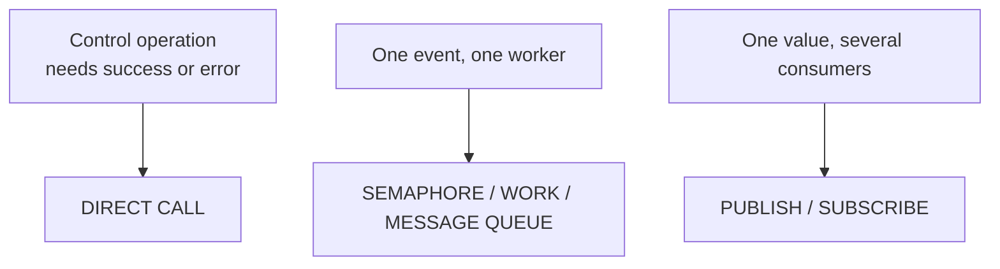

Do not introduce asynchronous messaging merely to make components look
decoupled. A queue adds capacity limits, overflow policy, memory use, and more
states to debug.

## Execution-context rules

- **Thread:** may perform bounded blocking work such as I2C access.
- **Timer callback:** signals work and returns; it does not access a sensor.
- **ISR:** captures the hardware event, signals deferred work, and returns.
- **Workqueue:** performs deferred work that is short enough for the selected
  queue; long-lived state machines deserve a dedicated thread.

### Practical example

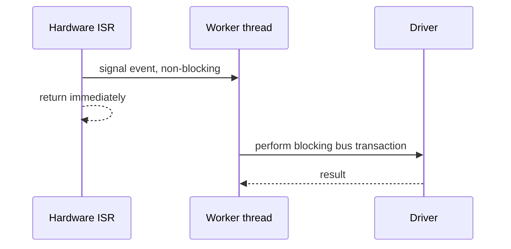

## Supporting multiple Core variants

Board definitions and Devicetree absorb physical differences. Higher layers
query Port capabilities instead of branching on MCU or board names.

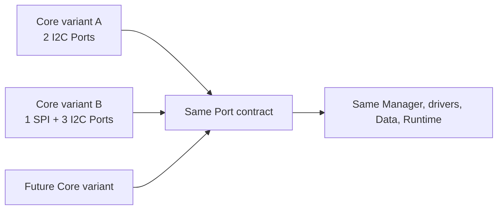

Adding a new Core variant should primarily add static board description. It
should not add `if (board == ...)` branches to Module Manager or Runtime.

## End-to-end example

This example combines the pieces without making any concrete technology a
requirement.

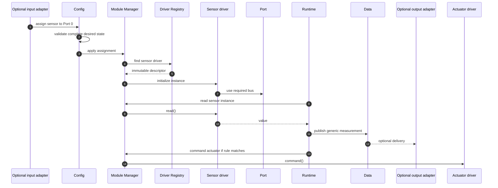

Replace the sensor, actuator, input transport, output transport, or Core board:
the central ownership and data flow stay the same.

## Architectural rules

1. Describe physical Core hardware at build time; represent removable modules
   at runtime.
2. Keep board details below the Port contract.
3. Let Module Manager be the sole owner of live module instances.
4. Keep driver descriptors immutable and runtime state per instance.
5. Validate desired Config completely before changing live state.
6. Keep Data independent of concrete drivers and transports.
7. Keep product rules in Runtime, not inside drivers or adapters.
8. Treat discovery, persistence, networking, and shared-resource coordination as
   optional capabilities.
9. Prefer direct calls until real concurrency requires a queue or pub/sub.
10. Never perform blocking work in ISR or timer callback context.

## Detailed component documentation

- [Public interfaces](include/spaghetti/README.md)
- [Board support](boards/spaghettilab/README.md)
- [Devicetree bindings](dts/bindings/spaghetti/README.md)
- [Core](subsys/core/README.md)
- [Port](subsys/port/README.md)
- [Driver Registry](subsys/driver_registry/README.md)
- [Module Manager](subsys/module_manager/README.md)
- [Config](subsys/config/README.md)
- [Data](subsys/data/README.md)
- [Runtime](subsys/runtime/README.md)
- [Communication adapters](subsys/communication/README.md)
- [External module drivers](spaghetti_modules/README.md)
