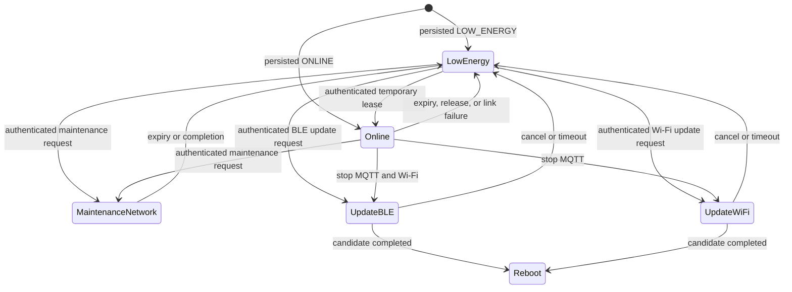
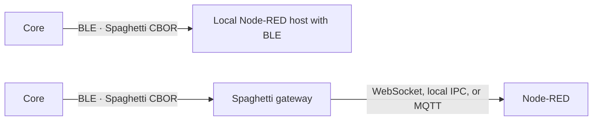

# Connectivity, energy, and resource contract

[← Architecture](ARCHITECTURE.md) · [V1 closure plan](roadmap/V1-PLATFORM-CLOSURE.md) ·
[Update hardware contract](UPDATE_HARDWARE_CONTRACT.md)

This document freezes the target contract for connectivity and memory ownership before
implementation tasks are created. It does not claim that Bluetooth LE, BLE update,
resource profiles, or dynamic TLS memory are implemented yet.

The design has four goals:

1. keep ESP32-C3-class Cores useful with limited internal RAM;
2. make Bluetooth LE the normal low-energy communication path when the product needs it;
3. start Wi-Fi only by policy or an authenticated temporary request;
4. preserve authenticated A/B update over BLE, Wi-Fi, or a local maintenance link.

Hardware-specific Discovery remains outside this contract. Manual Config remains valid
when no reliable identification method exists.

## Independent state dimensions

Spaghetti LAB does not encode every combination into one large mode enum. Three
independent values answer different questions.

| Dimension | Values | Question answered |
|---|---|---|
| Core operational mode | `UNPROVISIONED`, `NORMAL`, `MAINTENANCE` | Which application responsibilities may run? |
| Image state | `TRIAL`, `CONFIRMED` | May MCUboot roll the running image back? |
| Connectivity policy | `LOW_ENERGY`, `ONLINE` | Which normal-operation links should be kept available? |

`TRIAL` is not a maintenance or update mode. A valid new image may run as
`NORMAL + TRIAL` while Core performs its bounded health check. Receiving an image is
owned separately by the Update coordinator.

The persisted Config may select `LOW_ENERGY` or `ONLINE`. Maintenance and update
sessions are transient, bounded operations and must never be persisted as the desired
boot state.

The admission policy is:

| Situation | Runtime | Permitted external path |
|---|---|---|
| `UNPROVISIONED` | Stopped | Authenticated local maintenance only; no radio starts automatically |
| `NORMAL + LOW_ENERGY` | Running | BLE according to its availability policy |
| `NORMAL + ONLINE` | Running | BLE and Wi-Fi; direct MQTT if configured |
| `MAINTENANCE` | Stopped or explicitly quiesced | Exactly the selected BLE, Wi-Fi, or local adapter |
| Update receiving | Quiesced and outputs safe | Exactly one BLE, Wi-Fi, or local upload owner |

## Compile-time resource profiles

A resource profile is selected at build time by the Core variant. Runtime free-memory
detection must not decide which static stacks or protocol implementations exist,
because those reservations have already happened before the application starts.

| Profile | Intended class | Required behavior | Optional or excluded behavior |
|---|---|---|---|
| Minimal | ESP32-C3-class internal RAM | BLE, on-demand Wi-Fi, authenticated update, Runtime, bounded Config | Remote console excluded; one heavy secure session at a time; small capacities |
| Standard | ESP32-S3/C6-class internal RAM | Minimal behavior with larger capacities | Remote console and direct MQTT selectable |
| Extended | Core with verified external RAM | Standard behavior with external work buffers | More simultaneous sessions and larger bounded capacities |

The profile controls compile-time capacities such as Module count, rule count, queue
depth, protocol buffer size, and secure-session count. It must not silently invent a
hardware capability. Devicetree and the board definition remain the authority for
radios, buses, pins, flash partitions, and external RAM.

Every firmware artifact identifies its Core variant and resource profile. Update must
reject an artifact that is incompatible with the running Core, flash layout, or
required capabilities.

## Normal connectivity policies

### Low Energy

`NORMAL + LOW_ENERGY` keeps autonomous behavior running while expensive connectivity
is stopped unless requested:

| Component | Required state |
|---|---|
| Module, Runtime, rules | Running according to Config |
| BLE | Off, advertising, or connected according to the bounded BLE availability policy |
| Wi-Fi | Stopped |
| Direct MQTT | Stopped |
| TLS/DTLS workspace | Unowned |
| Network OTA listener | Closed |
| Remote console | Closed or not compiled |

BLE being the primary transport does not mean that it is permanently transmitting.
The product policy may keep a low-duty advertising window, maintain one connection, or
enable BLE only after a timer or local event. If BLE is completely off, a remote peer
cannot wake it; immediate remote reachability therefore requires advertising or an
existing connection.

### Online

`NORMAL + ONLINE` keeps Runtime active and permits BLE, Wi-Fi, and direct MQTT to serve
different peers at the same time. On ESP32-C3, Wi-Fi and BLE share one 2.4 GHz radio.
They may be logically connected concurrently, but radio access is time-shared and the
profile must bound throughput, scanning, and connection counts.

`ONLINE` may be:

- the persisted policy for an externally powered Core;
- a temporary authenticated lease requested over BLE or a local link;
- a bounded scheduled window used to publish accumulated records.

A temporary lease has an absolute expiry. Disconnect, failed association, explicit
release, or reboot returns to the persisted policy. Enabling Wi-Fi does not arm update
and does not open a remote console.

## Connectivity lifecycle

The Connectivity Manager owns transitions between links. A transport adapter must not
start or stop another adapter directly.



The diagram shows the low-energy return path. A Core whose persisted policy is
`ONLINE` returns to `ONLINE` after a non-rebooting maintenance session. Update normally
ends in reboot so MCUboot can start the candidate as `TRIAL`.

## Bluetooth LE transport

BLE is an adapter for the common Spaghetti machine protocol, not a second Config or
Data model. After the protocol V1 contract exists, BLE carries the same versioned CBOR
envelope as USB, MQTT, or another authenticated transport.

The logical BLE service contains bounded channels for:

- request frames;
- correlated response frames;
- asynchronous Data and state events;
- update control and ordered image chunks.

The exact GATT UUIDs, MTU, fragmentation format, credits, connection count, and bonding
policy are implementation decisions for the future BLE task. That task must measure
the ESP32-C3 controller and host memory before freezing capacities.

A BLE peer must authenticate before it can change Config, enable Wi-Fi, enter network
maintenance, or arm update. Pairing alone must not implicitly grant every operation;
Communication applies the same operation policy used by other local and remote
adapters.

### Node-RED without MQTT on the Core

MQTT is not required between a Core and Node-RED. Two supported topologies are:



The gateway may translate transport framing, but it must preserve protocol version,
operation, correlation ID, status, and payload meaning. A remote or cloud Node-RED
instance requires a nearby BLE gateway; BLE is not an Internet transport.

## Wi-Fi and MQTT policy

Wi-Fi credentials remain owned by Wi-Fi Profiles and are not copied into Config. The
Connectivity Manager decides when the interface may start; Wi-Fi Profiles decides
which saved network to join.

Direct MQTT is an optional adapter above an IP link:

- in `LOW_ENERGY`, a gateway can publish BLE records and the Core needs no MQTT session;
- in a bounded publish window, Core may start Wi-Fi, connect MQTT, exchange queued
  records and commands, then disconnect;
- in persisted `ONLINE`, Core may maintain MQTT while BLE serves another peer.

On a constrained profile, MQTT must disconnect before Wi-Fi OTA acquires the secure
workspace. The gateway topology is preferred when low energy is more important than
standalone Internet reachability.

## Network maintenance, sometimes called programming mode

“Programming” is ambiguous, so the firmware distinguishes configuration maintenance
from firmware update. An authenticated BLE peer may request a bounded network
maintenance session. Connectivity then starts Wi-Fi and Communication exposes the
operations permitted by maintenance policy, such as status, Config, credentials, and
diagnostics.

Network maintenance does not open an image upload listener. Firmware bytes are accepted
only after a separate authenticated request arms Update. The session has an absolute
timeout, is never the persisted boot policy, and returns to the prior normal
connectivity policy after completion or failure.

## Maintenance and update transports

Update coordinator remains transport-independent and continues to own exactly one
candidate in the MCUboot secondary slot. The supported target transport set is:

| Transport | Intended use | Network/TLS requirement |
|---|---|---|
| Local UART maintenance link | Initial provisioning and recovery | No network TLS; authenticated local entry and signed image still required |
| BLE | Normal low-energy update path | BLE authentication and bounded fragmentation |
| Wi-Fi | Faster update path | Authenticated TLS/DTLS session |

Only one transport may own an upload. Before receiving image bytes, Core places Module
outputs in their safe state, stops Runtime work that can interfere, disconnects MQTT,
closes the remote console, and releases resources not required by the selected
transport.

A BLE request may enable Wi-Fi and arm Wi-Fi update, but the two operations remain
distinct. After acknowledging the handover, the Minimal profile may disconnect BLE
before the Wi-Fi transfer to reduce RAM and RF contention.

Cancel, timeout, transport loss, or verification failure erases only the incomplete
secondary candidate. The confirmed image and persisted normal connectivity policy are
preserved. No Config value may persist `RECEIVING`, `VERIFYING`, or another transient
Update state.

## Secure memory ownership

mbedTLS remains available. Removing its current dedicated 60,000-byte static arena
must not remove TLS, DTLS, image authentication, or credential protection.

The target design replaces the always-resident private arena with a bounded secure
workspace acquired only by a service that needs it. Candidate backends include a
quota-controlled shared heap on internal RAM and an external-memory allocator on a
verified Extended Core. The implementation task must select and test the Zephyr 4.4
mechanism; this contract does not assume that changing one Kconfig symbol is sufficient.

The Minimal profile enforces these rules:

1. at most one heavy TLS/DTLS handshake owns the secure workspace;
2. MQTT releases its secure connection before Wi-Fi OTA starts;
3. Remote Console is not compiled into the production Minimal profile;
4. allocation failure returns a bounded error and leaves the prior mode operational;
5. a failed update never consumes the confirmed image or persisted Config;
6. peak memory is measured with Wi-Fi/BLE coexistence, not only at idle.

This is a justified bounded allocation for third-party protocol state. The existing
“no Spaghetti heap” rule still applies to Module instances, Config, records, rules,
catalogs, and queues: their capacities remain static and inspectable. No general-purpose
unbounded application allocation is introduced.

Freeing the static arena improves the link-time RAM report, but does not eliminate the
TLS peak. Enough memory must still be available while a secure session is active. A
build-time RAM gate and runtime allocation-failure tests are therefore mandatory.

## Capability reporting

Communication exposes immutable hardware/build capabilities and current mutable state
as different fields. A client must be able to discover at least:

```text
core_variant
resource_profile
connectivity_policy
ble_supported
wifi_supported
direct_mqtt_supported
remote_console_supported
ota_ble_supported
ota_wifi_supported
ota_local_supported
external_ram_bytes
max_modules
max_rules
max_secure_sessions
```

The report describes compiled and verified capability, not an aspirational feature.
Current state separately reports whether BLE, Wi-Fi, MQTT, maintenance, or update is
active. Node-RED and host tools must reject unsupported Config before attempting to
apply it.

## Matter, Thread, and Zigbee boundary

Matter, Thread, and Zigbee are not V1 Core requirements.

- ESP32-S3 can host Matter over Wi-Fi but has no native IEEE 802.15.4 radio.
- ESP32-C6 may expose IEEE 802.15.4 for Thread or Zigbee, subject to Zephyr and stack
  qualification.
- A C3/S3 Core may use an external radio coprocessor if future hardware justifies it.
- A gateway may bridge Spaghetti BLE to Matter, Thread, Zigbee, or MQTT without adding
  those stacks to a Minimal Core.

Future adapters must reuse the common protocol and capability model. No current task
may claim Zigbee or Matter support merely because a possible MCU has suitable radio
hardware.

## Safety and energy invariants

- BLE, Wi-Fi, MQTT, maintenance, and update each have one lifecycle owner.
- A temporary radio activation always has a timeout or an explicit owning connection.
- Wi-Fi activation never implicitly opens OTA or Remote Console.
- Update data has exactly one transport owner.
- Runtime outputs reach a safe state before an update takes flash and network resources.
- Reboot restores the persisted normal policy, not a transient maintenance/update state.
- Secrets are never stored in repository Config or printed through a transport.
- Low-energy behavior is verified with current measurements on final hardware; a
  Kconfig name alone is not evidence of low power.

## Implementation sequence to turn into tasks

No task is created by this document. When the roadmap is extended, preserve this order:

1. resource profiles, feature gates, capability report, and per-board RAM budgets;
2. Connectivity Manager with persisted `LOW_ENERGY`/`ONLINE` and temporary leases;
3. removal of the dedicated mbedTLS arena and secure-workspace admission control;
4. dynamic lifecycle for Wi-Fi, MQTT, OTA, and optional service stacks;
5. common Communication Protocol V1;
6. authenticated BLE transport and Node-RED/gateway adapter;
7. BLE update using the existing Update coordinator;
8. Wi-Fi activation/update handover requested over BLE;
9. coexistence, allocation-failure, power, interrupted-update, and rollback tests;
10. optional IEEE 802.15.4/Matter/Zigbee evaluation after V1 requirements are met.

Physical Discovery methods remain deliberately deferred until real module hardware
provides verifiable EEPROM, register, analog, 1-Wire, or presence contracts.
