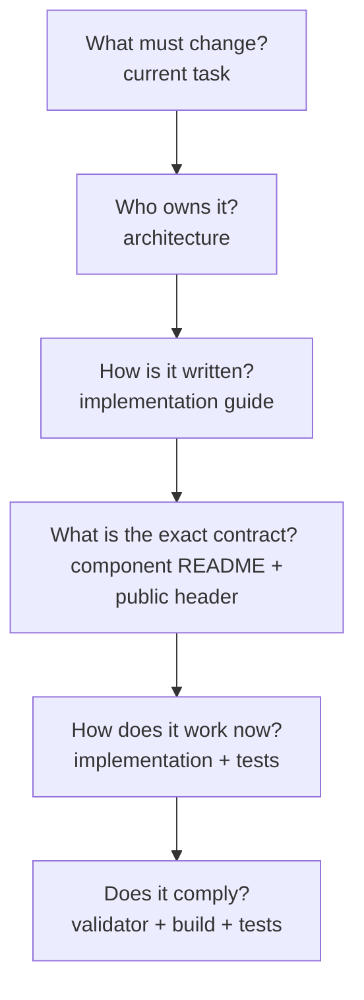

# Firmware file map and reading guide

[← Project README](README.md) · [Documentation index](DOCUMENTATION_INDEX.md) ·
[Architecture](ARCHITECTURE.md) ·
[Implementation guide](FIRMWARE_IMPLEMENTATION_GUIDE.md)

This document answers three questions for every important project file or file
family:

1. What does it contain?
2. When must it be read?
3. Why is it relevant to the current task?

Use it to choose the minimum complete reading set before making a change. Do not
open every file for every task.

If you want a linear introduction to all documentation rather than a change-specific
file set, start from [`DOCUMENTATION_INDEX.md`](DOCUMENTATION_INDEX.md).

## Mandatory reading before any firmware task

Read these in order:

1. The current task file: defines scope, expected result, exclusions, and test.
2. [`ARCHITECTURE.md`](ARCHITECTURE.md): identifies the correct owner and boundary.
3. [`FIRMWARE_IMPLEMENTATION_GUIDE.md`](FIRMWARE_IMPLEMENTATION_GUIDE.md): defines
   how code and contracts must be written.
4. The target component's `README.md`: defines functions, data, inputs, outputs,
   errors, concurrency, and examples.
5. The existing public header and implementation named by the task.
6. [`templates/firmware/change_contract.md.template`](templates/firmware/change_contract.md.template)
   for a non-trivial new API, state transition, thread, queue, or shared object.

If the work adds a new removable Module, Rule, Discovery provider, Device
Profile, Block, pack, transport, Protocol operation, or Core/board variant,
begin with [`EXTENDING_SPAGHETTI_LAB.md`](EXTENDING_SPAGHETTI_LAB.md). It provides
the post-V2/V1 executable paths, templates, and caveats; return here only to
select the detailed component references.

## Read by task type

| You are about to… | Read first | Why |
|---|---|---|
| Change any ownership or dependency | `ARCHITECTURE.md`, both component READMEs | Prevent cross-layer state leakage |
| Add/change a public function | Implementation guide, `include/spaghetti/README.md`, component README, header template | Choose signature, ownership, Doxygen, and errors |
| Implement a `.c` function | Current public header, component README, implementation guide | Make the body satisfy the declared contract |
| Add a component | Architecture, component/service/module overview, all firmware templates | Create the standard file/build/documentation set |
| Add a module driver | `spaghetti_modules/README.md`, Module/Driver/Port/schema headers, concrete module README, `EXTENDING` path 1 | Preserve iterable registration and Port boundaries |
| Add a rule / block / pack | Rule/Block/feature_pack headers, `spaghetti_rules/` / `spaghetti_blocks/` / `subsys/feature_registry/`, `EXTENDING` paths 2/10 | Keep DEFINE macros; no central tables |
| Add Discovery provider | `discovery.h`, `subsys/discovery/providers/`, `EXTENDING` path 3 | Providers emit candidates only |
| Add Device Profile | `device_profile.h`, declarative Module, `EXTENDING` path 9 | Data vs compiled opcodes |
| Add Protocol operation / transport | `protocol.h`, `subsys/communication/operations/`, Communication/service README, `EXTENDING` paths 5–6 | Status domain and permissions |
| Add Node-RED / host SDK node | `tools/sdk/typescript/`, `examples/node_red/`, `EXTENDING` path 7 | Host orchestration vs Zephyr real-time |
| Add Flow/Bay/rail layout | Board README, topology/power bindings, `EXTENDING` path 8 | DTS-only; no protocol change |
| Add or change a thread | Runtime/service README, thread section of implementation guide, thread template | Justify ownership, stack, priority, queue, stop policy |
| Share data across files | Implementation guide “Sharing data”, Data README, private-header template | Select snapshot, copied message, callback, ID, or private header |
| Add logs | Implementation guide “Logging”, component Kconfig/source files | Register exactly one module and choose correct level |
| Change physical wiring | Board README, binding README, schematic/datasheet, overlay/DTS | Keep only verified static hardware in Devicetree |
| Add a Devicetree property | Binding README, relevant YAML binding, board DTS | Define schema before consuming generated macros |
| Add a Kconfig option | Implementation guide, local Kconfig, `prj.conf` | Separate build choice from runtime Config |
| Add persistence | Storage README, Config README, partition DTS, notices | Preserve versioning, bounds, flash ownership |
| Add communication/MQTT | Communication README, service README, Data/Config contracts | Keep transports as replaceable adapters |
| Change build commands/environment | Root README, Makefile, compose files, Dockerfile, CMakeLists | Understand host/container boundary |
| Prepare a release | README licensing section, `THIRD_PARTY_NOTICES.md`, license files | Generate/review applicable third-party material |
| Review a validation finding | `VALIDATOR.md`, reported guide section, reported source | Understand severity and correction |
| Diagnose a failed build | Root README, compiler output, CMake/Kconfig/DTS inputs | Separate source, configuration, and generated evidence |

## Root files

| File | Contains | Read before / modify when |
|---|---|---|
| `README.md` | Supported hosts, Docker workflow, build/flash commands, navigation, licensing summary | First checkout; environment, build, flash, or documentation navigation changes |
| `DOCUMENTATION_INDEX.md` | Global reading order and paths for architecture, tasks, extensions, Node-RED and diagnosis | First orientation or whenever it is unclear which documentation path to follow |
| `EXTENDING_SPAGHETTI_LAB.md` | End-to-end English guide for eleven extension paths after Module Driver V2 / Protocol V1 freeze | First file to open when extending hardware, plug-ins, protocol, topology, or host Node-RED |
| `roadmap/V1-PLATFORM-CLOSURE.md` | Ordered plan for resources, generic Port/schema/Config/Runtime, BLE, protocol and Node-RED | Before implementing phases 291–390 or freezing Protocol V1 |
| `tools/device.py` | Cross-platform port discovery, flashing, and shared Rich monitor over serial or authenticated TLS-PSK | Changing flash, screen, monitor transport, or host credential handling |
| `ARCHITECTURE.md` | Generic ownership, boundaries, static/runtime split, data/control flow | Any new component, dependency, shared state, protocol adapter, or lifecycle change |
| `UPDATE_HARDWARE_CONTRACT.md` | Board-independent Maintenance Link, boot-entry policy, and Core V1 mapping | Implementing provisioning, pinmux switching, MCUboot, OTA, recovery, or a new Core backend |
| `FIRMWARE_IMPLEMENTATION_GUIDE.md` | Normative code/API/type/memory/thread/logging/testing rules | Before writing or reviewing firmware code |
| `FILE_MAP.md` | This reading map and file-purpose catalog | When deciding what must be read for a task |
| `VALIDATOR.md` | Validator commands, colors, scope, rules, severities, quiet/strict modes, and limitations | When a finding appears or validation behavior changes |
| `validator` | Executable Python rule engine; read-only against source | Only when implementing/debugging a validation rule |
| `CMakeLists.txt` | Zephyr application declaration, pre-build validator, compiled source/directory integration | Adding/removing source or changing build integration |
| `prj.conf` | Application-level Zephyr Kconfig selections | Enabling/configuring a Zephyr subsystem for this application |
| `sysbuild.conf` | Top-level MCUboot, swap mode and signing selections shared by the build domains | Changing bootloader inclusion, signing algorithm or A/B strategy |
| `sysbuild/mcuboot.conf` | MCUboot-domain logging and downgrade-prevention selections | Changing bootloader-only behavior |
| `Makefile` | Portable shortcuts around Docker Compose and West | Changing developer commands; not firmware behavior |
| `Dockerfile` | Versioned Zephyr workspace, SDK dependencies, blobs, container defaults | Changing Zephyr/toolchain/dependency versions |
| `compose.yaml` | Source mount, image, environment, ccache, interactive container | Changing common container execution on all hosts |
| `compose.linux.yaml` | Optional USB passthrough for manual container flashing on Linux | Changing advanced Linux container/device behavior |
| `.env.example` | Documented local environment-variable examples without secrets | Adding a developer-selectable port/board setting |
| `.gitignore` | Files that Git must not track | Adding a generated, secret, cache, editor, or build artifact family |
| `.dockerignore` | Files excluded from Docker build context | Changing what the image build needs from the repository |
| `THIRD_PARTY_NOTICES.md` | Zephyr/module/blob attribution workflow and SPDX release procedure | Before redistribution or dependency changes |
| `LICENSES/Apache-2.0.txt` | Local copy of Zephyr's primary license text | Release packaging/licensing review; never edit casually |

## Application entry and public contracts

| File | Contains | Read before / modify when |
|---|---|---|
| `src/main.c` | Minimal application entry: call Core, report boot result, then yield/return as designed | Changing only the top-level boot handoff; never put subsystem logic here |
| `include/spaghetti/README.md` | Rules and map for public firmware boundaries | Adding/changing any public header |
| `include/spaghetti/core.h` | Overall startup/state contract | Calling or changing Core initialization/state |
| `include/spaghetti/port.h` | Stable physical Port IDs, capabilities, and accessors | Drivers need board-independent bus/GPIO access |
| `include/spaghetti/module.h` | Runtime module identity, state, and common value types | Creating or referencing a live module instance |
| `include/spaghetti/module_driver.h` | Module Driver API v2 descriptor, schemas, sync/async ops, `SPAGHETTI_MODULE_DRIVER_DEFINE` | Implementing/registering a module type |
| `include/spaghetti/driver_registry.h` | Lookup over iterable Module driver section | Adding lookup behavior (not concrete drivers) |
| `include/spaghetti/rule_driver.h` | Rule driver contract and DEFINE macro | Implementing a Rule type |
| `include/spaghetti/block_driver.h` | Block driver contract and DEFINE macro | Implementing a processing Block |
| `include/spaghetti/feature_pack.h` | Capability Pack descriptors and catalog | Declaring packs in an image |
| `include/spaghetti/device_profile.h` | Declarative Device Profile catalog/exec | Built-in or installed profiles |
| `include/spaghetti/protocol.h` | Protocol V1 envelopes, status, operation DEFINE | New machine operations |
| `include/spaghetti/schema.h` | Property sets, field semantics, records | Any schema-backed config/record/command |
| `include/spaghetti/topology.h` | Flow/Bay descriptors | Multi-Flow board layouts |
| `include/spaghetti/module_manager.h` | Module lifecycle, assignment, read, command, and snapshots | Configuring/removing/using module instances |
| `include/spaghetti/config.h` | Desired-state validation, application, generation, and snapshots | Changing runtime/user/product configuration |
| `include/spaghetti/data.h` | Generic messages, publish/subscribe, and statistics | Producing or consuming values/events |
| `include/spaghetti/runtime.h` | Autonomous task/rule lifecycle | Adding periodic sampling or product behavior |
| `include/spaghetti/communication.h` | Generic request/response dispatch boundary | Adding an input/output transport adapter |
| `include/spaghetti/remote_console.h` | Authenticated remote-console lifecycle, credential and status contract | Changing network-console policy or provisioning |
| `include/spaghetti/discovery.h` | Normalized module-discovery proposal/provider boundary | Adding manual, memory, or probe discovery |
| `include/spaghetti/power.h` | Optional shared-resource coordination contract | Only when verified switchable/shared power hardware exists |
| `include/spaghetti/update.h` | Exclusive update-session state, timeout and copied status contract | Arming, cancelling or finalizing firmware updates |

Public headers contain contracts, not implementation state. Read the header
before its `.c`; it tells you what the implementation is required to preserve.

## Common subsystem files

Each subsystem follows the same three-file reading pattern:

1. `README.md` for responsibility, API behavior, examples, threading, and errors.
2. `include/spaghetti/<name>.h` for the compiler-visible public contract.
3. `subsys/<name>/<name>.c` for private state and implementation.

| Component | Documentation | Implementation | Read when |
|---|---|---|---|
| Core | `subsys/core/README.md` | `subsys/core/core.c` | Boot order, overall state, dependency startup |
| Port | `subsys/port/README.md` | `subsys/port/port.c` | Mapping static board hardware to stable runtime Ports |
| Driver Registry | `subsys/driver_registry/README.md` | `subsys/driver_registry/driver_registry.c` | Iterable Module driver lookup (no central table) |
| Rule Registry | `subsys/rule_registry/` | `rule_registry.c` | Iterable Rule driver lookup |
| Block Registry | `subsys/block_registry/` | `block_registry.c` | Iterable Block driver lookup |
| Feature Registry | `subsys/feature_registry/` | `feature_registry.c`, `pack_*.c` | Capability Packs and image manifest |
| Device Profiles | `subsys/device_profiles/README.md` | `device_profile.c` | Profile catalog and interpreter |
| Topology | `subsys/topology/` | `topology.c` | Flow/Bay enumeration from DTS |
| Schema | `subsys/schema/` | `schema.c` | Property/record validation |
| Module Manager | `subsys/module_manager/README.md` | `subsys/module_manager/module_manager.c` | Instance ownership, assignment, rollback, read/command |
| Config | `subsys/config/README.md` | `subsys/config/config.c` | Validate/apply desired state and generation control |
| Data | `subsys/data/README.md` | `subsys/data/data.c` | Generic messages, queues/zbus, delivery and backpressure |
| Runtime | `subsys/runtime/README.md` | `subsys/runtime/runtime.c` | Periodic work, rules, worker context and lifecycle |
| Communication | `subsys/communication/README.md` | `subsys/communication/communication.c` | Transport-neutral dispatch and status |
| Discovery | `subsys/discovery/README.md` | `subsys/discovery/discovery.c` | Normalize/validate identification proposals |
| Power | `subsys/power/README.md` | `subsys/power/power.c` | Coordinate a verified real shared power resource |

Do not read or modify a subsystem implementation merely because another
component calls its public API. Read the called component's README/header; open
its `.c` only when changing its owned behavior or diagnosing an internal defect.

## Services

| Path | Contains | Read when |
|---|---|---|
| `subsys/services/README.md` | Rules for optional replaceable services | Adding any service/backend |
| `subsys/services/timer/README.md` | Wake-up/timing service contract | Scheduling work without placing logic in timer callbacks |
| `subsys/services/storage/README.md` | Bounded persistence, Settings/NVS, versioning, partition example | Saving/loading configuration or state |
| `subsys/services/update/README.md` | Transport-independent update policy and MCUboot backend boundary | Implementing update state, cleanup, timeout or test boot |
| `subsys/services/mqtt/README.md` | Optional MQTT adapter and worker/network ownership | Product requirements explicitly choose MQTT |

Services support owners; they do not own product rules or module instances.

## Module drivers

| Path | Contains | Read when |
|---|---|---|
| `spaghetti_modules/README.md` | Module Driver v2 lifecycle, iterable registration, templates | Before every new sensor/actuator driver |
| `spaghetti_modules/ina219/` | I2C electrical meter reference | Implementing or testing INA219 behavior |
| `spaghetti_modules/relay/` | GPIO actuator reference | Implementing or testing relay/output behavior |
| `spaghetti_modules/declarative_device/` | Device Profile execution Module | Profile-backed peripherals |
| `spaghetti_rules/threshold/` | Threshold Rule Driver reference | New Rule Drivers |
| `spaghetti_blocks/` | Built-in Block Drivers | New processing blocks |

A new module directory owns only its protocol, per-instance private state, and
translation to generic values/commands. It does not own Port wiring, Manager
instances, Runtime policy, or transports.

## Hardware description

| Path | Contains | Read when |
|---|---|---|
| `boards/esp32c3_devkitm_esp32c3.overlay` | Verified application additions to the selected development board DTS | Changing console or verified development-board wiring |
| `boards/spaghettilab/spaghettilab_core_v1/` | Physical ESP32-C3 Core V1 definition and one I2C Port | Building or changing verified Core V1 wiring |
| `boards/spaghettilab/spaghettilab_core_v2_build_only/` | Simulated two-Port topology used only for portability builds | Verifying common code against a different Port catalog |
| `boards/spaghettilab/README.md` | Board/Core variant file layout and templates | Creating or reviewing a Spaghetti LAB board definition |
| `dts/bindings/spaghetti/README.md` | Custom binding purpose, schema, and matching DTS example | Adding/changing a `spaghettilab,*` compatible/property |
| `dts/bindings/spaghetti/*.yaml` | Machine-validated custom Devicetree schemas when present | Consuming or changing a custom hardware property |

Before editing hardware files, obtain the schematic/datasheet and verify the
actual controller, pins, address, polarity, interrupt, and flash region. Generated
`build/zephyr/zephyr.dts` is evidence of the merged result, never an input to edit.

## Templates

Start at [`templates/firmware/README.md`](templates/firmware/README.md). It tells
you which templates to copy and in which order.

| Template | Use |
|---|---|
| `change_contract.md.template` | Decide owner/API/types/errors/context before coding |
| `public_api.h.template` | Create a documented public contract |
| `private_header.h.template` | Share private types/helpers only between sibling `.c` files |
| `component.c.template` | Create bounded private state and synchronous operations |
| `thread_component.c.template` | Create a justified application-lifetime worker |
| `CMakeLists.txt.template` | Add component-owned sources |
| `Kconfig.template` | Add bounded build/resource/log choices |
| `test_component.c.template` | Start success/invalid/output-preservation ztests |
| `module_driver.h.template` | Module field IDs and config helpers (API v2) |
| `module_driver.c.template` | Property-set Module driver + iterable DEFINE |
| `rule_driver.c.template` | Rule Driver + DEFINE |
| `discovery_provider.c.template` | Discovery provider + DEFINE |
| `block_driver.c.template` | Block Driver + DEFINE |
| `feature_pack.c.template` | Capability Pack + DEFINE |
| `device_profile.c.template` | Built-in Device Profile + DEFINE |
| `operation_handler.c.template` | Protocol V1 operation handler + DEFINE |
| `board.yml.template` | Register a Core variant with Zephyr |
| `board.dts.template` | Describe Core hardware, Ports, Flows, rails, Bays |
| `board_defconfig.template` | Select only board-required hardware features |

Templates are starting points checked by `tests/templates/`. Copy only the
template required by the current task, replace every placeholder, and delete
unused behavior.

## Task documents

`roadmap/<phase>/TASK-*.md` files are execution instructions. When following this
workflow, read only:

1. the current task;
2. its explicitly linked dependency when its result is unclear;
3. the next task only after the current completion gate passes.

A task controls **scope**. Architecture controls **ownership**. The implementation
guide controls **writing rules**. Component documentation controls **behavioral
contract**. No one document replaces the others.

## Generated build files

Do not read generated files during normal implementation. Use them for a specific
diagnostic question:

| Generated path | Read only to answer |
|---|---|
| `build/domains.yaml` | Which sysbuild domains exist and in which order are they flashed? |
| `build/zephyr/.config` | Which top-level sysbuild Kconfig values were selected? |
| `build/app/zephyr/.config` | Which application Kconfig value was actually selected? |
| `build/app/zephyr/zephyr.dts` | Which application Devicetree nodes/properties survived merging? |
| `build/app/compile_commands.json` | Which compiler command/include/define built an application source? |
| `build/app/zephyr/zephyr.map` | Where did application code/data land and what consumes memory? |
| `build/app/zephyr/zephyr.elf` | What symbols/debug information are in the application image? |
| `build/app/zephyr/zephyr.signed.bin` | Which signed application binary is flashed? Do not inspect as source. |
| `build/mcuboot/zephyr/zephyr.bin` | Which MCUboot binary is provisioned at the boot address? |

Generated files can be deleted and recreated. Never edit or commit them.

## Rule for every new file

Before adding a file, be able to write one sentence answering:

> This file owns or documents **X**, and must be read when changing **Y**.

If its purpose overlaps another file, choose the existing owner or redesign the
boundary. After adding it:

- add it to the relevant component README file table;
- add it here when developers need it to choose a reading path;
- add it to CMake/Kconfig only when it is a real build input;
- add generated/local output to `.gitignore`, not to this map;
- validate, build, and test the behavior it introduces.
