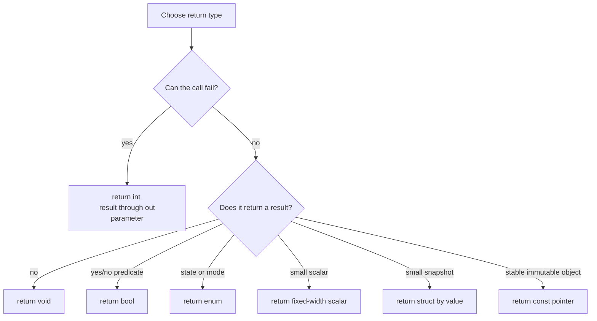
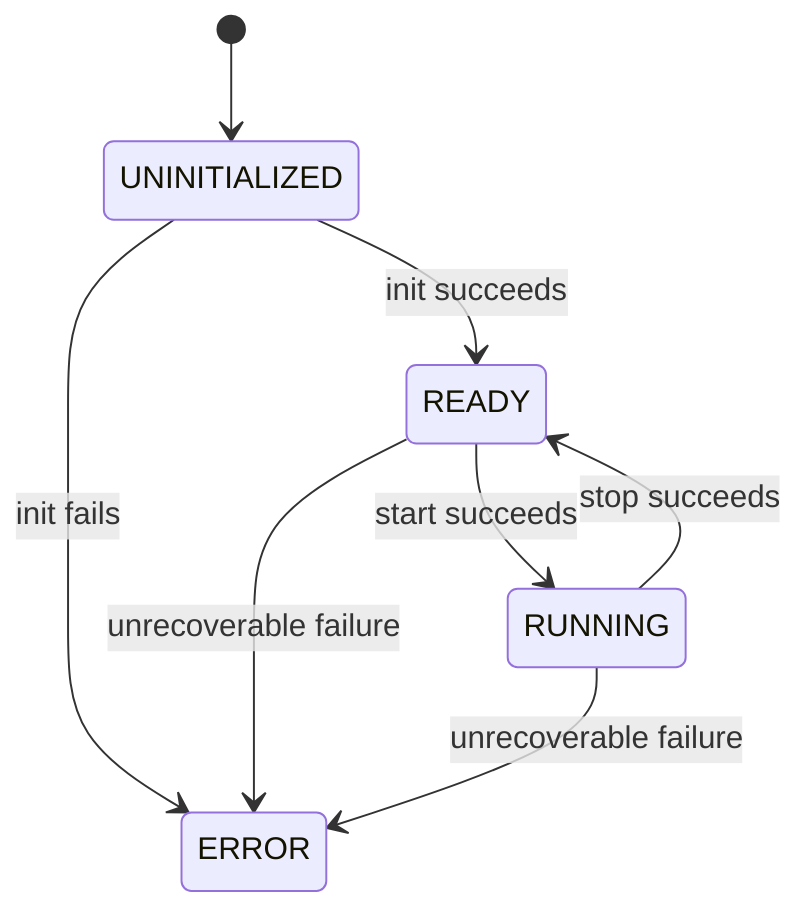

# Firmware implementation guide

[← Project README](README.md) · [Architecture](ARCHITECTURE.md) ·
[Public interfaces](include/spaghetti/README.md)

This guide defines how Spaghetti LAB firmware code is written. A task describes
**what** to implement; this guide defines **how** to express it consistently.
New code must follow these rules unless the task documents a concrete reason to
deviate.

The keywords **MUST**, **MUST NOT**, **SHOULD**, and **MAY** indicate mandatory,
forbidden, recommended, and optional rules.

## Implementation workflow

Follow this order for every task:

1. Read the whole task, its dependencies, and the component README.
2. Identify the component that owns the new state or resource.
3. Write down inputs, outputs, errors, ownership, and execution context.
4. Change the public contract only when another component needs it.
5. Add private types and helpers in the implementation file.
6. Implement the smallest complete behavior requested by the task.
7. Add or update Kconfig, Devicetree, and CMake only where required.
8. Test success, invalid input, boundary values, and rollback/error paths.
9. Run `./validator`; review every finding and correct it or document why the
   implementation needs an exception.
10. Build from a clean configuration when build metadata changed.
11. Review the completion checklist before committing.

For a non-trivial task, copy
[`change_contract.md.template`](templates/firmware/change_contract.md.template)
and answer it before writing the implementation. The answers determine the API
shape and execution mechanism; the algorithm remains the task-specific work.


Do not add functionality merely because it may be useful later. Do not mix
cleanup or unrelated refactoring into a focused task.

## Definition of done

A firmware change is complete only when:

- one component clearly owns every new mutable object;
- public functions document parameters, results, errors, and context;
- all buffers, queues, arrays, retries, and waits have explicit bounds;
- error paths leave the component in a documented state;
- ISR and timer callbacks perform only permitted bounded work;
- build configuration contains no unverified hardware assumptions;
- tests cover success and at least one realistic failure path;
- every pre-build validator finding has been corrected or consciously reviewed;
- the build succeeds without new warnings;
- documentation describes the behavior that now forms the contract.

## Project layout

Use this structure:

```text
include/spaghetti/<component>.h       public API needed by other components
subsys/<component>/<component>.c      component implementation and private state
subsys/<component>/CMakeLists.txt     sources owned by the component
subsys/<component>/Kconfig            optional compile-time choices
subsys/<component>/README.md          behavior and API contract
spaghetti_modules/<type>/             one concrete removable-module driver
boards/                               board DTS, overlays, and board metadata
dts/bindings/spaghetti/               Spaghetti-specific Devicetree schemas
tests/<component>/                     component tests and fakes
```

Rules:

- A public header MUST contain contracts, not mutable storage or implementation
  details.
- A helper used by one `.c` file MUST be `static` and remain in that file.
- A private type shared by several files of the same component MAY live in a
  private header inside that component directory. It MUST NOT be installed under
  `include/spaghetti/`.
- Board wiring belongs in Devicetree. Product choices belong in Config. Neither
  belongs as a conditional branch in a generic subsystem.
- Generated files under `build/` MUST NOT be edited or committed.

Copyable file skeletons are available in
[`templates/firmware/`](templates/firmware/README.md).

Use [`FILE_MAP.md`](FILE_MAP.md) to select the files that must be read before a
task. Use [`VALIDATOR.md`](VALIDATOR.md) when a validation finding needs
explanation or when adding a rule.

## Naming conventions

Use English for code, comments, logs, documentation, and commit messages.

| Item | Convention | Example |
|---|---|---|
| File or directory | lowercase `snake_case` | `module_manager.c` |
| Public function | `spaghetti_<component>_<verb>` | `spaghetti_port_get()` |
| Private function | concise `snake_case`, declared `static` | `validate_config()` |
| Public type | `struct spaghetti_<name>` or `enum spaghetti_<name>` | `struct spaghetti_sample` |
| Enum value | `SPAGHETTI_<TYPE>_<VALUE>` | `SPAGHETTI_CORE_READY` |
| Macro/constant | `SPAGHETTI_<COMPONENT>_<NAME>` | `SPAGHETTI_CONFIG_MAX_MODULES` |
| Kconfig symbol | `CONFIG_SPAGHETTI_<COMPONENT>_<NAME>` | `CONFIG_SPAGHETTI_RUNTIME_STACK_SIZE` |
| Devicetree compatible | lowercase vendor prefix | `spaghettilab,port` |
| Local variable | meaningful lowercase noun | `module_count` |
| Boolean | `is_`, `has_`, `can_`, or `should_` | `is_ready` |
| Count | `_count` | `module_count` |
| Byte size | `_size` | `payload_size` |
| String/array length | `_len` | `topic_len` |
| Capacity | `_capacity` or `_MAX_` | `queue_capacity` |
| Index | `_idx` | `port_idx` |
| Duration | unit suffix | `timeout_ms`, `period_us` |
| Callback | `_callback` or `_cb` | `storage_load_cb` |
| Work handler | `_work_handler` | `sample_work_handler` |
| Thread entry | `_thread_entry` | `runtime_thread_entry` |
| Lock/queue/work object | role suffix | `state_lock`, `command_queue`, `sample_work` |

Use a verb that describes the observable operation: `init`, `start`, `stop`,
`get`, `set`, `read`, `write`, `publish`, `configure`, `remove`, `validate`, or
`reset`. Avoid vague names such as `process`, `handle_data`, `do_work`, `manager`,
or abbreviations that are not domain terms.

## Formatting

- Follow Zephyr C style: tabs for indentation, spaces for alignment, and braces
  on the same line as function/control declarations.
- One indentation level is one tab displayed as eight columns. Do not replace
  indentation tabs with groups of spaces.
- Keep lines at or below 100 characters when practical.
- Use one declaration per line.
- Always use braces for `if`, `else`, `for`, `while`, `do`, and `switch` bodies,
  including a one-line body.
- Do not leave trailing whitespace.
- Use `/* ... */` comments in C. Use `//` only when a third-party or generated
  format requires it.
- Comments explain intent, constraints, ownership, or hardware reasoning. They
  MUST NOT restate an obvious statement.
- Use parentheses when operator precedence is not immediately obvious.
- Run the repository formatter when one is configured; do not manually reformat
  unrelated files.

### Spaces and line breaks

Use these forms consistently:

```c
if (is_ready && (module_count > 0U)) {
	err = spaghetti_module_read(module_id, &sample);
}

for (size_t idx = 0U; idx < ARRAY_SIZE(modules); ++idx) {
	modules[idx].is_active = false;
}
```

Rules:

- Put one space after `if`, `for`, `while`, and `switch`; do not put a space
  between a function name and `(`.
- Put spaces around binary and assignment operators. Do not put a space after
  unary `!`, `~`, `++`, `--`, `*`, or `&` operators.
- Write pointer declarations as `const struct device *device`, with `*` next to
  the variable name.
- Put one space after commas and no space before semicolons or commas.
- Put each function definition and each independent logical block one blank
  line apart.
- Do not put an empty line immediately after `{` or immediately before `}`.
- Do not use multiple consecutive blank lines.
- Break a long function call after `(` and align continuation lines with spaces;
  never use tabs solely to create visual alignment.
- End every text/source file with exactly one newline.
- A `case` is indented one tab inside its `switch`; its statements are indented
  one further tab.

### Canonical header order

Every public `.h` file uses this order:

1. SPDX/copyright notice after the project license is selected.
2. Doxygen `@file` block.
3. Include guard.
4. Required C standard headers.
5. Required Zephyr headers.
6. `extern "C"` guard when the API may be included by C++.
7. Doxygen group opening.
8. Public macros and constants.
9. Public enum, typedef, struct, and opaque declarations.
10. Callback typedefs and public function prototypes.
11. Doxygen group closing, C++ closing, and include-guard closing.

Separate header groups with one blank line. Do not include a header merely to
obtain a transitive type from another header.

### Canonical source order

Every `.c` file uses this order:

1. SPDX/copyright notice.
2. Its own public header, if it implements one.
3. C standard headers.
4. Zephyr headers.
5. Other project public headers, then a local private header.
6. `LOG_MODULE_REGISTER()` or `LOG_MODULE_DECLARE()`.
7. File-private macros/constants.
8. Private enum/struct/typedef declarations.
9. Static storage and Zephyr kernel objects.
10. Necessary private `static` prototypes.
11. Private helper/callback/thread-entry definitions.
12. Public function definitions in the same order as the header.

Prefer defining a private helper before its first use. Add a `static` prototype
only when dependency order or mutually recursive helpers makes it necessary.
Never repeat public prototypes manually in a `.c` file; include the public
header so the compiler checks declaration/definition consistency.

## Public headers

A public header MUST:

- have an include guard;
- include every standard/Zephyr type it directly uses;
- compile without relying on include order;
- expose the smallest useful contract;
- avoid writable global variables;
- avoid board-specific controller names and pins;
- document every public function, type, enum value, field, macro, and global
  symbol;
- place public symbols in a component Doxygen group.

### Doxygen location

- Public Doxygen documentation exists **only in the public `.h` file**, next to
  the declaration it documents.
- A `.c` function definition MUST NOT repeat the Doxygen block from its header.
  Duplicated documentation inevitably diverges.
- A `.c` file uses ordinary `/* ... */` comments only for implementation
  reasoning, invariants, workarounds, register details, or non-obvious private
  algorithms.
- A private header uses ordinary comments because it is not part of the public
  API reference.
- Every public header starts with an `@file` block and every public symbol is in
  the component Doxygen group.

```c
/**
 * @file
 * @brief Public contract for the Example component.
 * @ingroup spaghetti_example
 */
```

Use project-qualified includes from implementation files:

```c
#include <spaghetti/core.h>
```

Use this include-guard form:

```c
#ifndef SPAGHETTI_CORE_H
#define SPAGHETTI_CORE_H

/* Declarations. */

#endif /* SPAGHETTI_CORE_H */
```

Do not add an Apache SPDX identifier to original Spaghetti LAB code merely
because Zephyr uses Apache-2.0. When the project selects a license, every new
source file MUST use that project's SPDX identifier. Copied or modified
third-party code retains its applicable license and attribution.

### Function prototypes

- Declare a function in `include/spaghetti/<component>.h` only when code outside
  the owner component is allowed to call it.
- Declare a function in a local private header only when sibling `.c` files of
  the same component call it.
- Otherwise define it as `static` in the owning `.c` file.
- Write `(void)` for a function with no parameters; `function()` is not an
  explicit no-argument C prototype.
- Include parameter names in prototypes and keep them identical to the
  definition and Doxygen `@param` entries.
- Do not write redundant `extern` on ordinary function declarations.
- Do not put ordinary function implementations in headers. A `static inline`
  implementation is allowed only for a small, measured helper that requires
  header visibility; it still needs a documented contract when public.
- Callback typedef names end in `_callback_t` or `_cb_t` and state callback
  context, allowed operations, ownership, and lifetime.

## Function documentation

Public functions MUST use this Doxygen-compatible form. Copy it and remove
sections that truly do not apply:

```c
/**
 * @brief Perform one bounded component operation.
 *
 * Explain the observable behavior, important preconditions, and what changes
 * only when the operation succeeds.
 *
 * @param[in] config Caller-owned configuration. Valid for the duration of the
 *                   call and copied if it must be retained.
 * @param[out] result Caller-owned destination. Written only on success.
 *
 * @retval 0 Operation completed successfully.
 * @retval -EINVAL A pointer, size, enum value, or field is invalid.
 * @retval -ENODEV A required device is unavailable.
 * ...
 * @retval -EBUSY The owned resource cannot accept the operation now.
 *
 * @note Call from thread context. This function may block for at most
 *       @p timeout.
 */
int spaghetti_example_run(const struct spaghetti_example_config *config,
                          struct spaghetti_example_result *result,
                          k_timeout_t timeout);
```

The comment lines start with `* @brief`, not `- @brief`. Hyphens shown by a
Markdown list are not part of a C documentation comment.

Documentation rules:

- `@brief` uses an imperative verb and states what the caller obtains, not how
  the implementation works: “Get the state,” not “Gets the state.”
- Every parameter uses `@param[in]`, `@param[out]`, or `@param[in,out]`.
- State whether a pointer is borrowed, copied, retained, optional, or nullable.
- Use `@retval` for each expected result. Do not write “returns error on failure.”
- State the allowed execution context: thread, ISR-safe, callback, or boot only.
- State whether the call can sleep, wait, allocate, access a bus, or invoke a
  callback.
- Document units and bounds next to numeric parameters.
- Document concurrency requirements and what happens to output on failure.
- Public enum values and struct fields document meaning, range, units,
  representation, ownership, and lifetime wherever applicable.

Private functions need an ordinary `/* ... */` comment only when their contract,
algorithm, or constraint is not clear from the signature and name.

## Preprocessor and constants

Place a definition where its consumers require it:

| Definition | Location |
|---|---|
| Public capacity, flag, or compile-time helper | Public `.h` |
| Constant used by one implementation file | Private `#define`, `enum`, or `static const` in `.c` |
| Constant shared only inside one component | Private component header |
| User-selectable build option | `Kconfig`, consumed as `CONFIG_...` |
| Physical hardware value | Devicetree, never a C `#define` |

Rules:

- Names MUST use the project/component prefix; never introduce generic macros
  such as `MAX`, `TIMEOUT`, `BUFFER_SIZE`, or `DEBUG`.
- Use `U`, `UL`, or fixed-width constant helpers when signedness/width matters.
- Use `BIT(n)`, `GENMASK()`, `ARRAY_SIZE()`, `MIN()`, and `MAX()` from Zephyr
  instead of local replacements.
- Prefer an enum for related named integral values and `static const` for typed
  private data. Use a macro when the value must be a preprocessor/build-time
  expression or controls array/object declaration.
- Function-like macros MUST parenthesize every parameter and the complete
  expression. Prefer a `static inline` function when types and single evaluation
  matter.
- A macro parameter MUST be evaluated exactly once unless the name and comment
  explicitly state otherwise.
- Never hide control flow, allocation, locking, or a return statement inside an
  innocent-looking macro.
- `#if` blocks select genuine compile-time implementations. They MUST NOT replace
  runtime product configuration or board abstraction.

```c
#define SPAGHETTI_EXAMPLE_MAX_ITEMS 8U
#define SPAGHETTI_EXAMPLE_VALUE_TO_MILLI(value) ((int32_t)(value) * 1000)

static const k_timeout_t backend_timeout = K_MSEC(100);
```

## Variables and scope

- Declare a variable in the narrowest block that needs it, close to its first
  use, and initialize it at declaration whenever the correct value is known.
- Use `const` for locals, parameters, pointers, and tables that are not modified.
- Do not reuse one variable for unrelated meanings merely to reduce declarations.
- Do not shadow a global, parameter, or outer local variable.
- Use fixed-width integer types for hardware, persisted, wire, and explicitly
  sized values; use `size_t` for memory sizes and array lengths.
- Initialize structures with designated initializers. Zero initialization is
  acceptable only when zero is valid for every relevant field.
- Never use variable-length arrays. Stack arrays MUST have a small reviewed
  compile-time bound.
- Large buffers, thread stacks, queues, and persistent contexts MUST NOT be
  automatic local variables; place them in component-owned static storage or an
  appropriate fixed pool.
- A local variable is preferred whenever state does not need to survive the
  call. Static storage is justified only by lifetime, sharing, kernel-object, or
  memory-placement requirements.

### Global and file-static variables

Writable global variables visible outside a `.c` file are forbidden by default.

Allowed file-static storage includes:

- the single private context owned by a component;
- immutable `static const` descriptor tables;
- Zephyr objects declared with `K_MUTEX_DEFINE`, `K_MSGQ_DEFINE`,
  `K_THREAD_STACK_DEFINE`, or equivalent;
- bounded private pools whose owner is the current component.

Prefer one private context struct over many unrelated file-static variables:

```c
struct example_context {
	struct k_mutex lock;
	enum spaghetti_example_state state;
	struct spaghetti_example_config config;
};

static struct example_context context;
```

Do not place `extern` declarations for mutable state in a public or private
header. Other files interact with the owner through functions, messages, or
documented immutable descriptors.

## Sharing data between files and components

Choose by relationship:

| Need | Required pattern |
|---|---|
| Caller needs an immediate answer | Public function returning a value/error |
| Caller needs owned state | Getter copies a snapshot into caller storage |
| Another component requests a change | Setter/command function on the owner |
| Sibling `.c` files share private types/helpers | Local private header, no mutable storage |
| One producer sends ordered work | Bounded queue containing copied values |
| One value reaches independent consumers | zbus/publication with copied message |
| Asynchronous completion returns to caller | Callback plus context, with documented lifetime |
| Long-lived object must be referenced | Stable ID or opaque handle owned by one component |
| Truly immutable shared table | `extern const` declaration with one definition, or accessor |

Rules:

- Never share data by including a `.c` file.
- Never return a writable pointer to private component state.
- Never put a definition such as `struct object state;` in a header; that creates
  multiple definitions or uncontrolled ownership. A header declares types and
  functions, not storage.
- A snapshot getter locks/copies/unlocks and returns caller-owned data.
- Queue and zbus payloads contain values or stable IDs, not pointers to stack
  variables.
- A callback receives an explicit `void *user_data` context when it needs caller
  state. Document who owns it, how long it remains valid, and the callback's
  execution context.
- Cross-component communication uses public contracts under
  `include/spaghetti/`; a component MUST NOT include another component's private
  header.
- If two components need mutual access to each other's internals, the ownership
  boundary is wrong and must be redesigned.

## Designing a function signature

Design the contract before the body. Answer these questions in order:

1. Which component owns the operation and the state it changes?
2. Is the operation synchronous, asynchronous, or a pure query?
3. Can it fail? If yes, which negative errno values can the caller handle?
4. What exact value must the caller receive, and only after which success point?
5. Which inputs are small values and which are borrowed objects/buffers?
6. Does any input need to survive the call? If yes, who copies or owns it?
7. Can the call block, and what is its maximum timeout?
8. Which context may call it: boot thread, normal thread, workqueue, callback, or ISR?
9. Is it thread-safe, serialized, reentrant, or restricted to one owner thread?

If one answer is unknown, the function contract is not ready to implement.

### Choosing the return type

| Return type | Use it when | Do not use it when |
|---|---|---|
| `int` | The operation can fail: `0` success, negative errno failure | A positive domain value must also be returned directly |
| `void` | No result and no meaningful failure exists, or Zephyr fixes the callback signature | An operation can fail or the caller must know completion status |
| `bool` | A pure, infallible yes/no predicate | “False” could also mean unavailable, invalid, or I/O failure |
| `enum spaghetti_*` | An infallible state/mode snapshot has a valid value in every lifecycle state | Reading the value itself can fail |
| Fixed-width scalar | A small infallible value has no sentinel/error ambiguity | A valid value could be confused with an error sentinel |
| `size_t` | An infallible count/length is returned | The operation can fail; use `int` plus `size_t *out` |
| `const struct *` | Returning a stable immutable descriptor with documented lifetime; `NULL` means one unambiguous result | Returning mutable/private state or storage that can move/disappear |
| Struct by value | A deliberately small, infallible snapshot | Copy is large, ABI stability matters, or the query can fail |



Project default: an operation that can fail returns `int` and writes the domain
result through an output parameter only on success.

```c
int spaghetti_module_read(spaghetti_module_id_t id,
			  struct spaghetti_sample *out);
```

Do not return `-1`, `UINT32_MAX`, an empty string, or `NULL` as an undocumented
generic failure sentinel. Do not combine a byte count and negative errors in one
signed return type unless an existing Zephyr API requires that exact convention.

### Common function shapes

Use these shapes as defaults:

```c
/* Lifecycle operation that can fail. */
int spaghetti_example_init(const struct spaghetti_example_config *config);

/* Infallible state snapshot. */
enum spaghetti_example_state spaghetti_example_get_state(void);

/* Fallible query with output written only on success. */
int spaghetti_example_get_status(struct spaghetti_example_status *out);

/* Pure predicate that cannot fail. */
bool spaghetti_example_is_ready(void);

/* Bounded input buffer borrowed only for the call. */
int spaghetti_example_decode(const uint8_t *data, size_t data_size,
			     struct spaghetti_example_message *out);

/* Bounded output buffer with explicit capacity and produced length. */
int spaghetti_example_encode(const struct spaghetti_example_message *message,
			     uint8_t *buffer, size_t buffer_capacity,
			     size_t *written_size);

/* Bounded wait expressed in native Zephyr form. */
int spaghetti_example_submit(const struct spaghetti_example_command *command,
			     k_timeout_t timeout);
```

An `init()` function receives complete configuration, validates it, copies any
retained values, acquires resources, and returns `0` only when the component's
documented ready state is committed. A `get()` function never transfers writable
ownership accidentally. A `set()` or `command()` function validates the complete
request before changing hardware or state.

### Function parameters

Order parameters consistently:

1. object/instance/ID being operated on;
2. required input values and read-only objects;
3. buffer pointer immediately followed by its size/capacity;
4. output parameters;
5. timeout;
6. callback and callback context.

Keep related parameters together. If a function needs more than about five
domain parameters, create a request/config struct rather than a long positional
list. Do not create a struct merely to hide one or two obvious scalar inputs.

Every pointer parameter must answer all of these in its Doxygen entry:

- may it be `NULL`?
- is it input, output, or both?
- who owns the pointed object?
- how long must it remain valid?
- is it copied or retained?
- what alignment, size, capacity, and termination are required?
- may the function modify it, and when?

### `const`, `volatile`, and atomic data

Use qualifiers by meaning:

| Form | Meaning |
|---|---|
| `const struct config *config` | Function cannot modify the caller's object through this pointer |
| `struct result *out` | Function writes caller-owned output according to the contract |
| `const uint8_t *data` | Read-only byte range; pair with `size_t data_size` |
| `const char *text` | Read-only NUL-terminated text only when termination is guaranteed |
| `void *user_data` | Opaque callback context; lifetime must be documented |
| `const void *data` | Untyped read-only bytes only when a typed interface is impossible; pair with size/type metadata |

`const` does not make shared data thread-safe. It only prevents mutation through
that access path. Never cast away `const` or `volatile`.

Use `volatile` only for semantics that explicitly require compiler-visible
access, such as memory-mapped hardware through an appropriate Zephyr API. It is
not synchronization and does not make a variable atomic. Use Zephyr atomics,
locks, queues, or one owning thread for concurrency.

Use `atomic_t` only for simple independently valid atomic state/counters. If
several fields must be coherent together, protect a struct with one owner or
lock instead of composing unrelated atomics.

### Pointer rules

- Validate required pointers against `NULL` at the public boundary.
- Use `NULL`, never integer zero, as a null pointer constant.
- Do not retain a caller pointer unless the API explicitly transfers or extends
  ownership and lifetime.
- Never retain a pointer to a local/stack object after its function returns.
- Avoid more than two pointer-indirection levels. A pointer-to-pointer requires a
  clear ownership-transfer or iterator reason.
- Pointer arithmetic is allowed only within one validated array/object.
- Do not compare unrelated pointers with ordering operators.
- Do not use `void *` to avoid defining a real type.
- An opaque public object is forward-declared in the header and manipulated only
  through owner functions; callers never access its fields.

### Arrays and strings in signatures

An array parameter decays to a pointer, so public APIs use an explicit pointer
and element count:

```c
int spaghetti_example_apply(const struct spaghetti_rule *rules,
			    size_t rule_count);
```

Do not write array parameters with `static` inside brackets, such as
`rules[static 4]`. Do not use `sizeof(parameter)` to infer the number of elements
after an array has decayed to a pointer.

For text, choose one representation and document it:

- `const char *text` for trusted NUL-terminated text whose lifetime is bounded by
  the call;
- `const char *text, size_t text_len` for external or possibly unterminated text;
- fixed `char value[CAPACITY]` inside an owned struct when a bounded copy must be
  retained.

`text_len` counts content bytes and excludes a terminator unless documented
otherwise. `buffer_capacity` describes all writable bytes including space for a
terminator. Validate encoding separately when UTF-8 or protocol restrictions
matter.

### Callback signatures

Use a typed callback plus explicit caller context:

```c
typedef void (*spaghetti_example_callback_t)(
	const struct spaghetti_example_event *event,
	void *user_data);
```

A callback returning `void` reports an event the producer cannot retry based on
the callback result. Use `int` only when the invoker has a defined policy for
each callback failure. Document whether callbacks run synchronously, from a
worker thread, workqueue, timer, or ISR; whether they may block; and whether they
may call back into the component.

### Timeout and time parameters

- Use `k_timeout_t` when the value controls waiting in a Zephyr API. Accept or
  reject `K_NO_WAIT` and `K_FOREVER` explicitly in the contract.
- Use a fixed-width integer with a unit suffix (`period_ms`, `timeout_us`) for
  persisted, network, or runtime configuration.
- Use `int64_t` for values derived from `k_uptime_get()` and suffix them `_ms`.
- Do not pass raw Zephyr ticks across component APIs unless tick representation
  is the actual contract.
- Use wrap-safe Zephyr time helpers rather than open-coded timestamp arithmetic.

## Choosing types

### Integer and scalar types

Use a type based on the domain, not on the current MCU register width:

| Type | Use |
|---|---|
| `int` | Function success/error convention and APIs that explicitly require native `int` |
| `bool` | Infallible logical state with exactly `true` or `false` |
| `uint8_t` | Raw byte, 8-bit register/field, encoded unsigned value |
| `int8_t` | Explicit signed 8-bit encoded/register value; rarely general arithmetic |
| `uint16_t` / `int16_t` | Explicit 16-bit protocol, register, storage, or bounded domain |
| `uint32_t` | IDs, flags, counters, sequence numbers, or explicit 32-bit encoding |
| `int32_t` | Signed fixed-point measurements and explicit 32-bit domains |
| `uint64_t` / `int64_t` | Large counters, timestamps, or explicit 64-bit encoding |
| `size_t` | Object size, byte count, array length, capacity, or index |
| `ptrdiff_t` | Difference between pointers into the same array, when genuinely required |
| `uintptr_t` / `intptr_t` | Low-level pointer-sized integer conversion required by an API; never ordinary object ownership |
| `char` | Text character/storage, not an implicitly signed numeric byte |
| `float` / `double` | Only when range/precision and FPU cost are explicitly justified |

There is no project type named plain `uint`. Use the explicit standard type
(`uint8_t`, `uint16_t`, `uint32_t`, or `uint64_t`) required by the domain.

Rules:

- Use `int` for errno-compatible return values even on a 32-bit target; use an
  output parameter for the domain result.
- Do not use unsigned types merely because a value “cannot be negative.” Use
  unsigned when modulo/bit/encoded semantics or required non-negative range are
  real parts of the contract.
- Avoid mixing signed and unsigned arithmetic/comparisons. Validate first, then
  convert explicitly to a type that can represent the full value.
- Check bounds before narrowing. A cast does not validate a value.
- Add `U` to unsigned integer literals (`0U`, `1000U`). Never use lowercase `l`
  as a literal suffix.
- Check addition, multiplication, shifts, and unit conversions for overflow.
- Signed overflow is invalid; unsigned wraparound is allowed only when the
  algorithm and contract deliberately require modulo arithmetic.
- Shift counts must be smaller than the bit width of the left operand.
- Do not rely on the signedness of plain `char`.
- Avoid `short`, `long`, `long long`, and plain `unsigned` in public data
  contracts; their widths are less explicit than fixed-width alternatives.
- For measurements, prefer named fixed-point units such as
  `temperature_millicelsius` over undocumented raw integers.
- Floating point requires a documented precision/error budget and confirmation
  of Zephyr/FPU configuration, stack/context cost, serialization, and test
  tolerances. Prefer integer fixed-point when it satisfies the range.

Create a project typedef only when it adds domain meaning, not merely an alias:

```c
typedef uint16_t spaghetti_port_id_t;
typedef uint32_t spaghetti_module_id_t;
```

The typedef's invalid/sentinel values and serialized representation must be
documented. Do not create aliases such as `typedef uint32_t spaghetti_uint32_t`.

### Enum

Use an `enum` for a small, closed set of named states, commands, or modes:

```c
enum spaghetti_module_state {
	SPAGHETTI_MODULE_UNINITIALIZED,
	SPAGHETTI_MODULE_READY,
	SPAGHETTI_MODULE_ERROR,
};
```

Rules:

- Enum constants MUST share the type prefix.
- Every external enum input MUST be validated; C permits values not listed in
  the declaration.
- Use a terminal `_COUNT` value only for internal iteration/table sizing. It is
  not a valid runtime value.
- Do not store a C enum directly in persistent or network formats because its
  representation is compiler-dependent. Encode an explicit-width integer and
  validate it when decoding.
- Use bit flags, not an enum, when values can be combined.

### Bit flags

Use `BIT(n)` with an explicitly sized storage type:

```c
enum spaghetti_port_capability {
	SPAGHETTI_PORT_CAP_I2C = BIT(0),
	SPAGHETTI_PORT_CAP_SPI = BIT(1),
	SPAGHETTI_PORT_CAP_GPIO = BIT(2),
};

typedef uint32_t spaghetti_port_capabilities_t;
```

Validate unknown bits before accepting external input.

### Struct

Use a `struct` when values form one coherent object, configuration, request,
result, snapshot, or private context.

```c
struct spaghetti_sample {
	spaghetti_module_id_t source;
	int32_t value_milliunits;
	int64_t uptime_ms;
	uint32_t sequence;
};
```

Rules:

- Name fields by meaning and include units in the name.
- Do not use anonymous ownership: document which component may modify it.
- Do not expose private mutexes, Zephyr device pointers, or driver state in a
  public struct unless they are part of the intentional API.
- Use a tagged union when one object can contain one of several payload types;
  validate the tag before accessing the union member.
- Do not use C bit-fields for registers, persistent data, or wire formats because
  allocation order and layout are implementation-defined. Use explicit masks and
  shifts on a fixed-width integer.
- For persisted/wire data, define a versioned encoding. Do not serialize a C
  struct with `memcpy`: padding, endianness, enum size, and ABI may change.

### Scalar and pointer parameters

Use this decision table:

| Value | Pass as | Rule |
|---|---|---|
| ID, enum, boolean, small integer | By value | Validate its range |
| Read-only struct/config | `const struct ... *` | Borrow during call; copy if retained |
| Output object | `struct ... *out` | Validate non-NULL; write only on success |
| Optional output | Nullable pointer | Explicitly document NULL behavior |
| Byte/string/array input | Pointer plus `size_t` | Never infer capacity from the pointer |
| Callback | Function pointer plus context pointer | Document callback context and lifetime |
| Long-lived object | Stable ID or owned object | Avoid returning writable internal pointers |

Do not use a pointer when a small value communicates ownership more clearly. Do
not pass a large struct by value unless copying is deliberate and measured.

## Static and dynamic data

Prefer static allocation because firmware memory must remain bounded and
observable at build time.

Use:

- `static` for file-private functions and storage;
- `const` for immutable descriptors and borrowed read-only input;
- fixed pools for a bounded number of runtime instances;
- fixed arrays or Zephyr slabs for same-sized bounded objects;
- stack-local variables for small temporary state with a known maximum size.

Dynamic allocation (`k_malloc`, `malloc`) MUST NOT be the default. It MAY be used
only when the task documents:

- why a static bound is impractical;
- which component owns and frees the allocation;
- the maximum total allocation;
- behavior on allocation failure;
- fragmentation and long-running behavior;
- why allocation never occurs in an ISR.

Configuration passed at initialization is usually dynamic **in value**, but not
dynamic **in memory**: validate it and copy it into component-owned bounded
storage. Compile-time hardware facts instead belong in `const` tables generated
from Devicetree.

## Arrays, buffers, and strings

- Every array MUST have a compile-time capacity or an accompanying runtime
  length.
- Use `ARRAY_SIZE(array)` instead of repeating an element count.
- Use `sizeof(array)` only when the expression is truly an array, not a pointer.
- Capacity means allocated elements/bytes; length means currently valid content.
- Check `index < count` before access.
- Check addition/multiplication for overflow before calculating byte sizes from
  external input.
- Use `BUILD_ASSERT()` for relationships known at build time.
- Use fixed-capacity strings with guaranteed NUL termination, or pointer/length
  pairs for byte-oriented protocols.
- Never use unbounded `strcpy`, `strcat`, `sprintf`, or `scanf("%s", ...)`.
- Treat truncation as an explicit result; do not silently accept it.
- Queue and message element types SHOULD be values without borrowed pointers.

```c
#define SPAGHETTI_NAME_MAX_LEN 32U

struct spaghetti_name {
	char value[SPAGHETTI_NAME_MAX_LEN];
	size_t len;
};

BUILD_ASSERT(SPAGHETTI_NAME_MAX_LEN > 1U);
```

## Return values and errors

Functions that can fail return `int`:

- `0` means success;
- a negative errno-compatible value describes failure;
- positive values MUST NOT encode failure.

Use consistent errors:

| Error | Meaning |
|---|---|
| `-EINVAL` | Invalid pointer, size, field, enum, or combination |
| `-ENODEV` | Required hardware/device is unavailable |
| `-ENOENT` | Requested ID, key, or instance does not exist |
| `-ENOTSUP` | Valid operation unsupported by this implementation |
| `-EBUSY` | Resource is temporarily owned or cannot transition |
| `-EALREADY` | Requested transition is already complete |
| `-ENOMEM` | Bounded pool/allocation has no capacity |
| `-EIO` | Hardware/backend operation failed without a better code |
| `-ETIMEDOUT` | Explicit deadline expired |

Rules:

- Validate public inputs before changing state.
- Preserve a meaningful dependency error rather than replacing it with `-EIO`.
- Commit state only after all fallible steps succeed, or implement explicit
  rollback.
- Output parameters remain unchanged on failure unless documented otherwise.
- Log an error once at the boundary that can add useful context. Lower helpers
  return errors rather than logging the same failure repeatedly.
- Assertions detect programmer invariants. They MUST NOT replace validation of
  external, persisted, hardware, or runtime input.

## State and ownership

Every mutable object has exactly one owner. The owner:

- creates and destroys it;
- validates state transitions;
- chooses the lock or serialization mechanism;
- returns snapshots or stable IDs rather than writable internal pointers.

Represent non-trivial lifecycle explicitly:



For each transition define:

- allowed source states;
- validation performed before mutation;
- operations that may fail;
- final state after success;
- final state after failure;
- whether the transition is idempotent.

## Concurrency and synchronization

Choose the simplest mechanism that matches the behavior:

| Need | Mechanism |
|---|---|
| Immediate result in the same context | Direct function call |
| Protect short mutable state in threads | `k_mutex` |
| Protect tiny state shared with ISR | atomic operation or `k_spinlock` |
| Signal one event to a worker | `k_sem` or `k_work` |
| Ordered bounded commands | `k_msgq` |
| Fixed-size object allocation | `k_mem_slab` |
| One value to independent consumers | zbus/pub-sub |

Rules:

- Document which state each lock protects.
- Acquire locks in one documented global order.
- Do not hold a lock while calling unknown callbacks or performing a long bus,
  flash, or network operation unless ownership requires it and the bound is
  documented.
- Do not use a mutex from ISR context.
- A queue full condition MUST have a policy: reject, drop newest, drop oldest,
  coalesce, or wait for a bounded timeout.
- `K_FOREVER` requires an owned shutdown/wakeup design and explicit justification.
- Prefer copying small messages into queues over transferring borrowed pointers.
  For a measured large payload, use a bounded slab/pool and transfer exclusive
  ownership of its pointer or stable ID: the sender stops accessing it after
  enqueue, the receiver releases it, and a stack pointer is never transferred.

## ISR and timer rules

An ISR or `k_timer` expiry callback MUST do only short, non-blocking work:

- capture minimal status;
- update an atomic counter;
- give a semaphore;
- submit work;
- enqueue with `K_NO_WAIT` when the full policy is defined.

It MUST NOT:

- sleep or wait;
- take a mutex;
- allocate memory;
- perform flash, filesystem, network, or blocking bus I/O;
- parse a complex protocol;
- invoke product logic.

Move that work to thread context.

## When to create a thread

Create a dedicated thread only when a component owns at least one of these:

- a blocking state machine;
- a long-lived connection or socket poll loop;
- ordered work that must not delay the system workqueue;
- independent timing/deadline behavior;
- a resource that must be serialized by one execution owner.

Otherwise use a direct call, `k_work`, or an existing owner thread.

Every thread MUST define:

- one owner component and one entry function;
- stack size and priority through Kconfig;
- its input mechanism and bounded capacity;
- blocking points and maximum waits;
- start/stop semantics;
- behavior when input is malformed or the queue is full;
- a watchdog/health signal when required by the product.

Priority numbers are not guessed in source code. Lower Zephyr priority numbers
run at higher priority; negative values are cooperative. Project threads SHOULD
be preemptive unless a measured requirement proves otherwise. Compare each new
thread with existing timing requirements before selecting its default.

Use [`templates/firmware/thread_component.c.template`](templates/firmware/thread_component.c.template)
as the starting point.

## Logging

Use Zephyr Logging in every component. Reserve `printk()` for the earliest
bootstrap or an explicitly tiny baseline before logging is available.

One and only one `.c` file registers a component log module:

```c
#include <zephyr/logging/log.h>

LOG_MODULE_REGISTER(spaghetti_example, CONFIG_SPAGHETTI_EXAMPLE_LOG_LEVEL);
```

Every additional `.c` file belonging to the same component declares it:

```c
#include <zephyr/logging/log.h>

LOG_MODULE_DECLARE(spaghetti_example, CONFIG_SPAGHETTI_EXAMPLE_LOG_LEVEL);
```

Do not register the same name in two files. Headers SHOULD NOT log. If a
necessary `static inline` public function logs, put `LOG_MODULE_DECLARE()` inside
that function as required by Zephyr.

Choose levels by meaning:

| Level | Use |
|---|---|
| `LOG_ERR` | Operation failed and the requested result was not produced |
| `LOG_WRN` | Invalid input was rejected, recovery occurred, or service is degraded |
| `LOG_INF` | Low-frequency lifecycle/configuration milestones useful in normal operation |
| `LOG_DBG` | Developer detail disabled from normal production output |

Logs follow these rules:

- Add context unavailable in the returned error: operation, stable Port/module
  ID, state, and errno value.
- Do not log the same error in every layer. The layer that can add useful context
  logs it; lower helpers return the original error.
- Do not append `\n`; the logging backend owns line termination and formatting.
- Do not prefix text with the module name; Zephyr already records the source.
- Never log credentials, tokens, private keys, certificates, personal data, or
  untrusted buffers as C strings.
- Use bounded `LOG_HEXDUMP_DBG()` only for non-sensitive protocol data.
- Use rate-limited logging macros for repeated faults or high-frequency paths.
- Avoid logs in ISR and timer callbacks. If one is essential, keep it constant,
  bounded, and rate limited.
- Do not use logs as control flow, persistent state, or the only error report.
- Log levels and optional diagnostics MUST be configurable through Kconfig.

```c
err = backend_init(port_id);
if (err < 0) {
	LOG_ERR("init failed: port=%u err=%d", port_id, err);
	return err;
}

LOG_INF("ready: port=%u", port_id);
```

## Devicetree, Kconfig, and runtime Config

Use the right configuration owner:

| Information | Owner | Example |
|---|---|---|
| Physical wiring and fixed hardware | Devicetree | Port 0 uses `i2c0` |
| Compile-time feature/resource bound | Kconfig | Runtime stack size |
| Product/user choice at runtime | Config subsystem | Sample period |

Rules:

- Devicetree values MUST come from a schematic, datasheet, or verified board
  definition. Never invent pins, addresses, flash offsets, or polarities.
- A custom Devicetree property requires a binding with type, meaning, and
  required/optional status.
- Code uses generated Devicetree macros and readiness checks; it does not parse
  `.dts` text.
- Kconfig symbols use defaults that are safe, bounded, and explained in help.
- Use `depends on` for prerequisites and `select` only when its consequences are
  fully understood.
- Runtime Config is validated as a complete candidate before it changes live
  state.

Devicetree formatting:

- indent blocks with tabs displayed as eight columns;
- use dashes in node/property names and underscores only in node labels;
- put one space on each side of `=`;
- do not leave an empty line immediately before a dedenting `};`;
- use spaces only to align wrapped values after their tab indentation;
- indent binding YAML with spaces, never tabs.

Kconfig formatting:

- indent entries with tabs;
- indent help text with one tab followed by two spaces;
- write comments as `# Comment`, not `#Comment`;
- keep one blank line between option declarations;
- prefix project symbols with `SPAGHETTI_<COMPONENT>_`;
- in `.conf` fragments, write `CONFIG_NAME=value` without spaces around `=`.

## CMake rules

- Use lowercase CMake commands with no space before `(`.
- Indent CMake with two spaces per level; never use tabs.
- Put source-file arguments on separate lines when a command contains several.
- Quote string/path variables that may contain spaces; do not quote boolean
  constants such as `ON` and `OFF`.
- The root `CMakeLists.txt` identifies the application and adds component
  directories.
- Each component lists only its owned source files.
- Compile optional sources with Kconfig-aware helpers such as
  `zephyr_library_sources_ifdef()`.
- Do not add generated build paths or host-specific absolute paths.
- Adding a `.c` file is incomplete until CMake compiles it in the intended
  configuration.

## Function implementation pattern

Use this sequence for public mutating functions:

1. Validate pointers, lengths, enums, ranges, and state.
2. Copy or normalize caller input when required.
3. Acquire the owner synchronization primitive.
4. Revalidate state that could have changed before the lock.
5. Perform fallible operations without exposing partial success.
6. Commit owner state.
7. Release resources in reverse order.
8. Return the original meaningful result.

Use a single cleanup path when several acquired resources must be released:

```c
int spaghetti_example_start(void)
{
	int err;

	err = acquire_first();
	if (err < 0) {
		return err;
	}

	err = acquire_second();
	if (err < 0) {
		goto release_first;
	}

	return 0;

release_first:
	release_first_resource();
	return err;
}
```

Do not use `goto` for ordinary branching; use it for clear, centralized cleanup.

## Testing rules

For every public operation, consider:

- normal success;
- NULL pointer;
- zero, maximum, and one-past-maximum length/index;
- invalid enum and unknown flag bits;
- wrong lifecycle state;
- dependency failure;
- timeout or full queue;
- repeated call/idempotency;
- rollback after a partial dependency sequence;
- concurrency when the API permits multiple callers.

Hardware-independent logic SHOULD use fakes and Zephyr `ztest`. Hardware tests
MUST record the exact board, wiring, firmware build, stimulus, and observed
result.

## Quick best-practice reference

| Do | Do not |
|---|---|
| Keep the public contract in `.h` and implementation in `.c` | Repeat Doxygen on both declaration and definition |
| Keep mutable state behind one owning component | Expose `extern` writable globals |
| Copy snapshots and queue messages | Share pointers to stack or private state |
| Use a private header only between sibling source files | Include another component's private header |
| Use `static` for file-private helpers and storage | Export a symbol “just in case” |
| Use named bounds and `ARRAY_SIZE()` | Use magic sizes or variable-length arrays |
| Return precise negative errno values | Return `-1`, swallow errors, or rely only on logs |
| Register one Zephyr log module per component | Use `printk()` throughout the firmware |
| Keep ISR/timer work short and defer processing | Sleep, lock a mutex, or perform bus I/O in callbacks |
| Pass small scalars by value and structs by `const` pointer | Pass writable pointers without ownership rules |
| Put hardware facts in Devicetree | Hardcode pins/controllers in generic C code |
| Make queue capacity and timeout behavior explicit | Wait forever or silently drop data |

## Review checklist

Before committing, answer **yes** to each applicable question:

### Contract

- [ ] Is the owner of every new object obvious?
- [ ] Are inputs, outputs, units, ranges, and pointer lifetimes documented?
- [ ] Are expected errno values documented?
- [ ] Is execution context explicit?
- [ ] Are outputs unchanged on failure or documented otherwise?

### Memory and concurrency

- [ ] Are all capacities and waits bounded?
- [ ] Is dynamic allocation absent or justified?
- [ ] Are queue-full and timeout policies defined?
- [ ] Is every lock paired and ordered?
- [ ] Are ISR/timer paths non-blocking?
- [ ] Does every thread have a justified owner and configurable resources?

### Integration

- [ ] Does CMake compile the source?
- [ ] Are Kconfig dependencies and defaults correct?
- [ ] Are Devicetree values verified hardware facts?
- [ ] Are logs useful and free of sensitive data?
- [ ] Do tests cover boundaries and failure rollback?
- [ ] Does a clean build succeed without new warnings?

## Patterns forbidden by default

- Writable globals exposed by public headers.
- Heap allocation without a documented bound and owner.
- Infinite waits without shutdown/recovery design.
- Blocking work in ISR or timer callbacks.
- Raw writable pointers to another component's internal state.
- Silent truncation, ignored return codes, or generic `-1` errors.
- Magic numbers for capacities, units, timeouts, pins, or addresses.
- Serializing C structs or enums directly into storage/network messages.
- Board-name conditionals in generic subsystem or driver code.
- A new thread for a function that a direct call or work item can safely perform.
- Adding credentials, private keys, generated build files, or local `.env` files
  to Git.

## External references

The project targets Zephyr 4.4.0. When a project rule does not cover a detail,
use the corresponding Zephyr 4.4 documentation and APIs:

- [Zephyr coding style](https://docs.zephyrproject.org/4.4.0/contribute/style/index.html)
- [Threads](https://docs.zephyrproject.org/4.4.0/kernel/services/threads/index.html)
- [Workqueues](https://docs.zephyrproject.org/4.4.0/kernel/services/threads/workqueue.html)
- [Logging](https://docs.zephyrproject.org/4.4.0/services/logging/index.html)
- [CMake application development](https://docs.zephyrproject.org/4.4.0/build/cmake/index.html)
- [Kconfig tips and best practices](https://docs.zephyrproject.org/4.4.0/build/kconfig/tips.html)

Project ownership and architectural rules take precedence over a generic Zephyr
example. The task remains the authority for scope.
