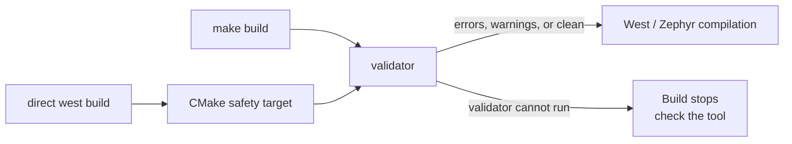

# Firmware validator

[← Project README](README.md) ·
[Implementation guide](FIRMWARE_IMPLEMENTATION_GUIDE.md) ·
[File map](FILE_MAP.md)

`validator` is the executable, read-only pre-build checker for Spaghetti LAB
firmware conventions. It explains each violation with its location, the rule,
the suggested correction, and the relevant implementation-guide section.

Convention findings are **report-only by default**: both red errors and orange
warnings are shown, but neither prevents firmware compilation. Use strict mode
only when an explicit quality gate is wanted.

It never changes source files automatically.

## When to read this file

Read this document:

- before the first build on a new checkout;
- when `validator` reports a finding or cannot run;
- before adding or changing a validation rule;
- when deciding whether a finding is an error or a review warning;
- when a file is unexpectedly included in or excluded from validation.

You do not need to reread it before every normal edit. For coding decisions, use
the [implementation guide](FIRMWARE_IMPLEMENTATION_GUIDE.md).

## Build flow



`make build` and `make pristine` run the validator synchronously before starting
West. Source-style findings never stop West, CMake, Ninja, or compilation.
Only an operational failure, such as an invalid invocation or a broken validator
executable, stops the chained command. This prevents the build from silently
claiming that validation ran when it did not.

`CMakeLists.txt` also makes the validator a dependency of the application target
as a safety net for direct `west build` use. It has the same report-only policy.

After the Makefile check succeeds, it passes
`SPAGHETTI_VALIDATOR_ALREADY_RUN=1` to West so the CMake safety target does not
repeat the same full scan.

## Commands

Run it locally when Python 3 is available:

```sh
./validator
```

The local interpreter must be Python 3.9 or newer. On Windows, use:

```powershell
py validator
```

Run the same checker in the project container:

```sh
make validate
```

Run a normal build without printing convention findings or their summary:

```sh
make build VALIDATOR_QUIET=1
```

The validator still scans every file. `VALIDATOR_QUIET=1` silences only its
normal convention report; compiler, linker, West, and real validator execution
errors remain visible. The same flag works with `make validate` and
`make pristine`. The accepted true values are `1`, `true`, `yes`, and `on`.

Without `make` (for example on Windows), run the same container command:

```powershell
docker compose run --rm --entrypoint python3 dev validator
```

Check only selected files or directories while editing:

```sh
./validator include/spaghetti/core.h subsys/core/core.c
./validator subsys/core
```

An explicit path performs local checks. Run the default whole-project scan
before committing because cross-file checks, such as ensuring every declared log
module has one registration elsewhere, require the complete scope.

Enable an explicit blocking quality gate:

```sh
./validator --strict
```

Run locally without convention output:

```sh
./validator --quiet
```

Inspect all rule codes:

```sh
./validator --list-rules
```

Other options:

```text
--no-color    disable terminal colors
--quiet       run all checks without findings or a summary
--version     print the validator version
--help        print command syntax
```

## Results and exit codes

| Exit code | Meaning | Build behavior |
|---:|---|---|
| `0` | Scan completed; findings may have been reported | Build continues |
| `1` | `--strict` was requested and findings exist | Caller chooses whether to stop |
| `2` | Invalid invocation, such as a missing path | Chained build stops |

An **error** is an objective non-adherence to review: malformed
public contract, trailing whitespace, missing bounds documentation, forbidden
comment style, duplicated log registration, and similar violations.

A **warning** identifies a choice requiring engineering review: dynamic
allocation, `printk`, a non-Kconfig log level, or an externally visible name that
may be a framework-required exception. Normal builds display both severities but
continue. `--strict` makes any finding return exit code `1` for an optional CI or
review gate.

On color-capable terminals, `ERROR` is bright red and `WARNING` is orange.
Colors are disabled automatically when output is redirected, or explicitly with
`--no-color` or the standard `NO_COLOR` environment variable.

## Output format

Example:

```text
ERROR [C001] subsys/core/core.c:10 — Block indentation uses spaces
  Found: first indentation character is a space
  Fix:   Use one tab per block level; reserve spaces for continuation alignment.
  Guide: FIRMWARE_IMPLEMENTATION_GUIDE.md — Spaces and line breaks
```

Review the first structural finding before assuming later findings are
independent. For example, repairing a malformed declaration may remove several
documentation findings attached to it.

## Validated scope

By default, `validator` scans project-owned build inputs under:

```text
src/
include/
subsys/
spaghetti_modules/
boards/
dts/
tests/
CMakeLists.txt
Kconfig
prj.conf
```

Supported file types include C/C++ headers and sources, Devicetree files,
bindings, Kconfig, CMake, and configuration fragments.

It excludes:

- `build/` and `build-*` generated artifacts;
- `.git/`, `.west/`, caches, and Python bytecode;
- `LICENSES/` third-party license texts;
- `roadmap/` planning/task documents;
- `templates/`, because placeholders are intentionally not complete firmware.

Empty future source/header placeholders are counted and skipped. Validation
starts as soon as a file contains non-whitespace content.

## Rule families

| Prefix | Checks |
|---|---|
| `TEXT` | UTF-8 and line-ending validity |
| `FMT` | Whitespace, final newline, line length, and blank lines |
| `C` | C style, types, comments, allocation, macros, naming, and Doxygen placement |
| `HDR` | Public guards, `@file`, public contracts, parameters, returns, enums, and fields |
| `LOG` | Zephyr log registration, declaration, and Kconfig level ownership |
| `CFG` | `prj.conf` assignment shape |
| `FILE` | Source filename convention |
| `CMAKE` | CMake indentation and command syntax |
| `KCFG` | Kconfig indentation and comment style |
| `DTS` | Devicetree indentation and property naming |
| `YAML` | Binding/YAML tab prohibition |

The complete live list is always:

```sh
./validator --list-rules
```

## Files that implement validation

| File | Purpose | Read/change when |
|---|---|---|
| `validator` | Rules, scanner, colors, CLI, exit policy | Adding or fixing a rule |
| `CMakeLists.txt` | Direct-West validation target | Changing West integration |
| `Makefile` | Pre-build validation and quiet flag | Changing build shortcuts |
| `FIRMWARE_IMPLEMENTATION_GUIDE.md` | Normative rule source | Changing a convention |
| `VALIDATOR.md` | Validator usage and behavior | Changing CLI, scope, or workflow |

Do not add a validator rule before adding the corresponding human-readable rule
to the implementation guide. The script enforces the guide; it does not invent
new policy.

## What the validator does not replace

The validator is a focused convention checker. It does not replace:

- the C compiler and linker;
- Zephyr Devicetree/binding validation;
- Kconfig dependency validation;
- `clang-format`, `checkpatch`, static analysis, or security analysis;
- unit, integration, hardware, timing, stack-usage, or race tests;
- human review of architecture, ownership, algorithm correctness, and hardware
  facts.

A passing validator means the checked writing rules are satisfied. It does not
prove that the firmware behavior is correct.

## Adding a rule

1. Add the normative requirement to `FIRMWARE_IMPLEMENTATION_GUIDE.md`.
2. Decide whether the condition is objective (`error`) or requires engineering review
   (`warning`).
3. Add one stable code and actionable correction to `RULES` in `validator`.
4. Implement detection narrowly enough to avoid obvious false positives.
5. Test one valid example, one invalid example, an empty file, and a boundary.
6. Run the validator on the whole project and on an explicit path.
7. Update this document when scope, commands, severity, or behavior changes.

Suppressions are intentionally not supported initially. A false positive should
be corrected in the rule. If a real framework exception is unavoidable, document
it in the implementation guide before adding a narrow, named exception.
