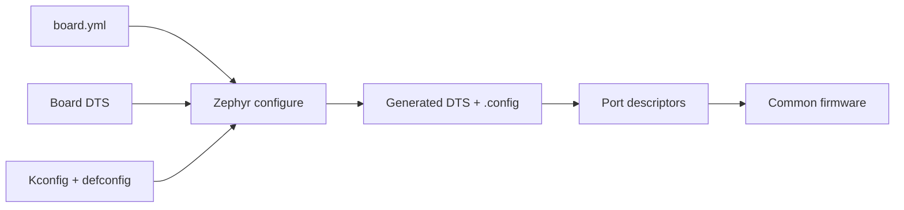

# Spaghetti LAB board support

[← Project README](../../README.md) · [Architecture](../../ARCHITECTURE.md) ·
[Guida per aggiungere un Core](../../EXTENDING_SPAGHETTI_LAB.md#percorso-b-aggiungere-una-nuova-variante-core)

A board definition describes one physical Core variant to Zephyr. It contains facts that are fixed by the schematic: MCU, memory, controllers, pins, Ports, console, flash layout, and real hardware capabilities.

## What this component owns

- Board identity and supported SoC.
- Static pin routing and peripheral controllers.
- Physical Port nodes and board-required defaults.
- Flash/debug runner selection when the board requires it.

## What this component does not own

- The removable module assigned to a Port.
- User rules, measurements, network endpoints, or runtime configuration.
- Generic Module Manager, Data, or Runtime behavior.

## Files

| File | Role |
|---|---|
| `board.yml` | Board name, vendor, SoC, and variants discovered by Zephyr. |
| `<board>.dts` | Concrete hardware instances and wiring. |
| `Kconfig.<board>` | Board/SoC selection contract. |
| `Kconfig.defconfig` | Hardware-justified default values. |
| `<board>_defconfig` | Minimal `CONFIG_...` options required to boot the board. |
| `board.cmake` | Flash/debug runners, only when needed. |

## Data model

| Type / object | Owner | Meaning |
|---|---|---|
| Board metadata | Build system | Identifies the selectable board target. |
| Generated Devicetree | Zephyr build | Compile-time constants consumed by Port and drivers. |
| Generated `.config` | Kconfig | Software features and defaults selected for this build. |

## API contract

This component has no runtime C API. Its contract is processed at build time.

## How it works



## Implemented variants

- `spaghettilab_core_v1/esp32c3` is the physical ESP32-C3 Core: USB console,
  I2C0 on verified GPIO3/GPIO4, and Port 0.
- `spaghettilab_core_v2_build_only/esp32c3` is a simulated portability target:
  I2C0 on simulated GPIO5/GPIO6 and Port 0 plus Port 1. It has no default flash
  runner; never flash this target.

Both variants generate the same `spaghettilab,port` contract, so Port, Module
Manager, Runtime and Module drivers contain no board-name branches.

## Zephyr integration

- Board selection happens with the existing `BOARD` value used by the Docker build.
- Devicetree contains hardware topology and pin references.
- Kconfig selects software; it must not carry pin numbers or runtime module assignments.
- With the current sysbuild layout, inspect `build/app/zephyr/zephyr.dts` and
  `build/app/zephyr/.config` after a board change.

## Configuration templates

### Directory layout

```text
boards/spaghettilab/spaghetti_core_<variant>/
├── board.yml
├── Kconfig.spaghetti_core_<variant>
├── Kconfig.defconfig
├── spaghetti_core_<variant>_defconfig
├── spaghetti_core_<variant>_<qualifier>.dts
└── board.cmake                    # only if a runner is required
```

### `board.yml`

```yaml
board:
  name: spaghetti_core_<variant>
  full_name: Spaghetti LAB Core <Variant>
  vendor: spaghettilab
  socs:
    - name: <zephyr_soc_name>
```

Replace every angle-bracket token with a value supported by the active
Zephyr version.

### Board DTS fragment

```dts
/ {
spaghetti_ports {
        compatible = "simple-bus";
        #address-cells = <1>;
        #size-cells = <0>;

        port0: port@0 {
            compatible = "spaghettilab,port";
            reg = <0>;
            i2c = <&i2c0>; /* Use the controller wired by the schematic. */
            status = "okay";
        };
    };
};
```

### Board defconfig

```ini
# Enable only features required for this board to boot and expose hardware.
CONFIG_SERIAL=y
CONFIG_CONSOLE=y
```

Application features belong in `prj.conf`, not in the board defconfig.

## Ownership and concurrency

Board files have no runtime concurrency. They are consumed once by host build tools. Concurrency rules belong to the runtime objects created from the generated description.

## Contract guarantees

- Every production pin and controller reference comes from a real schematic.
- A removable module never appears as a permanent board child node.
- Higher layers select behavior through Port capabilities, not board-name conditionals.
