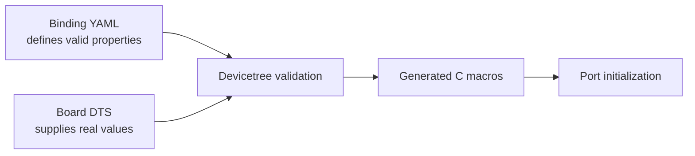

# Spaghetti LAB Devicetree bindings

[← Project README](../../../README.md) · [Architecture](../../../ARCHITECTURE.md)

A Devicetree binding is a YAML schema for static hardware. The Spaghetti Port binding validates that every board describes a physical connector in the same machine-readable form.

## What this component owns

- The meaning and type of each `spaghettilab,port` property.
- Required/optional property rules.
- Build-time validation of Port nodes.

## What this component does not own

- Concrete GPIO numbers or controller choices for a board.
- Runtime module identity.
- C lifecycle behavior or discovery policy.

## Files

| File | Role |
|---|---|
| `spaghettilab,port.yaml` | Schema for one physical Port node. |
| Board `.dts` files | Concrete instances validated against the schema. |
| `build/zephyr/zephyr.dts` | Generated result used to verify the final topology; never edit it. |

## Data model

| Type / object | Owner | Meaning |
|---|---|---|
| `reg` | Board DTS | Stable logical Port index. |
| I2C capability | Binding and Port | The current compatible requires an I2C controller. |
| `i2c` phandle | Board DTS | Reference to a real static Zephyr controller. |

## API contract

This component has no runtime C API. Its contract is processed at build time.

## How it works



## Practical example

A board declares Port 0 with an `i2c` phandle. The binding rejects the build if
the Port has no `reg` or references a nonexistent controller.

## Zephyr integration

- Bindings validate at configure time, before C compilation.
- A phandle references another Devicetree node; Port converts the generated reference into a Zephyr device.
- `status = "okay"` enables an instance; disabled nodes are not exposed as usable Ports.

## Configuration templates

### Binding template

```yaml
description: Spaghetti LAB external module port

compatible: "spaghettilab,port"

include: base.yaml

properties:
  reg:
    required: true
    description: Stable logical Port index; its cell-array type comes from base.yaml

  i2c:
    type: phandle
    required: true
    description: I2C controller wired to the Port
```

### Matching DTS instance

```dts
port0: port@0 {
    compatible = "spaghettilab,port";
    reg = <0>;
    i2c = <&i2c0>;
    status = "okay";
};
```

Every Port in the current binding is I2C-capable and therefore requires `i2c`.
Future capability kinds must extend the schema explicitly instead of relying on
a runtime failure.

## Ownership and concurrency

Bindings have no runtime state. Validation and macro generation happen in the single build pipeline.

## Contract guarantees

- Invalid static Port descriptions fail the build.
- Bindings contain no board-specific numeric values.
- Bindings describe connector hardware, never the removable module attached to it.
