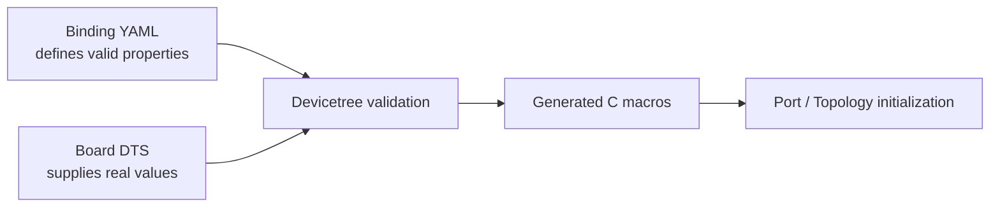

# Spaghetti LAB Devicetree bindings

[← Project README](../../../README.md) · [Architecture](../../../ARCHITECTURE.md)

A Devicetree binding is a YAML schema for static hardware. Spaghetti Port, Flow,
and power bindings validate that every board describes connectors, five-signal
paths, and Bay rail reachability in the same machine-readable form.

## What this component owns

- The meaning and type of each `spaghettilab,port`, `spaghettilab,flow`,
  `spaghettilab,power-rail`, and `spaghettilab,bay-power` property.
- Required/optional property rules.
- Build-time validation of those nodes.

## What this component does not own

- Concrete GPIO numbers or controller choices for a board.
- Runtime module identity.
- C lifecycle behavior or discovery policy.

## Files

| File | Role |
|---|---|
| `spaghettilab,port.yaml` | Schema for one physical Port node. |
| `spaghettilab,flow.yaml` | Schema for one five-signal Flow path. |
| `spaghettilab,power-rail.yaml` | Schema for one power rail and its assurance. |
| `spaghettilab,bay-power.yaml` | Schema for rails routed to one Function Bay. |
| Board `.dts` files | Concrete instances validated against the schema. |
| `build/zephyr/zephyr.dts` | Generated result used to verify the final topology; never edit it. |

## Data model

| Type / object | Owner | Meaning |
|---|---|---|
| Port `reg` | Board DTS | Stable logical Port index. |
| Flow `reg` | Board DTS | Stable logical Flow index. |
| Flow `port` phandle | Board DTS | Terminating Port for that Flow. |
| Flow `direction` | Board DTS | `field-to-core`, `core-to-field`, or `bidirectional`. |
| Flow `signal-count` | Board DTS | Always five for V1 connectors. |
| Flow `function-bay-count` | Board DTS | Ordered Bay positions from the field. |
| I2C capability | Binding and Port | The current Port compatible requires an I2C controller. |
| Port `i2c` phandle | Board DTS | Reference to a real static Zephyr controller. |

## API contract

This component has no runtime C API. Its contract is processed at build time.

## How it works



## Practical example

A board declares Port 0 and Flow 0 with `signal-count = <5>` and
`function-bay-count = <0>` when the prototype has no backbone yet. The binding
rejects missing `reg`, invalid direction strings, or a nonexistent Port phandle.

## Zephyr integration

- Bindings validate at configure time, before C compilation.
- A phandle references another Devicetree node; Port converts the generated reference into a Zephyr device.
- `status = "okay"` enables an instance; disabled nodes are not exposed as usable Ports or Flows.

## Configuration templates

### Port binding template

```yaml
description: Spaghetti LAB external module port

compatible: "spaghettilab,port"

include: base.yaml

properties:
  reg:
    required: true
    description: Stable logical Port index; its cell-array type comes from base.yaml

  i2c:
    type: phandle
    required: true
    description: I2C controller wired to the Port
```

### Flow binding template

```yaml
compatible: "spaghettilab,flow"
properties:
  reg:
    required: true
  port:
    type: phandle
    required: true
  direction:
    type: string
    required: true
    enum:
      - "field-to-core"
      - "core-to-field"
      - "bidirectional"
  signal-count:
    type: int
    required: true
  function-bay-count:
    type: int
    required: true
```

### Matching DTS instance

```dts
port0: port@0 {
    compatible = "spaghettilab,port";
    reg = <0>;
    i2c = <&i2c0>;
    status = "okay";
};

flow0: flow@0 {
    compatible = "spaghettilab,flow";
    reg = <0>;
    port = <&port0>;
    direction = "field-to-core";
    signal-count = <5>;
    function-bay-count = <0>;
    status = "okay";
};
```

Every Port in the current binding is I2C-capable and therefore requires `i2c`.
Future capability kinds must extend the schema explicitly instead of relying on
a runtime failure. Flow nodes never duplicate GPIO numbers.

## Ownership and concurrency

Bindings have no runtime state. Validation and macro generation happen in the single build pipeline.

## Contract guarantees

- Invalid static Port or Flow descriptions fail the build.
- Bindings contain no board-specific numeric pin values.
- Bindings describe connector hardware, never the removable module attached to it.
