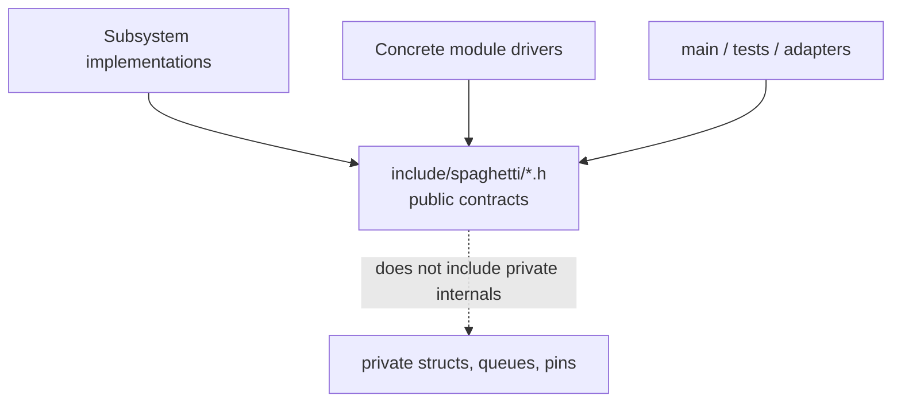

# Spaghetti LAB public interfaces

[← Project README](../../README.md) · [Architecture](../../ARCHITECTURE.md)

This directory contains contracts shared between firmware components. Headers expose stable types and operations; ownership and implementation details remain in the component that provides the API.

## What this component owns

- Public IDs, enums, immutable value objects, and function declarations.
- Parameter ownership and lifetime rules.
- Common error and timeout conventions.

## What this component does not own

- Global mutable state.
- Board pin mappings.
- Private Zephyr thread, mutex, queue, or driver context objects.

## Files

| File | Role |
|---|---|
| `core.h` | Boot and Core state contract. |
| `capabilities.h` | Immutable build profile, bounded limits, and board-backed capability snapshot. |
| `identity.h` | Hardware device ID and persisted friendly device name. |
| `access_control.h` | Bounded principals, roles, permissions, and audit ring. |
| `factory_reset.h` | Authorized scoped factory reset without MCUboot erasure. |
| `feature_pack.h` | Capability Pack descriptors, registry, and host catalog. |
| `image_manifest.h` | Embedded image manifest and candidate Config compatibility checks. |
| `resources.h` | Build/runtime resource snapshot with high-water marks (no free_ram promise). |
| `resource_contract.h` | Pure compile-time consistency predicates shared by firmware and negative build tests. |
| `connectivity.h` | Persistent connectivity policy and temporary service leases. |
	| `energy.h` | Low-energy BLE availability and connectivity-policy orchestration. |
| `health.h` | Health supervisor, heartbeat windows, and reset-cause snapshot. |
| `secure_workspace.h` | Admission and high-water metrics for heavy secure sessions. |
| `service.h` | Generic lifecycle owner for optional services. |
| `port.h` | Physical Port access contract. |
| `topology.h` | Flow, Function Bay, and Port termination topology. |
| `module.h` | Runtime module instance and identifiers. |
| `module_driver.h` | Immutable driver descriptor and operation table. |
| `module_manager.h` | Module lifecycle and operation routing. |
| `config.h` | Validated desired-state model. |
| `config_codec.h` | Bounded CBOR-to-Config decode contract. |
| `data.h` | Normalized values and events. |
| `runtime.h` | Autonomous behavior contract. |
| `communication.h` | Transport-independent request/response boundary. |
| `mqtt.h` | Optional bounded MQTT service contract. |
| `wifi_profiles.h` | Persistent Wi-Fi credentials and selection-policy contract. |
| `discovery.h` | Bounded per-key identification results and lifecycle events. |
| `power.h` | Optional shared-resource contract. |
| `update.h` | Transport-independent firmware-update session contract. |

## Data model

| Type / object | Owner | Meaning |
|---|---|---|
| ID types | Declaring header | Small value types passed by copy. |
| Configuration/value structs | Caller until accepted; provider after copy | Bounded objects with explicit sizes. |
| Opaque handles | Providing subsystem | References whose internal layout stays private. |
| Snapshots | Caller after successful getter | Copied read-only diagnostic state. |

## API contract

This component has no runtime C API. Its contract is processed at build time.

## How it works



## Practical example

`runtime.c` includes `module_manager.h` and calls the Manager with a runtime Module ID.
Config uses a stable Module key and Manager maps it to that ID. Neither component
assumes that a Port identifies one Module; a bounded Port query may return several
snapshots.

The resource snapshot is copied into caller-owned storage and can be used before
accepting an operation that needs an optional service:

```c
struct spaghetti_capabilities caps;

if (spaghetti_capabilities_get(&caps) == 0 &&
    spaghetti_capabilities_support(SPAGHETTI_BUILD_CAP_MQTT)) {
	/* MQTT is present in this exact firmware image. */
}
```

`resource_profile`, `core_variant`, and `build_capabilities` together form the
compatibility input for future update metadata. They describe the compiled image;
they are never inferred from momentary free heap.

## Zephyr integration

- Use Zephyr public types in signatures only when they are part of the intended cross-component contract, such as `k_timeout_t`.
- Prefer negative errno-compatible returns for failures.
- Forward-declare opaque structs to reduce include cycles.

## Configuration templates

### Public header template

```c
#ifndef SPAGHETTI_EXAMPLE_H_
#define SPAGHETTI_EXAMPLE_H_

#include <stddef.h>
#include <stdint.h>

struct spaghetti_example;

/**
 * @brief Perform one bounded operation.
 *
 * @param example Provider-owned opaque object.
 * @param input   Caller-owned input, valid for the duration of the call.
 * @param output  Caller-owned destination populated only on success.
 *
 * @return 0 on success, or a negative errno-compatible value.
 */
int spaghetti_example_run(const struct spaghetti_example *example,
                          const void *input,
                          void *output);

#endif /* SPAGHETTI_EXAMPLE_H_ */
```

Public structures must use fixed capacities or explicit pointer/length pairs.
Never expose a pointer to temporary stack storage.

## Ownership and concurrency

Each API documents its valid execution context. Public headers declare the contract but do not expose the mutex or queue used to satisfy it.

## Contract guarantees

- A caller can determine ownership, lifetime, return value, and realistic errors from the header documentation.
- Headers do not leak board or concrete-driver implementation details.
- All payload sizes are bounded or explicitly supplied.
