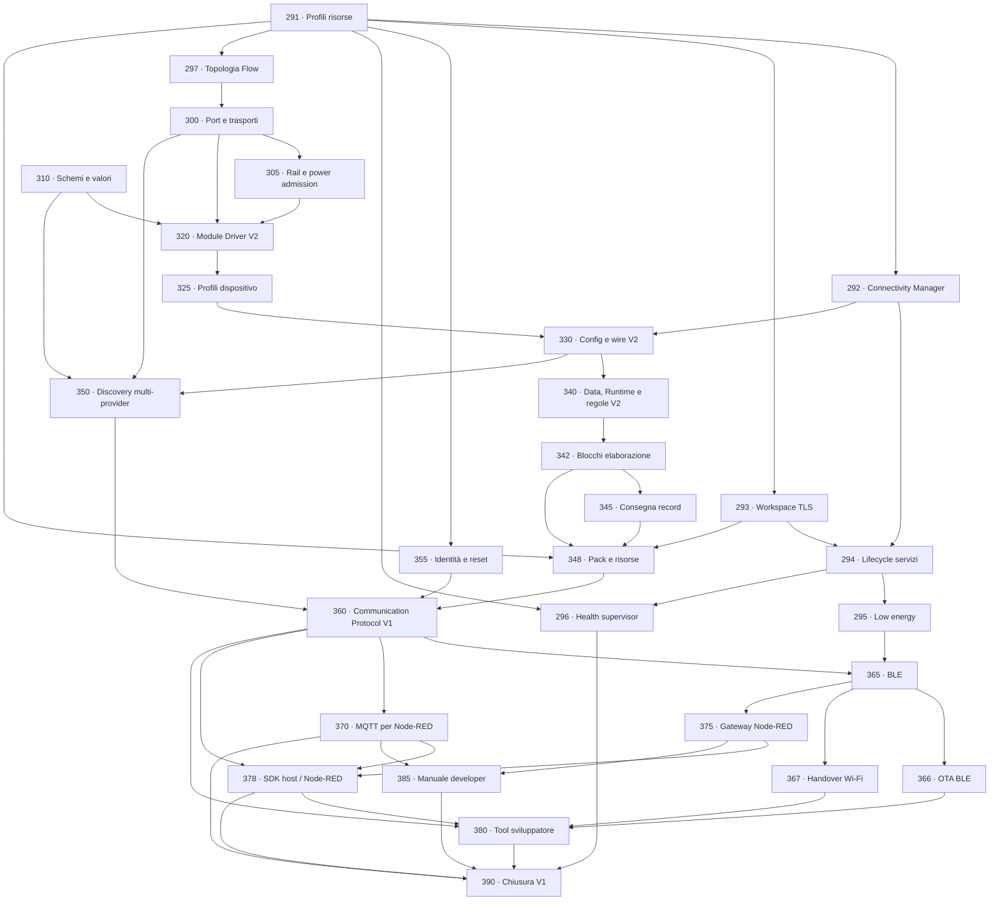

# Chiusura della piattaforma firmware V1.0

[← Indice roadmap](README.md) ·
[Guida alle estensioni](../EXTENDING_SPAGHETTI_LAB.md) ·
[Architettura](../ARCHITECTURE.md) ·
[Contratto connettività e risorse](../CONNECTIVITY_AND_RESOURCE_CONTRACT.md)

Questo blocco chiude il firmware comune prima del lavoro principale in Node-RED.
L'obiettivo non è aggiungere molti dispositivi concreti: è fare in modo che un nuovo
Module, metodo di identificazione, Core, trasporto o comportamento si aggiunga ai
bordi senza modificare ogni sottosistema centrale.

## Risultato finale

Al termine delle fasi 291–390:

- ogni variante Core seleziona un profilo risorse e comunica capability/limiti reali;
- Connectivity Manager governa LOW_ENERGY, ONLINE e lease temporanee;
- TLS/DTLS usa un workspace condiviso e i servizi opzionali rilasciano le proprie
  risorse quando vengono arrestati;
- Health Supervisor controlla heartbeat e watchdog senza permettere a un worker di
  alimentarlo autonomamente;
- ogni Core pubblica quanti Flow possiede, la loro direzione, la Port terminale e le
  Function Bay ordinate; ogni connettore funzionale espone cinque segnali;
- un Core base può dichiarare rail con jumper non verificabili, mentre un Core Pro
  applica limiti elettrici solo quando board e Module forniscono dati reali;
- BLE è il trasporto low-energy autenticato del protocollo comune e può ricevere OTA o
  richiedere un handover Wi-Fi bounded;
- una Port può esporre I2C, SPI, UART, GPIO, ADC o 1-Wire tramite un contratto
  indipendente dalla board;
- controller condivisi e transazioni sono serializzati dal proprietario corretto;
- driver, regole e provider Discovery si auto-registrano con le iterable sections di
  Zephyr, senza modificare tabelle centrali;
- profili dispositivo dichiarativi descrivono registri, transazioni e schemi di
  sensori comuni senza richiedere un driver C per ogni modello;
- Config usa proprietà tipizzate e versionate, non copie di struct C specifiche;
- Data trasporta record tipizzati descritti da schema, non soltanto misure INA219;
- MQTT e BLE leggono la stessa ring con cursori e contatori di perdita indipendenti;
- Runtime pianifica più sorgenti e carica regole plug-in senza conoscere sensori o
  attuatori concreti;
- Runtime compila pipeline bounded di blocchi catalogati; filtri ed elaborazioni
  installati nel firmware vengono istanziati e collegati soltanto tramite Config;
- ogni immagine dichiara Capability Pack, feature-set hash e consumo misurato; il Core
  espone headroom flash, pool/workspace e high-water di stack/RAM osservabili;
- un Module può essere dichiarato manualmente oppure proposto da zero o più provider
  Discovery indipendenti;
- nessuna EEPROM è obbligatoria: EEPROM, registri I2C, analogico e 1-Wire sono metodi
  opzionali con diversa affidabilità;
- Communication espone un protocollo CBOR V1 con principal, errori stabili, replay,
  job e Config compare-and-swap su USB, console autenticata, BLE o MQTT;
- MQTT oppure BLE/gateway permettono a Node-RED di ricevere record, inviare
  Config/comandi e correlare le risposte;
- un tool host trasforma JSON leggibile in CBOR, interroga il catalogo e gestisce
  configurazione, discovery e update;
- un SDK TypeScript condiviso permette a Node-RED di invalidare il catalogo dopo OTA e
  coordina read/merge/validate/apply della Config senza lost update;
- il percorso completo è provato con fake e `native_sim`, anche senza Module fisici.

## Decisioni congelate

1. **Un solo modello interno, molti trasporti.** CBOR è il formato macchina canonico
   V1; USB, TLS, MQTT e futuri adapter trasportano lo stesso envelope. Un adapter non
   ridefinisce Config o comandi.
2. **Proprietà e valori sono tipizzati.** I formati esterni non contengono dump di
   struct C. Campo, tipo, limite e versione sono verificabili.
3. **Schema dichiarato dal plug-in.** Un driver o una regola porta descrittori
   immutabili per config, record e comandi. Registry e catalogo li enumerano.
4. **Discovery propone, Config decide.** Un provider non crea direttamente un Module.
   Il risultato diventa un candidato; policy o utente lo accettano assegnando una key.
5. **Manuale sempre disponibile.** Un Module privo di identificazione automatica è
   pienamente supportato tramite Config.
6. **Probe espliciti.** Un provider dichiara se la prova è autorevole o euristica e se
   può modificare il dispositivo. Le prove invasive restano disabilitate salvo policy.
7. **Niente heap Spaghetti general-purpose.** Module, record, proprietà, regole, code e
   cataloghi hanno capacità Kconfig o costanti pubbliche. Lo stato temporaneo di
   librerie TLS può usare allocazione bounded e ammessa dal Resource Manager, come
   definito nel contratto connettività; non introduce ownership dinamica nei modelli
   centrali.
8. **Il Core esegue pipeline locali bounded, Node-RED coordina sistemi.** Runtime V2
   conserva scheduling, acquisizione, elaborazioni catalogate e regole necessarie
   offline; non accetta codice arbitrario e non tenta di replicare un runtime host.
9. **Connettività e update sono lifecycle, non effetti collaterali.** Accendere Wi-Fi
   non apre OTA; una lease scade; un solo trasporto possiede Update.
10. **Tempo e perdita sono espliciti.** Record porta boot ID e uptime; una coda RAM
    bounded espone i drop e non promette storico flash. Ogni consumer ha il proprio
    cursore: l'ACK di MQTT non consuma i dati BLE.
11. **Config è una transazione concorrente.** Il client legge generation/hash, valida e
    applica compare-and-swap. Una Config identica non scrive flash; un conflitto non
    viene forzato.
12. **Il contratto host non è errno Zephyr.** Status pubblici, int64 lossless, golden
    vector e fingerprint catalogo sono congelati per C, Python e TypeScript.
13. **Node-RED coordina, non esegue Zephyr.** Hardware, real-time e safe state restano
    plug-in firmware; i nodi host chiamano solo operation handler catalogati.
14. **Capability installata e Config sono livelli distinti.** Un Capability Pack entra
    tramite immagine MCUboot firmata; dopo il reboot Config può usarne i tipi senza un
    altro update. Un Device Profile composto da opcode già presenti resta installabile
    come dato.
15. **Le risorse sono misure nominate, non una `free_ram` generica.** Build e runtime
    separano flash/headroom, RAM statica, stack, pool, workspace, uso corrente e
    high-water; soltanto il manifest della nuova immagine decide la compatibilità.

## Ordine e dipendenze

La qualifica fisica 290 può procedere in parallelo. Segui l'ordine numerico da 291;
la fase 310 può procedere in parallelo a 297–305 prima di convergere nella 320.

## Cosa non viene inventato ora

- Pin, chip-select, canali ADC e controller non presenti nello schema corrente.
- Formato fisico definitivo dell'eventuale EEPROM identificativa.
- Soglie analogiche associate a futuri Module.
- Registri di identificazione non documentati dai datasheet.
- Root key/eFuse e provisioning irreversibile di produzione.
- Valori prestazionali definitivi di MTU, throughput, intervalli e numero peer prima
  delle misure su ESP32-C3.
- Tensione massima `PWR_RAW`, corrente totale, corrente per Bay e circuiti di
  selezione/misura non ancora congelati dallo schema elettrico.
- Uno stack Matter/Zigbee soltanto perché una futura variante può avere la radio.

Le API, i provider e i fake vengono predisposti ora. Il backend reale viene aggiunto
quando schema e Module fisici forniscono dati verificabili.

Il comportamento BLE-first, Wi-Fi on-demand e i profili RAM è congelato nel
[contratto connettività e risorse](../CONNECTIVITY_AND_RESOURCE_CONTRACT.md) e viene
implementato dalle fasi 291–295 e 365–375.

## Gate per passare a Node-RED

Puoi spostare il lavoro principale su Node-RED quando:

1. un fake Module definito fuori dai sottosistemi centrali compare nel catalogo;
2. un JSON host crea due Module sulla stessa Port e sopravvive al reboot;
3. due schemi dati differenti raggiungono MQTT e BLE/gateway senza modificare gli
   adapter e con cursori Record Delivery indipendenti;
4. Node-RED invia un comando generico e riceve una risposta con lo stesso correlation ID;
5. un provider fake produce candidati, mentre un Module manuale continua a funzionare;
6. un tipo/provider/regola nuovi non richiedono modifiche a Registry, Config, Data,
   Runtime, Communication o MQTT centrali;
7. capability e profilo impediscono Config/immagini incompatibili;
8. LOW_ENERGY, lease Wi-Fi, OTA BLE/Wi-Fi e ritorno alla policy superano timeout/errori;
9. boot ID e contatori drop rendono visibile ogni discontinuità dati;
10. due client concorrenti gestiscono generation conflict senza perdere modifiche;
11. Config identica non incrementa generation e non scrive Storage;
12. retry cross-transport non ripete Config o comandi;
13. SDK TypeScript e CLI Python superano gli stessi golden vector del firmware;
14. Health Supervisor, fuzzing, validator, Twister e build di ogni profilo passano;
15. l'host legge una topologia con più Flow senza conoscere la board e distingue
    chiaramente power `UNVERIFIED` da power `ENFORCED`.
16. due Device Profile con registri differenti usano lo stesso driver dichiarativo e
    un profilo compatibile viene installato senza OTA;
17. un blocco Kalman assente rende Config unsupported, compare dopo OTA del relativo
    Capability Pack ed è poi istanziabile senza ulteriori update;
18. resource report e manifest distinguono flash, RAM statica, stack, pool, workspace,
    uso corrente e high-water; una build `all-supported` è accettata solo dai gate.

La qualificazione fisica della fase 290 resta necessaria prima di dichiarare una
release hardware di produzione, ma non blocca lo sviluppo del contratto Node-RED con
fake e board attuale.
