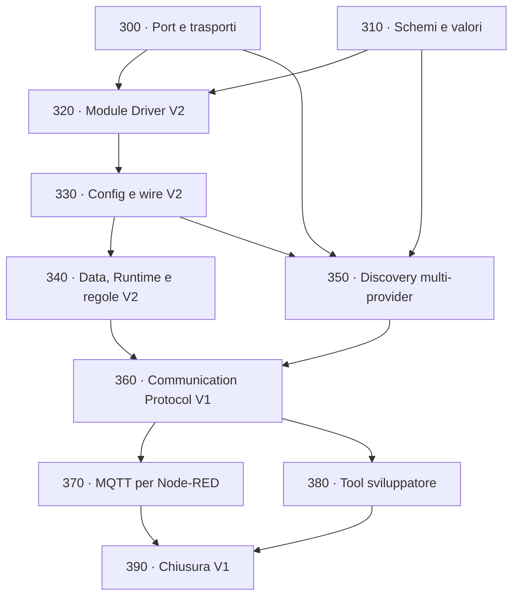

# Chiusura della piattaforma firmware V1.0

[← Indice roadmap](README.md) ·
[Guida alle estensioni](../EXTENDING_SPAGHETTI_LAB.md) ·
[Architettura](../ARCHITECTURE.md)

Questo blocco chiude il firmware comune prima del lavoro principale in Node-RED.
L'obiettivo non è aggiungere molti dispositivi concreti: è fare in modo che un nuovo
Module, metodo di identificazione, Core, trasporto o comportamento si aggiunga ai
bordi senza modificare ogni sottosistema centrale.

## Risultato finale

Al termine delle fasi 300–390:

- una Port può esporre I2C, SPI, UART, GPIO, ADC o 1-Wire tramite un contratto
  indipendente dalla board;
- controller condivisi e transazioni sono serializzati dal proprietario corretto;
- driver, regole e provider Discovery si auto-registrano con le iterable sections di
  Zephyr, senza modificare tabelle centrali;
- Config usa proprietà tipizzate e versionate, non copie di struct C specifiche;
- Data trasporta record tipizzati descritti da schema, non soltanto misure INA219;
- Runtime pianifica più sorgenti e carica regole plug-in senza conoscere sensori o
  attuatori concreti;
- un Module può essere dichiarato manualmente oppure proposto da zero o più provider
  Discovery indipendenti;
- nessuna EEPROM è obbligatoria: EEPROM, registri I2C, analogico e 1-Wire sono metodi
  opzionali con diversa affidabilità;
- Communication espone un protocollo CBOR V1 versionato e trasportabile su USB,
  console autenticata o MQTT;
- MQTT permette a Node-RED di ricevere record, inviare Config/comandi e correlare le
  risposte;
- un tool host trasforma JSON leggibile in CBOR, interroga il catalogo e gestisce
  configurazione, discovery e update;
- il percorso completo è provato con fake e `native_sim`, anche senza Module fisici.

## Decisioni congelate

1. **Un solo modello interno, molti trasporti.** CBOR è il formato macchina canonico
   V1; USB, TLS, MQTT e futuri adapter trasportano lo stesso envelope. Un adapter non
   ridefinisce Config o comandi.
2. **Proprietà e valori sono tipizzati.** I formati esterni non contengono dump di
   struct C. Campo, tipo, limite e versione sono verificabili.
3. **Schema dichiarato dal plug-in.** Un driver o una regola porta descrittori
   immutabili per config, record e comandi. Registry e catalogo li enumerano.
4. **Discovery propone, Config decide.** Un provider non crea direttamente un Module.
   Il risultato diventa un candidato; policy o utente lo accettano assegnando una key.
5. **Manuale sempre disponibile.** Un Module privo di identificazione automatica è
   pienamente supportato tramite Config.
6. **Probe espliciti.** Un provider dichiara se la prova è autorevole o euristica e se
   può modificare il dispositivo. Le prove invasive restano disabilitate salvo policy.
7. **Niente heap Spaghetti.** Pool, record, proprietà, code e cataloghi hanno capacità
   Kconfig o costanti pubbliche.
8. **Node-RED esegue le automazioni di prodotto.** Il Runtime V2 conserva scheduling
   locale e regole plug-in essenziali, ma non tenta di diventare un secondo Node-RED.

## Ordine e dipendenze

Le fasi 300 e 310 possono essere sviluppate separatamente. Dalla 320 in avanti segui
l'ordine numerico.

## Cosa non viene inventato ora

- Pin, chip-select, canali ADC e controller non presenti nello schema corrente.
- Formato fisico definitivo dell'eventuale EEPROM identificativa.
- Soglie analogiche associate a futuri Module.
- Registri di identificazione non documentati dai datasheet.
- Root key/eFuse e provisioning irreversibile di produzione.

Le API, i provider e i fake vengono predisposti ora. Il backend reale viene aggiunto
quando schema e Module fisici forniscono dati verificabili.

## Gate per passare a Node-RED

Puoi spostare il lavoro principale su Node-RED quando:

1. un fake Module definito fuori dai sottosistemi centrali compare nel catalogo;
2. un JSON host crea due Module sulla stessa Port e sopravvive al reboot;
3. due schemi dati differenti raggiungono MQTT senza modificare MQTT;
4. Node-RED invia un comando generico e riceve una risposta con lo stesso correlation ID;
5. un provider fake produce candidati, mentre un Module manuale continua a funzionare;
6. un tipo/provider/regola nuovi non richiedono modifiche a Registry, Config, Data,
   Runtime, Communication o MQTT centrali;
7. validator, Twister completo e build sysbuild delle due board passano.

La qualificazione fisica della fase 290 resta necessaria prima di dichiarare una
release hardware di produzione, ma non blocca lo sviluppo del contratto Node-RED con
fake e board attuale.
