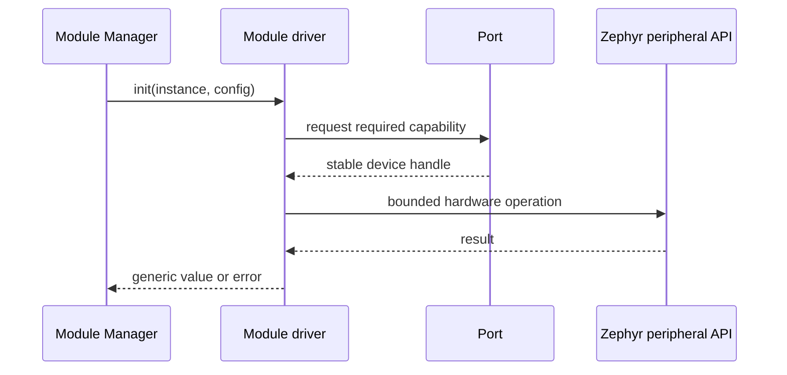

# Spaghetti module drivers

[← Project README](../README.md) · [Architecture](../ARCHITECTURE.md)

Each child directory implements one external module type through the common module-driver contract. The code executes on the Core; the external module is a peripheral, not another Zephyr application.

## What this component owns

- The peripheral protocol for one module type.
- One immutable driver descriptor.
- Validation and mutation of per-instance private context through driver operations.
- Translation between raw hardware results and generic values/commands.

## What this component does not own

- Module instance lifetime or Port assignment.
- Sampling schedules and product rules.
- Board pin mappings or transport protocols.

## Files

| File | Role |
|---|---|
| `<module>/<module>.h` | Descriptor declaration and module-specific bounded config. |
| `<module>/<module>.c` | Protocol and operation-table implementation. |
| `<module>/README.md` | Concrete API, data format, wiring expectations, and examples. |
| `include/spaghetti/module_driver.h` | Common operation-table contract used by every driver. |

## Data model

| Type / object | Owner | Meaning |
|---|---|---|
| Driver descriptor | Concrete driver | Immutable type ID, required capabilities, and operations. |
| Module instance | Module Manager | Port assignment, state, ID, and private context pointer. |
| Private context | Manager-provided storage; driver-managed content | Address, calibration, cached state, or protocol state for one instance. |
| Input/output values | Caller during direct call | Bounded generic read results or command payloads. |

## API contract

### `int init(struct spaghetti_module *module, const void *config, size_t config_size)`

**Purpose:** Validate the Port and initialize one instance.

**Parameters**

| Parameter | Meaning |
|---|---|
| `module` | Manager-owned instance with a valid Port and private context. |
| `config` | Caller-owned bounded configuration. |
| `config_size` | Exact configuration byte count. |

**Returns:** `0` when READY; negative error otherwise.

**Errors:** Invalid config, missing capability, device absent, or bus timeout.

**Execution context:** Calling thread; may perform bounded bus I/O.

**Calls:** Port API and the relevant Zephyr peripheral API.

### `int read(struct spaghetti_module *module, struct spaghetti_sample *out)`

**Purpose:** Acquire one value and populate generic output.

**Parameters**

| Parameter | Meaning |
|---|---|
| `module` | READY instance. |
| `out` | Caller-owned destination written only on success. |

**Returns:** `0` plus a valid sample; negative error otherwise.

**Errors:** Not ready, invalid output, protocol/CRC error, or I/O timeout.

**Execution context:** Calling thread, never ISR.

**Calls:** Port and Zephyr bus APIs.

### `int command(struct spaghetti_module *module, const struct spaghetti_command *command)`

**Purpose:** Apply one supported actuator/configuration command.

**Parameters**

| Parameter | Meaning |
|---|---|
| `module` | READY instance. |
| `command` | Validated bounded command value. |

**Returns:** `0` on accepted hardware state; `-ENOTSUP` when unsupported.

**Errors:** Invalid command/value, not ready, or hardware error.

**Execution context:** Calling thread.

**Calls:** Port and Zephyr peripheral APIs.

### `int deinit(struct spaghetti_module *module)`

**Purpose:** Place hardware in its defined safe state and release instance resources.

**Parameters**

| Parameter | Meaning |
|---|---|
| `module` | Initialized or error-state instance being removed. |

**Returns:** `0` on a completed safe transition; negative error otherwise.

**Errors:** Invalid state or hardware safe-state failure.

**Execution context:** Calling thread.

**Calls:** Port and optional shared-resource API.

## How it works



## Practical example

A temperature driver receives an instance configured for address `0x44`. It requests the I2C device from the assigned Port, validates the sensor response, and returns a generic temperature sample. Runtime never calls the concrete driver directly.

## Zephyr integration

- Devicetree describes the Core controller and Port wiring, not a removable module instance.
- Drivers use synchronous I2C/SPI/GPIO calls from thread context unless their documented hardware requires deferred interrupt processing.
- Register one Zephyr log module per concrete driver.

## Configuration templates

### Descriptor template

```c
static const struct spaghetti_module_driver_ops example_ops = {
    .init = example_init,
    .read = example_read,
    .command = example_command,
    .deinit = example_deinit,
};

const struct spaghetti_module_driver spaghetti_example_driver = {
    .type_id = "example",
    .required_capabilities = SPAGHETTI_PORT_CAP_I2C,
    .ops = &example_ops,
};
```

### Application `CMakeLists.txt` fragment

```cmake
target_sources(app PRIVATE
  spaghetti_modules/example/example.c
)
```

### Application `prj.conf` fragment

```ini
# Enable the Core-side bus API used by the driver.
CONFIG_I2C=y
CONFIG_LOG=y
```

## Ownership and concurrency

Drivers do not create a thread by default. Module Manager owns lifecycle serialization; Port owns shared-bus serialization. An ISR may only capture/signal and must defer blocking protocol work.

## Contract guarantees

- Every operation is bounded and reports a precise status.
- A driver contains no board-name or physical-pin branch.
- Per-instance mutable state is never stored in the immutable descriptor.
