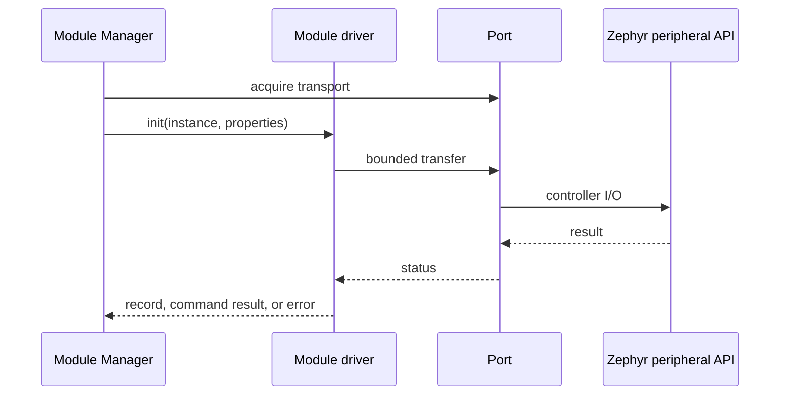

# Spaghetti module drivers

[← Project README](../README.md) · [Architecture](../ARCHITECTURE.md) ·
[Guide for adding a Module](../EXTENDING_SPAGHETTI_LAB.md#1-module-driver-sync-and-async)

Each child directory implements one external module type through the Module
Driver API v2. The code executes on the Core; the external module is a
peripheral, not another Zephyr application.

Drivers register with `SPAGHETTI_MODULE_DRIVER_DEFINE`. Driver Registry iterates
the linker section; there is no central `drivers[]` table to edit.

## What this component owns

- The peripheral protocol for one module type.
- One immutable driver descriptor (schemas, transport, ops).
- Validation and mutation of per-instance private context through driver operations.
- Translation between raw hardware results and schema-backed records/commands.

## What this component does not own

- Module slot lifetime or Port catalog ownership.
- Sampling schedules and product rules.
- Board pin mappings or host Protocol transports.

## Files

| File | Role |
|---|---|
| `<module>/<module>.h` | Field IDs and config decode helpers. |
| `<module>/<module>.c` | Schemas, slab, ops, `SPAGHETTI_MODULE_DRIVER_DEFINE`. |
| `<module>/README.md` | Concrete API, data format, wiring, safe state. |
| `include/spaghetti/module_driver.h` | Common descriptor and operation-table contract. |

## Implemented types

| `type_id` | Directory | Notes |
|---|---|---|
| `ina219` | `ina219/` | I2C electrical meter; sync `read`. |
| `relay` | `relay/` | GPIO actuator; sync `command`. |
| `declarative-device` | `declarative_device/` | Executes Device Profiles; caps from profile. |

## API contract (v2)

### Pure configuration

```c
int validate_config(const struct spaghetti_property_set *config);
int describe_endpoint(const struct spaghetti_property_set *config,
                      struct spaghetti_module_endpoint *out);
```

No hardware access, no allocation. Endpoint uses `kind` + `value_size` + `value[]`
(for example I2C address in `value[0]`).

### Lifecycle

```c
int init(struct spaghetti_module *module,
         const struct spaghetti_property_set *config);
int read(struct spaghetti_module *module,
         struct spaghetti_record_payload *out);      /* optional */
int command(struct spaghetti_module *module,
            const struct spaghetti_module_command *command); /* optional */
int start(struct spaghetti_module *module,
          spaghetti_module_event_cb_t emit, void *user_data); /* async */
int stop(struct spaghetti_module *module);                   /* async */
int deinit(struct spaghetti_module *module);
```

At least one of `read` or `command` is required. `start`/`stop` are both NULL for
synchronous drivers, or both implemented for async emission from thread context.

Manager acquires Port transport before `init()`. Drivers perform bounded I/O
through Port helpers such as `spaghetti_port_i2c_transfer()`.

## How it works



## Templates and registration

Start from
[`templates/firmware/module_driver.h.template`](../templates/firmware/module_driver.h.template)
and
[`module_driver.c.template`](../templates/firmware/module_driver.c.template).

```c
SPAGHETTI_MODULE_DRIVER_DEFINE(spaghetti_example_module_driver) = {
    .type_id = "example",
    .api_version = SPAGHETTI_MODULE_DRIVER_API_VERSION,
    .required_capabilities = SPAGHETTI_PORT_CAP_I2C,
    .transport = SPAGHETTI_PORT_TRANSPORT_I2C,
    .power_requirement = { .declared = false },
    .config_schema = &example_config_schema,
    .record_schemas = example_record_schemas,
    .record_schema_count = ARRAY_SIZE(example_record_schemas),
    .commands = NULL,
    .command_count = 0U,
    .ops = &example_ops,
};
```

Add the `.c` to application `CMakeLists.txt` and slab/log options to `Kconfig`.
Do not modify `subsys/driver_registry/driver_registry.c`.

### Driver-owned context pool

```c
K_MEM_SLAB_DEFINE(example_context_slab,
                  sizeof(struct example_context),
                  CONFIG_SPAGHETTI_EXAMPLE_MODULE_MAX_INSTANCES,
                  __alignof__(struct example_context));
```

## Ownership and concurrency

Drivers do not create a thread by default. Module Manager owns lifecycle
serialization. An ISR may only capture/signal. Shared-controller serialization
belongs to Port. See
[Caveat Spaghetti LAB](../EXTENDING_SPAGHETTI_LAB.md#caveat-spaghetti-lab).

## Contract guarantees

- Every operation is bounded and reports a precise status.
- A driver contains no board-name or physical-pin branch.
- Per-instance mutable state is never stored in the immutable descriptor.
- Context capacity is fixed per driver; exhaustion returns `-ENOMEM` without heap.
- Schemas and field IDs are the host-visible contract.
