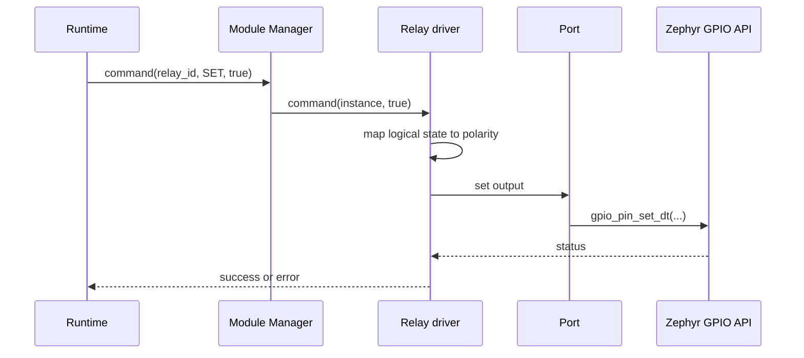

# Relay module driver

[← Project README](../../README.md) · [Architecture](../../ARCHITECTURE.md)

The Relay driver is a concrete example of an output module. It translates a generic boolean command into a safe hardware state through capabilities exposed by the assigned Port.

## What this component owns

- Relay polarity and safe-state configuration for one instance.
- Boolean SET command validation.
- Safe initialization, command, and deinitialization behavior.
- The immutable `relay` driver descriptor.

## What this component does not own

- The physical GPIO number or board wiring.
- Threshold decisions and automation rules.
- Module lifetime, scheduling, or external command protocols.

## Files

| File | Role |
|---|---|
| `relay.h` | Relay config, command value, and descriptor declaration. |
| `relay.c` | Lifecycle and SET implementation. |
| `include/spaghetti/module_driver.h` | Common command operation contract. |
| `include/spaghetti/port.h` | Stable output capability used by the driver. |

## Data model

| Type / object | Owner | Meaning |
|---|---|---|
| `spaghetti_relay_config` | Config copied into instance context | Active polarity and safe logical state. |
| Relay private context | Module instance | Current known logical state and Port resource. |
| Boolean command | Caller during command | Requested OFF/ON state independent of electrical polarity. |

## API contract

### `int relay_init(struct spaghetti_module *module, const void *config, size_t config_size)`

**Purpose:** Validate the output capability and drive the configured safe state.

**Parameters**

| Parameter | Meaning |
|---|---|
| `module` | Manager-owned instance assigned to a compatible Port. |
| `config` | Pointer to relay polarity/safe-state config. |
| `config_size` | Exact config size. |

**Returns:** `0` when the output is in the safe state.

**Errors:** Invalid config, missing output capability, unavailable device, or GPIO error.

**Execution context:** Calling thread.

**Calls:** Port output API and Zephyr GPIO API.

### `int relay_command(struct spaghetti_module *module, const struct spaghetti_command *command)`

**Purpose:** Apply one logical SET command.

**Parameters**

| Parameter | Meaning |
|---|---|
| `module` | READY relay instance. |
| `command` | Command ID plus bounded boolean value. |

**Returns:** `0` after hardware and cached logical state agree.

**Errors:** Unsupported command, invalid value, not ready, or GPIO failure.

**Execution context:** Calling thread.

**Calls:** Port output API.

### `int relay_deinit(struct spaghetti_module *module)`

**Purpose:** Return the output to the configured safe state before removal.

**Parameters**

| Parameter | Meaning |
|---|---|
| `module` | Initialized relay instance. |

**Returns:** `0` when safe state is confirmed.

**Errors:** Invalid instance or safe-state write failure.

**Execution context:** Calling thread.

**Calls:** Port output API.

## How it works



## Practical example

Runtime decides that an actuator must turn on. It sends logical `true`; a relay configured active-low converts that to the correct electrical level. On removal, the driver always attempts the configured safe state.

## Zephyr integration

- Enable GPIO support with `CONFIG_GPIO=y` when the Port uses a GPIO output.
- Board DTS owns the physical GPIO specifier; the relay driver receives it through Port.
- Use logical values in product code and isolate electrical polarity in config/driver code.

## Configuration templates

### Runtime configuration

```c
struct spaghetti_relay_config {
    bool active_low;
    bool safe_state;
};
```

### `prj.conf`

```ini
CONFIG_GPIO=y
CONFIG_LOG=y
```

### Static board-side Port fragment

```dts
port1: port@1 {
    compatible = "spaghettilab,port";
    reg = <1>;
    capabilities = "gpio";
    output-gpios = <&gpio0 7 GPIO_ACTIVE_LOW>; /* Schematic-derived example. */
    status = "okay";
};
```

## Ownership and concurrency

Commands are serialized through Module Manager/Port. The driver owns no thread. A failed output write does not update the cached logical state as if it succeeded.

## Contract guarantees

- Initialization and deinitialization define a safe physical state.
- Runtime sees logical ON/OFF and never board polarity.
- Unsupported commands return `-ENOTSUP` without changing the output.
