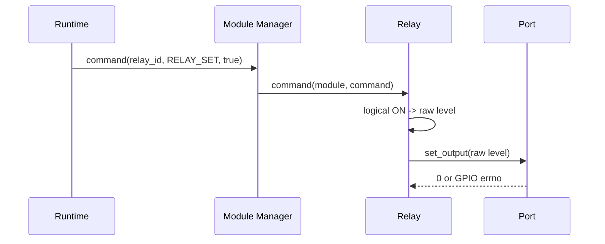

# Relay module driver

[← Project README](../../README.md) · [Architecture](../../ARCHITECTURE.md)

The Relay driver translates a generic logical ON/OFF command into the raw
electrical level required by one output Port. It owns polarity, safe state, and
one typed context per live instance; it never owns the physical GPIO number or
the threshold decision.

## Contract

```c
struct spaghetti_relay_config {
	bool active_high;
	bool safe_on;
};
```

- `active_high` means logical ON is electrical high. When false, ON is low.
- `safe_on` is the logical state written during both init and deinit.
- `validate_config` accepts only the exact struct size.
- `describe_endpoint` returns `SPAGHETTI_ENDPOINT_PORT_EXCLUSIVE`: a Relay owns
  the output resource of its Port and cannot share that Port with another Module.
- `init` obtains a context from a static `k_mem_slab` and writes `safe_on` before
  publishing the context.
- `command` accepts `SPAGHETTI_COMMAND_RELAY_SET` and updates cached state only
  after the Port write succeeds.
- `deinit` attempts `safe_on`, then releases the context even when the hardware
  write fails.

The driver requires `SPAGHETTI_PORT_CAP_DIGITAL_OUTPUT` and calls
`spaghetti_port_set_output()`. The Port owns the GPIO device and pin; Relay never
contains a board-specific pin number.



The current ESP32-C3 overlay exposes only I2C on Port 0. Consequently the Relay
driver is registered and testable, but production Config correctly receives
`-ENOTSUP` until a verified Core variant describes a real digital-output Port.
Unit tests use a fake Port and cover active-high/active-low mapping, safe init,
safe deinit, context release, and hardware errors without inventing board wiring.
