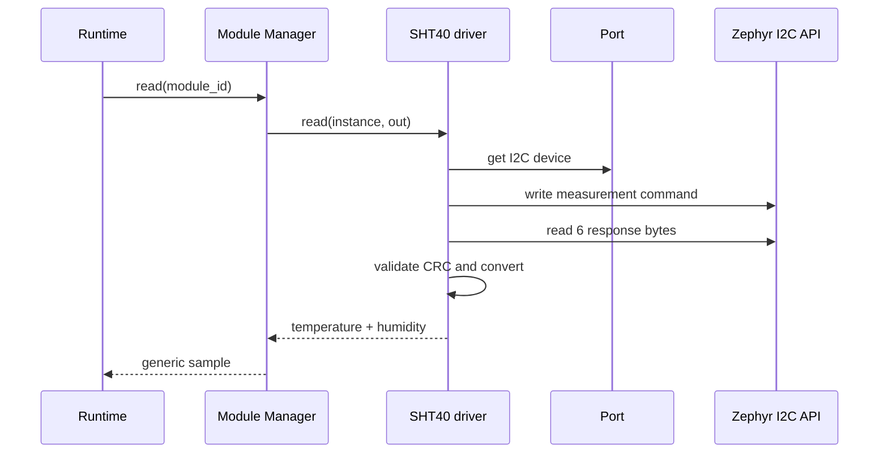

# SHT40 module driver

[← Project README](../../README.md) · [Architecture](../../ARCHITECTURE.md)

The SHT40 driver is a concrete example of a removable input module. It performs the SHT4x measurement protocol through the I2C controller exposed by the assigned Port and returns generic temperature/humidity values.

## What this component owns

- SHT40 runtime address and per-instance protocol state.
- Measurement command, response parsing, CRC validation, and conversion formulas.
- The immutable `sht40` driver descriptor.

## What this component does not own

- The physical I2C controller or pins.
- Module lifetime, periodic scheduling, Data delivery, or output transports.
- A permanent SHT40 Devicetree device node.

## Files

| File | Role |
|---|---|
| `sht40.h` | Runtime config and exported descriptor declaration. |
| `sht40.c` | SHT40 operation callbacks and protocol implementation. |
| `include/spaghetti/module_driver.h` | Common driver operation signatures. |
| `include/spaghetti/data.h` | Generic measurement output contract. |

## Data model

| Type / object | Owner | Meaning |
|---|---|---|
| `spaghetti_sht40_config` | Config copied into instance context | Validated 7-bit I2C address and selected bounded measurement mode. |
| SHT40 private context | Module instance | Address and last diagnostic state. |
| Temperature/humidity sample | Caller after successful read | Converted fixed representation with source and validity. |

## API contract

### `int sht40_init(struct spaghetti_module *module, const void *config, size_t config_size)`

**Purpose:** Validate config, resolve the Port I2C device, and verify the instance can be used.

**Parameters**

| Parameter | Meaning |
|---|---|
| `module` | Manager-owned instance assigned to an I2C-capable Port. |
| `config` | Pointer to `spaghetti_sht40_config`. |
| `config_size` | Must equal the config structure size. |

**Returns:** `0` and READY state on success.

**Errors:** `-EINVAL` for malformed config, `-ENOTSUP` for a non-I2C Port, `-ENODEV` for unavailable controller/device.

**Execution context:** Calling thread.

**Calls:** `spaghetti_port_i2c_device()` and optional bounded probe transaction.

### `int sht40_read(struct spaghetti_module *module, struct spaghetti_sample *out)`

**Purpose:** Trigger one measurement, validate the response, and return converted values.

**Parameters**

| Parameter | Meaning |
|---|---|
| `module` | READY SHT40 instance. |
| `out` | Caller-owned sample destination. |

**Returns:** `0` with temperature/humidity populated.

**Errors:** Invalid pointer/state, I2C error, timeout, short response, or CRC mismatch.

**Execution context:** Calling thread; the conversion and bus wait are bounded.

**Calls:** Zephyr `i2c_write()`/`i2c_read()` through Port.

### `int sht40_deinit(struct spaghetti_module *module)`

**Purpose:** Clear instance protocol state; no global driver state is changed.

**Parameters**

| Parameter | Meaning |
|---|---|
| `module` | Initialized SHT40 instance. |

**Returns:** `0` after the context is no longer usable.

**Errors:** `-EINVAL` for an invalid instance.

**Execution context:** Calling thread.

**Calls:** No bus call unless the selected operating mode requires an explicit stop.

## How it works



## Practical example

A module instance on Port 0 carries address `0x44`. One read sends the selected measurement command, receives two raw values plus CRC bytes, converts them, and returns them. Disconnecting the sensor produces a bus error instead of fabricated data.

## Zephyr integration

- Enable the generic I2C API with `CONFIG_I2C=y`.
- Use the Port-provided `struct device`; do not instantiate the removable SHT40 permanently in Devicetree.
- Sleep/wait only in thread context and use datasheet-defined measurement timing.

## Configuration templates

### Runtime configuration

```c
struct spaghetti_sht40_config {
    uint16_t i2c_address; /* Valid 7-bit address, for example 0x44. */
};
```

### `prj.conf`

```ini
CONFIG_I2C=y
CONFIG_LOG=y
```

The standard Zephyr Sensor API is not required for the removable runtime
model; the driver talks to the Port's I2C controller directly.

## Ownership and concurrency

Reads are synchronous. Module Manager prevents removal during an operation and Port serializes shared I2C transactions. The driver owns no thread and exposes no global mutable address.

## Contract guarantees

- CRC failure never produces a valid sample.
- Every protocol constant is traceable to the SHT4x datasheet.
- Two instances may use different Ports or addresses without sharing mutable state.
