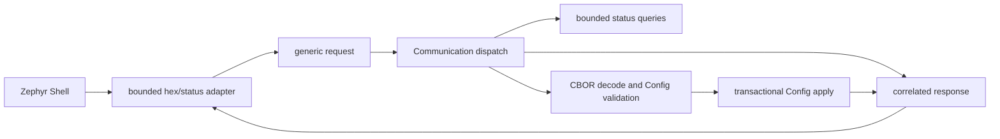

# Communication

[← Project README](../../README.md) · [Architecture](../../ARCHITECTURE.md)

Communication V0 separates transport-specific input from bounded firmware
requests. Zephyr Shell is the first adapter; future transports reuse the same
`spaghetti_communication_handle_request()` dispatch.

## Contratti

`include/spaghetti/communication.h` defines caller-owned request and response
envelopes with a fixed 256-byte payload. Communication never retains pointers to
Shell `argv` or transport buffers.

```c
enum spaghetti_request_type {
	SPAGHETTI_REQUEST_GET_STATUS,
	SPAGHETTI_REQUEST_SET_CONFIG,
};

int spaghetti_communication_init(void);
int spaghetti_communication_handle_request(
	const struct spaghetti_request *request,
	struct spaghetti_response *response);
```

The function return value describes envelope/dispatch validity. Once a request is
accepted it returns `0`, copies the correlation ID, and puts the domain result in
`response.status`. This distinction lets every adapter handle malformed frames and
valid operations in the same way.

## GET_STATUS

Communication first queries the count for every Port with
`spaghetti_module_manager_list_by_port(port_id, NULL, 0, &count)`, then copies all
snapshots into a fixed array. The response contains Core state, operational mode,
MCUboot image state, active slot, confirmation, signed version, Port count, Module
count and, for every Module:

- stable key and runtime ID;
- Port ID;
- complete driver type ID;
- endpoint kind/value;
- lifecycle state.

The compact status type field accepts up to 15 visible characters plus NUL, which
covers the registered `ina219` and `relay` drivers. A longer future type returns
`response.status = -EMSGSIZE`; it is never truncated. Consumers copy payload bytes
with `memcpy` into `spaghetti_communication_status_payload` before reading them.

## SET_CONFIG

SET_CONFIG accepts 1–256 CBOR bytes. Communication decodes them into a temporary
`spaghetti_config`, obtains the current snapshot and generation, then calls
`spaghetti_config_apply(&candidate, generation)`. A concurrent replacement returns
`-ESTALE` instead of overwriting newer desired state. Decode, apply, persistence or
rollback errors are returned in `response.status`; the dispatch return remains `0`
because the request envelope itself was valid.

The decoder does not retain request bytes and Config does not know about CBOR or the
Shell. This keeps the same dispatch usable by future MQTT and other transports.

## Shell adapter

`communication_shell.c` registers:

```text
spaghetti status
spaghetti apply <hex>
spaghetti wifi add <ssid> <open|wpa2>
spaghetti wifi list
spaghetti wifi prefer <ssid>
spaghetti wifi unprefer
spaghetti wifi remove <ssid>
spaghetti wifi connect
```

`status` first prints the independent operational mode and image state, then every
Module, including multiple Modules on the same Port. `apply`
requires non-empty even-length hexadecimal text, rejects invalid characters, and
decodes at most 256 bytes into a stack-owned request. Missing, odd, malformed, or
oversized input never reaches dispatch.

The shell uses the existing `usb_serial` console selected by the board overlay.
`CONFIG_SHELL_CMD_BUFF_SIZE=600` permits the 512 hexadecimal characters required by
the maximum payload plus command text. `CONFIG_SHELL_STACK_SIZE=3072` bounds enough
stack for the two 256-byte envelopes and the status snapshot built synchronously.
Shell handlers call only Communication, never Manager or Config directly.
The Wi-Fi subcommands are a separate provisioning adapter: WPA2 passwords are read
from a hidden interactive prompt, copied into Secure Storage, and wiped from the
handler stack. They never appear in command arguments, history, list output, or logs.
See [Persistent Wi-Fi Profiles](../services/wifi_profiles/README.md).



Core initializes Communication after restoring persisted Config. Before init,
dispatch returns `-EACCES`; a second init returns `-EALREADY`.

## Authenticated remote console

`remote_console.c` applies lifecycle and authorization policy;
`remote_console_tls.c` owns the TLS 1.2 TCP socket on port `1338`, the dedicated
PSK record in PSA ITS, and a bounded log backend. This is deliberately not Zephyr
Telnet: the remote peer receives only `spaghetti status`, `spaghetti apply <hex>`,
`maintenance reboot`, and `help`. Status and Config still cross the same
`spaghetti_communication_handle_request()` boundary used by the serial adapter.

The listener exists only in Normal mode and only after a separate 32-byte console
PSK and 1–32 byte identity have been provisioned through the local Maintenance Link
(management command IDs 10 and 11 set/clear them). OTA credentials are independent.
One authenticated client is accepted; inactivity closes it after five minutes.
The log backend copies fragments into eight static 256-byte slots without waiting.
When full, it discards the oldest fragment and increments the status counter, so a
slow client cannot block Runtime or a log producer.

The current Core V1/V2 secure-storage transform derives its encryption key from the
device ID. Zephyr warns that this does not establish strong physical at-rest
protection; production hardware must replace that provider with a protected key.

The host credential file is JSON and must be readable only by its owner:

```json
{"identity":"core-v1","psk":"64 hexadecimal digits"}
```

```sh
chmod 600 .keys/remote-console.json
make monitor TRANSPORT=network HOST=192.0.2.10 PORT=1338 \
  CREDENTIALS=.keys/remote-console.json
```

The client requires Python 3.13+ with TLS-PSK, fixes TLS to
`PSK-AES128-GCM-SHA256`, and has no option to skip authentication. Serial and
network bytes feed the same Rich formatter; Ctrl+X remains local and Ctrl+C is sent
to the selected console.
