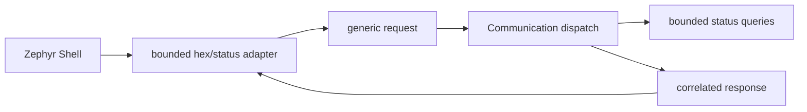

# Communication

[← Project README](../../README.md) · [Architecture](../../ARCHITECTURE.md)

Communication V0 separates transport-specific input from bounded firmware
requests. Zephyr Shell is the first adapter; future transports reuse the same
`spaghetti_communication_handle_request()` dispatch.

## Contratti

`include/spaghetti/communication.h` defines caller-owned request and response
envelopes with a fixed 256-byte payload. Communication never retains pointers to
Shell `argv` or transport buffers.

```c
enum spaghetti_request_type {
	SPAGHETTI_REQUEST_GET_STATUS,
	SPAGHETTI_REQUEST_SET_CONFIG,
};

int spaghetti_communication_init(void);
int spaghetti_communication_handle_request(
	const struct spaghetti_request *request,
	struct spaghetti_response *response);
```

The function return value describes envelope/dispatch validity. Once a request is
accepted it returns `0`, copies the correlation ID, and puts the domain result in
`response.status`. This distinction lets every adapter handle malformed frames and
valid operations in the same way.

## GET_STATUS

Communication first queries the count for every Port with
`spaghetti_module_manager_list_by_port(port_id, NULL, 0, &count)`, then copies all
snapshots into a fixed array. The response contains Core state, Port count, Module
count and, for every Module:

- stable key and runtime ID;
- Port ID;
- complete driver type ID;
- endpoint kind/value;
- lifecycle state.

The compact status type field accepts up to 15 visible characters plus NUL, which
covers the registered `ina219` and `relay` drivers. A longer future type returns
`response.status = -EMSGSIZE`; it is never truncated. Consumers copy payload bytes
with `memcpy` into `spaghetti_communication_status_payload` before reading them.

## SET_CONFIG

In phase 140, SET_CONFIG validates and carries 1–256 opaque bytes but returns
`response.status = -ENOTSUP`. It deliberately does not guess their format or modify
Config. Phase 150 adds the documented CBOR decoder and connects decode → validate →
apply at this exact dispatch point.

## Shell adapter

`communication_shell.c` registers:

```text
spaghetti status
spaghetti apply <hex>
```

`status` prints every Module, including multiple Modules on the same Port. `apply`
requires non-empty even-length hexadecimal text, rejects invalid characters, and
decodes at most 256 bytes into a stack-owned request. Missing, odd, malformed, or
oversized input never reaches dispatch.

The shell uses the existing `usb_serial` console selected by the board overlay.
`CONFIG_SHELL_CMD_BUFF_SIZE=600` permits the 512 hexadecimal characters required by
the maximum payload plus command text. `CONFIG_SHELL_STACK_SIZE=3072` bounds enough
stack for the two 256-byte envelopes and the status snapshot built synchronously.
Shell handlers call only Communication, never Manager or Config directly.



Core initializes Communication after restoring persisted Config. Before init,
dispatch returns `-EACCES`; a second init returns `-EALREADY`.
