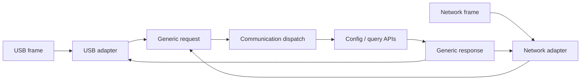

# Communication adapters

[← Project README](../../README.md) · [Architecture](../../ARCHITECTURE.md)

Communication separates transport-specific bytes from generic firmware requests, responses, and events. USB, UART, Bluetooth, HTTP, or MQTT can be adapters around the same internal command contract.

## What this component owns

- Bounded request/response/event envelopes and request dispatch.
- Correlation IDs, protocol version, payload-size validation, and status mapping.
- Adapter registration and transport-independent diagnostics.

## What this component does not own

- Module instances, Config internals, product rules, or network client state.
- Unbounded transport buffers or borrowed RX memory after callback return.

## Files

| File | Role |
|---|---|
| `include/spaghetti/communication.h` | Generic request/response/event API. |
| `subsys/communication/communication.c` | Validation and command dispatch. |
| `communication_<transport>.c` | Framing/parsing/output for one optional transport. |
| Component APIs | Core/Config/Data/Discovery operations called by dispatch. |

## Data model

| Type / object | Owner | Meaning |
|---|---|---|
| Request | Adapter until copied/handled | Version, correlation ID, command, bounded payload. |
| Response | Communication then adapter | Correlation ID, status, bounded payload. |
| Event | Producer/Communication | Unsolicited bounded notification. |
| Communication status | Communication | Adapter readiness, malformed/oversize/drop counters. |

## API contract

### `int spaghetti_communication_init(void)`

**Purpose:** Initialize dispatch tables, status, and registered adapters.

**Parameters**

| Parameter | Meaning |
|---|---|
| None | No input parameters. |

**Returns:** `0` when request handling is available.

**Errors:** Invalid static command table or adapter initialization failure.

**Execution context:** Main thread during boot.

**Calls:** Selected adapter initialization.

### `int spaghetti_communication_handle_request(const struct spaghetti_request *request, struct spaghetti_response *response)`

**Purpose:** Validate and synchronously dispatch one complete generic request.

**Parameters**

| Parameter | Meaning |
|---|---|
| `request` | Caller-owned request valid during the call. |
| `response` | Caller-owned destination populated for every accepted request. |

**Returns:** `0` when a response was produced; negative framing/dispatch error otherwise.

**Errors:** Unsupported version/command, invalid length/payload, unauthorized state, or component error.

**Execution context:** Communication/shell thread, never raw ISR.

**Calls:** Core query, Config apply, Discovery submit, or other explicit component API.

### `int spaghetti_communication_receive(const uint8_t *bytes, size_t length, enum spaghetti_transport_id transport)`

**Purpose:** Copy and decode one bounded transport frame before dispatch.

**Parameters**

| Parameter | Meaning |
|---|---|
| `bytes` | Transport-owned bytes valid only during the call. |
| `length` | Exact frame length below configured maximum. |
| `transport` | Registered source adapter ID. |

**Returns:** `0` after response handoff or negative decode/dispatch error.

**Errors:** Null/empty/oversized frame, malformed encoding, unknown transport, or queue full.

**Execution context:** Thread/workqueue; callback must defer before calling if it cannot block.

**Calls:** Codec, `handle_request()`, and adapter response send.

### `int spaghetti_communication_send_event(const struct spaghetti_event *event)`

**Purpose:** Fan one generic event out to interested ready adapters.

**Parameters**

| Parameter | Meaning |
|---|---|
| `event` | Bounded event copied before return. |

**Returns:** `0` when accepted by policy.

**Errors:** Invalid/oversized event, no ready adapter, or adapter queue full.

**Execution context:** Calling thread or Data subscriber adapter.

**Calls:** Registered adapter enqueue functions.

### `int spaghetti_communication_get_status(struct spaghetti_communication_status *out)`

**Purpose:** Copy adapter and protocol counters.

**Parameters**

| Parameter | Meaning |
|---|---|
| `out` | Caller-owned destination. |

**Returns:** `0` with coherent status.

**Errors:** Invalid output or uninitialized component.

**Execution context:** Calling thread.

**Calls:** None.

## How it works



## Practical example

`spaghetti status` from a USB shell and an HTTP `GET /status` request both become
`GET_STATUS`. Dispatch returns a bounded list of zero or more Modules for each Port;
every entry contains stable key, runtime ID, driver type, normalized endpoint, and
state. It never returns a singular "Module of Port". Only transport framing differs.

## Zephyr integration

- A Zephyr shell command runs in shell thread context and may make bounded direct calls.
- UART/USB/network receive callbacks copy and defer work when parsing or dispatch can block.
- Use fixed frame/payload limits and bounded adapter queues.

## Configuration templates

### Generic envelope

```c
struct spaghetti_request {
    uint16_t version;
    uint32_t correlation_id;
    enum spaghetti_command_id command;
    uint8_t payload[SPAGHETTI_REQUEST_PAYLOAD_MAX];
    size_t payload_size;
};
```

### Shell adapter `prj.conf`

```ini
CONFIG_SHELL=y
CONFIG_SHELL_BACKEND_SERIAL=y
```

### Shell registration shape

```c
SHELL_STATIC_SUBCMD_SET_CREATE(spaghetti_commands,
    SHELL_CMD(status, NULL, "Show Core status", cmd_status),
    SHELL_CMD(apply, NULL, "Apply bounded encoded config", cmd_apply),
    SHELL_SUBCMD_SET_END
);
```

## Ownership and concurrency

Dispatch is synchronous unless a command explicitly returns accepted/pending. Transport callbacks never retain caller buffers. Each adapter owns its outbound queue and full policy.

## Contract guarantees

- A transport cannot bypass validation or mutate component internals.
- Every retained request/event byte is copied into bounded storage.
- Adding or removing an adapter does not alter Manager, Config, Data, or Runtime contracts.
- Status and commands identify a Module by key or runtime ID, never by Port alone.
