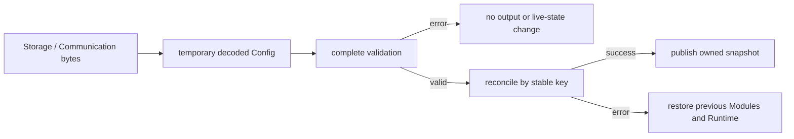

# Config

[← Project README](../../README.md) · [Architecture](../../ARCHITECTURE.md)

Config owns the validated desired state of the firmware. Storage, Communication,
and the CBOR codec construct the same bounded `struct spaghetti_config`; live Modules
change only after complete validation.

## Responsibilities

Config owns a copy of the last successfully applied snapshot. Each desired Module
contains a stable key, a shareable Port, a driver type ID, and copied concrete driver
bytes. Config does not own live Module instances, driver contexts, samples, or wire
formats.

The Port-to-Module relation is 1:N. Two INA219 Modules on Port 0 are valid at distinct
I2C endpoints such as `0x40` and `0x41`. A repeated stable key or the same endpoint on
the same Port is a collision.

## Files and API

| File | Role |
|---|---|
| `include/spaghetti/config.h` | Bounded desired-state model and transaction API. |
| `include/spaghetti/config_codec.h` | Bounded CBOR decode boundary. |
| `subsys/config/config.c` | Validation, reconciliation, commit, and rollback. |
| `subsys/config/config_cbor.c` | Strict wire V0/V1 decoder. |
| `subsys/config/spaghetti_config_v0.cddl` | Authoritative legacy wire V0 schema. |
| `subsys/config/spaghetti_config_v1.cddl` | Wire V1 schema with MQTT settings. |
| `tests/config/src/main.c` | Native transaction tests. |
| `tests/config_codec/src/main.c` | Native codec and boundary tests. |

```c
int spaghetti_config_decode_cbor(const uint8_t *bytes, size_t length,
				 struct spaghetti_config *out);
int spaghetti_config_validate(const struct spaghetti_config *candidate);
int spaghetti_config_apply(const struct spaghetti_config *candidate);
int spaghetti_config_get_snapshot(struct spaghetti_config *out);
```

`spaghetti_config_decode_cbor()` accepts 1–256 borrowed bytes, parses into a temporary
snapshot, calls `spaghetti_config_validate()`, and copies to `out` only on complete
success. It never applies Config. Legacy wire V0 has version `1` and decodes with MQTT
disabled. Wire V1 has version `2` and adds a bounded MQTT map containing enabled,
host, TCP port, and base topic. Both map explicit fields into internal Config version
`3`, so the persistent C struct is never treated as a network ABI.

`spaghetti_config_validate()` checks version, bounds, keys, Ports, drivers,
capabilities, concrete configuration, endpoint conflicts, sampling, threshold
references, and canonical MQTT settings without hardware I/O. The sampling source
must support `read`; the rule target must support `command`.

`spaghetti_config_apply()` reconciles by stable key and publishes only after success.
On failure it removes new instances and restores the previous Modules, Runtime, and
MQTT state. `spaghetti_config_get_snapshot()` returns a coherent caller-owned copy and
leaves its output unchanged when no Config has been applied.

## Flow and ownership



The snapshot contains no pointers. Config copies strings and concrete driver bytes;
decoder and caller buffers are borrowed only during each call. A mutex serializes
apply and snapshot reads. All storage is statically bounded and no heap is used.
