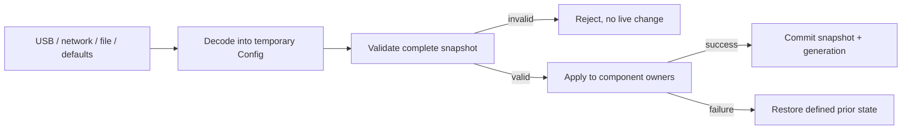

# Config

[← Project README](../../README.md) · [Architecture](../../ARCHITECTURE.md)

Config is the validated desired-state model. It gives every input source and storage backend one common representation before anything changes in the live system.

## What this component owns

- The current validated configuration snapshot and schema version.
- Syntactic/semantic validation independent of transport.
- Atomic replacement and reconciliation requests to owning components.

## What this component does not own

- Transport parsing, flash layout, module instances, measurements, or product execution.
- Secrets unless an explicit protected-storage contract is defined.

## Files

| File | Role |
|---|---|
| `include/spaghetti/config.h` | Bounded schema, snapshot, validation, and apply declarations. |
| `subsys/config/config.c` | Validation and atomic snapshot management. |
| Optional codec files | Translate CBOR/JSON/other bytes into the same internal model. |
| Storage service | Persists an encoded/versioned snapshot when required. |

## Data model

| Type / object | Owner | Meaning |
|---|---|---|
| `spaghetti_config` | Config | Complete validated desired-state snapshot. |
| Module assignment | Config snapshot | Port ID, bounded type ID, and bounded driver config. |
| Runtime rule/schedule | Config snapshot | Generic module IDs/channels and timing. |
| Generation/version | Config | Detects stale updates and incompatible schemas. |

## API contract

### `int spaghetti_config_init(const struct spaghetti_config *defaults)`

**Purpose:** Validate and install the startup default snapshot.

**Parameters**

| Parameter | Meaning |
|---|---|
| `defaults` | Complete caller-owned default configuration copied on success. |

**Returns:** `0` with generation initialized.

**Errors:** Null or semantically invalid defaults.

**Execution context:** Main thread during boot.

**Calls:** Pure validation; no live apply required by this function.

### `int spaghetti_config_validate(const struct spaghetti_config *candidate, struct spaghetti_config_error *error)`

**Purpose:** Validate the entire candidate without side effects.

**Parameters**

| Parameter | Meaning |
|---|---|
| `candidate` | Complete caller-owned snapshot. |
| `error` | Optional destination for field/index/reason diagnostics. |

**Returns:** `0` when fully valid; negative semantic error otherwise.

**Errors:** Unsupported version, invalid count/range/string, duplicates, inconsistent references.

**Execution context:** Calling thread; pure function.

**Calls:** Bounded schema checks only.

### `int spaghetti_config_apply(const struct spaghetti_config *candidate, uint32_t expected_generation)`

**Purpose:** Reconcile a valid candidate with live component owners and commit atomically.

**Parameters**

| Parameter | Meaning |
|---|---|
| `candidate` | Complete candidate copied before return. |
| `expected_generation` | Current generation required to reject stale writers. |

**Returns:** `0` plus incremented generation.

**Errors:** Validation failure, stale generation, component apply error, or rollback error.

**Execution context:** Calling thread; never ISR.

**Calls:** Module Manager, Runtime, and selected service configuration APIs.

### `int spaghetti_config_get_snapshot(struct spaghetti_config *out, uint32_t *generation)`

**Purpose:** Copy the current desired state.

**Parameters**

| Parameter | Meaning |
|---|---|
| `out` | Caller-owned snapshot destination. |
| `generation` | Optional generation destination. |

**Returns:** `0` with a coherent copy.

**Errors:** Invalid output or uninitialized Config.

**Execution context:** Calling thread.

**Calls:** None.

### `int spaghetti_config_reset_defaults(void)`

**Purpose:** Validate and apply the stored default snapshot through the same transactional path.

**Parameters**

| Parameter | Meaning |
|---|---|
| None | No input parameters. |

**Returns:** `0` after defaults are live and current.

**Errors:** Apply/rollback failure.

**Execution context:** Calling thread.

**Calls:** `spaghetti_config_apply()`.

## How it works



## Practical example

A candidate assigns two modules but repeats Port 0. Validation rejects it before Manager is called. A valid candidate is applied completely; only after all owners accept it does Config publish the new generation.

## Zephyr integration

- Config is runtime state; Kconfig is unrelated build-time feature selection.
- A short `k_mutex` can protect snapshot/generation copies.
- Persistence uses a Storage adapter; Zephyr Settings callbacks must decode into a temporary candidate before apply.

## Configuration templates

### Bounded schema shape

```c
#define SPAGHETTI_CONFIG_MAX_MODULES 8
#define SPAGHETTI_TYPE_ID_MAX 24

struct spaghetti_module_config {
    spaghetti_port_id_t port_id;
    char type_id[SPAGHETTI_TYPE_ID_MAX];
    uint8_t driver_config[SPAGHETTI_DRIVER_CONFIG_MAX];
    size_t driver_config_size;
};

struct spaghetti_config {
    uint32_t version;
    size_t module_count;
    struct spaghetti_module_config modules[SPAGHETTI_CONFIG_MAX_MODULES];
};
```

The concrete schema may add bounded sections, but every retained string and
payload must be owned by the snapshot.

## Ownership and concurrency

Readers receive coherent copies. A single apply transaction serializes desired-state mutation and never exposes the partially reconciled candidate as current.

## Contract guarantees

- Invalid input has no live side effect.
- A committed snapshot owns all retained bytes.
- Transport, encoding, and storage format do not change the internal Config contract.
