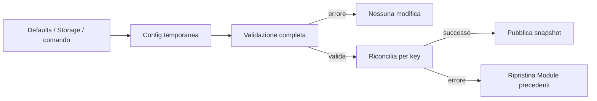

# Config

[← Project README](../../README.md) · [Architecture](../../ARCHITECTURE.md)

Config è il desired state validato del firmware. Tutte le sorgenti future, come
Storage, Shell o CBOR, devono prima costruire la stessa `struct spaghetti_config`:
solo dopo una validazione completa Config modifica i Module vivi.

## Responsabilità

Config possiede una copia bounded dell'ultimo snapshot applicato con successo.
Ogni Module desiderato contiene una key stabile, una Port condivisibile, il type ID
del driver e una copia dei byte di configurazione del driver. Config non possiede le
istanze vive, i context dei driver, i sample o il formato persistente.

La relazione Port → Module è 1:N. Due INA219 sulla Port 0 sono validi se usano, per
esempio, gli endpoint I2C `0x40` e `0x41`. La stessa key o lo stesso endpoint sulla
stessa Port costituiscono invece una collisione.

## File

| File | Ruolo |
|---|---|
| `include/spaghetti/config.h` | Schema bounded e API pubblica. |
| `subsys/config/config.c` | Validazione, riconciliazione e rollback. |
| `tests/config/src/main.c` | Test nativo della transazione. |

## API

```c
int spaghetti_config_validate(const struct spaghetti_config *candidate);
int spaghetti_config_apply(const struct spaghetti_config *candidate);
int spaghetti_config_get_snapshot(struct spaghetti_config *out);
```

`spaghetti_config_validate()` è pura: verifica versione, limiti, key, Port, driver,
capability, configurazioni concrete, endpoint e sorgente di sampling senza toccare
l'hardware o il Manager.

`spaghetti_config_apply()` riconcilia per key. Mantiene intatti i Module invariati,
rimuove quelli assenti o cambiati e configura quelli nuovi. Pubblica la copia del
candidato soltanto dopo il successo completo. Se un'operazione fallisce, elimina le
istanze appena aggiunte e ricrea quelle precedenti che aveva rimosso.

`spaghetti_config_get_snapshot()` scrive una copia coerente nel buffer del chiamante.
Prima del primo apply riuscito restituisce `-ENOENT`; in caso di errore non modifica
l'output.

## Flusso



Il campo `sampling.source_key` resta una key persistente. Durante apply Config la
risolve in un Module runtime READY. La consegna dell'ID al Runtime verrà aggiunta
quando il componente Runtime sarà implementato nella fase 120.

## Proprietà e concorrenza

Lo snapshot non contiene puntatori: stringhe e configurazioni dei driver sono copie
possedute da Config per tutta la durata dello snapshot corrente. Gli input sono
prestati soltanto durante la chiamata. Un mutex serializza apply e lettura dello
snapshot; le risorse restano statiche e non viene usato heap.
