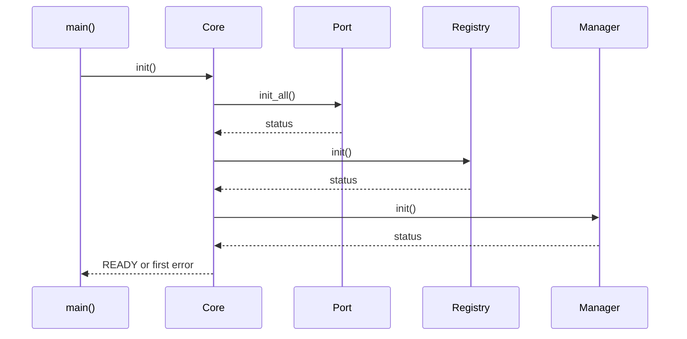

# Core

[← Project README](../../README.md) · [Architecture](../../ARCHITECTURE.md)

Core is the firmware startup coordinator. It initializes required components in dependency order and exposes one board-independent view of overall readiness.

## What this component owns

- Overall boot state and immutable firmware/Core information.
- Initialization and start ordering.
- Propagation of mandatory dependency failures.

## What this component does not own

- Ports, module instances, sensor protocols, product rules, or transport state.
- Board-specific pins or MCU-name branches.

## Files

| File | Role |
|---|---|
| `include/spaghetti/core.h` | Public Core state, info, and function declarations. |
| `subsys/core/core.c` | Private state and startup sequence. |
| `src/main.c` | Calls Core and handles its final boot result. |

## Data model

| Type / object | Owner | Meaning |
|---|---|---|
| `spaghetti_core_state` | Core | UNINITIALIZED, INITIALIZING, READY, RUNNING, DEGRADED, or FAILED. |
| `spaghetti_core_info` | Core | Immutable firmware identity and capability summary. |
| Initialization flags | Core | Private record preventing invalid repeated transitions. |

## API contract

### `int spaghetti_core_init(void)`

**Purpose:** Initialize every mandatory component in documented dependency order.

**Parameters**

| Parameter | Meaning |
|---|---|
| None | No input parameters. |

**Returns:** `0` when Core reaches READY; first negative dependency error otherwise.

**Errors:** Invalid static hardware, unavailable mandatory dependency, or repeated invalid initialization.

**Execution context:** Zephyr main thread; bounded blocking is allowed.

**Calls:** Port, Registry, Manager, Config/Data/Runtime initialization as selected by the application.

### `int spaghetti_core_start(void)`

**Purpose:** Start asynchronous components after construction is complete.

**Parameters**

| Parameter | Meaning |
|---|---|
| None | No input parameters. |

**Returns:** `0` when Core reaches RUNNING; negative start error otherwise.

**Errors:** Called before READY or an asynchronous component fails to start.

**Execution context:** Zephyr main thread.

**Calls:** Only selected components that have a distinct start operation.

### `enum spaghetti_core_state spaghetti_core_get_state(void)`

**Purpose:** Return the current overall state without changing it.

**Parameters**

| Parameter | Meaning |
|---|---|
| None | No input parameters. |

**Returns:** Current enum value.

**Errors:** None.

**Execution context:** Any documented thread context; implementation must provide a coherent read.

**Calls:** None.

### `int spaghetti_core_get_info(struct spaghetti_core_info *out)`

**Purpose:** Copy immutable identity/capability information for diagnostics.

**Parameters**

| Parameter | Meaning |
|---|---|
| `out` | Caller-owned destination. |

**Returns:** `0` with a complete snapshot.

**Errors:** `-EINVAL` for null output; `-EAGAIN` before initialization if info is unavailable.

**Execution context:** Calling thread.

**Calls:** None.

## How it works



## Practical example

If Port initialization returns `-ENODEV`, Core stops the sequence, enters FAILED, returns that error to `main`, and never reports READY. It does not hide the failure and continue with invalid hardware.

## Zephyr integration

- `main()` already runs in a Zephyr thread.
- Use one Zephyr logging module for structured boot diagnostics.
- Kconfig controls which optional components are compiled; Core coordinates only those present.

## Configuration templates

### `CMakeLists.txt`

```cmake
target_include_directories(app PRIVATE include)

target_sources(app PRIVATE
  src/main.c
  subsys/core/core.c
)
```

### `prj.conf`

```ini
CONFIG_LOG=y
CONFIG_SERIAL=y
CONFIG_CONSOLE=y
```

### Minimal `main.c` usage

```c
int main(void)
{
    int err = spaghetti_core_init();
    if (err < 0) {
        return err;
    }

    return spaghetti_core_start();
}
```

## Ownership and concurrency

Initialization and start transitions are serialized in the main thread. Getters return copied or atomically coherent state. Core owns no worker thread solely for coordination.

## Contract guarantees

- READY means every mandatory initialized dependency succeeded.
- The first meaningful error is preserved for diagnostics.
- No higher component must branch on a concrete MCU or board name.
