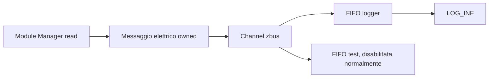

# Data

[← Project README](../../README.md) · [Architecture](../../ARCHITECTURE.md)

Data distribuisce misure normalizzate senza esporre ai consumer il driver che le ha
prodotte. Logger, test e futuri adapter MQTT conoscono il messaggio elettrico, non
`ina219.h` né i dettagli I2C.

## Responsabilità

Data possiede il channel zbus, gli observer statici e i contatori diagnostici. Non
esegue acquisizioni, non possiede Module o Port e non conserva puntatori del publisher.

## File

| File | Ruolo |
|---|---|
| `include/spaghetti/data.h` | Messaggio, statistiche e API pubbliche. |
| `subsys/data/data.c` | Channel, subscriber, logger e publish. |
| `tests/data/` | Test fan-out e pool pieno. |

## Messaggio

`struct spaghetti_electrical_message` è priva di puntatori e contiene:

- `source_id`, handle dell'istanza Module viva;
- `source_key`, identità Config stabile anche dopo un reboot;
- bus voltage, current firmata e power nelle stesse microunità di
  `struct spaghetti_sample`;
- uptime di acquisizione in millisecondi;
- sequence del publisher, con wrap unsigned intenzionale.

Due Module sulla stessa Port restano distinti tramite ID e key. Data non usa la Port
come identità e non assume che la sorgente sia un INA219.

## API

```c
int spaghetti_data_init(void);
int spaghetti_data_publish_electrical(
	const struct spaghetti_electrical_message *message,
	k_timeout_t timeout);
int spaghetti_data_get_stats(struct spaghetti_data_stats *out);
```

`spaghetti_data_init()` azzera i contatori una sola volta. Channel e observer sono
oggetti statici che Zephyr prepara prima di `main`.

`spaghetti_data_publish_electrical()` presta il messaggio a zbus per la durata della
chiamata. zbus ne copia il contenuto nel channel e poi crea una copia per ciascun
observer abilitato. `K_NO_WAIT` è la policy usata dal producer firmware.

`spaghetti_data_get_stats()` restituisce i contatori atomici di publish completate,
chiamate rifiutate ed errori di consegna. I contatori possono fare wrap.

## zbus e capacità

Le FIFO dei message subscriber sono separate, ma in Zephyr 4.4 i loro messaggi usano
un pool globale di `net_buf`. Il firmware configura 8 buffer statici da 64 byte:

```ini
CONFIG_ZBUS=y
CONFIG_ZBUS_MSG_SUBSCRIBER=y
CONFIG_ZBUS_PREFER_DYNAMIC_ALLOCATION=n
CONFIG_ZBUS_MSG_SUBSCRIBER_BUF_ALLOC_STATIC=y
CONFIG_ZBUS_MSG_SUBSCRIBER_NET_BUF_POOL_SIZE=8
CONFIG_ZBUS_MSG_SUBSCRIBER_NET_BUF_STATIC_DATA_SIZE=64
```

Non viene usato heap. Il logger subscriber è consumato continuamente da un thread
bounded. Il subscriber di test esiste staticamente ma è disabilitato nel firmware
normale; il test lo abilita soltanto mentre riceve e verifica il fan-out.

## Backpressure

Se il pool non può completare tutte le copie, zbus restituisce `-ENOMEM`. Le notifiche
sono sequenziali: un observer precedente può avere già ricevuto il messaggio, quindi
l'errore rappresenta un fan-out incompleto. Data incrementa `delivery_errors`; il
producer non ritenta e continua. I consumer usano `sequence` per riconoscere buchi.



## Ownership e concorrenza

Il publisher mantiene valido il proprio oggetto soltanto fino al ritorno; zbus e i
subscriber lavorano su copie. I contatori sono atomici, stack e pool sono statici e
bounded. Il logger è l'unico proprietario della lettura dalla propria FIFO.
