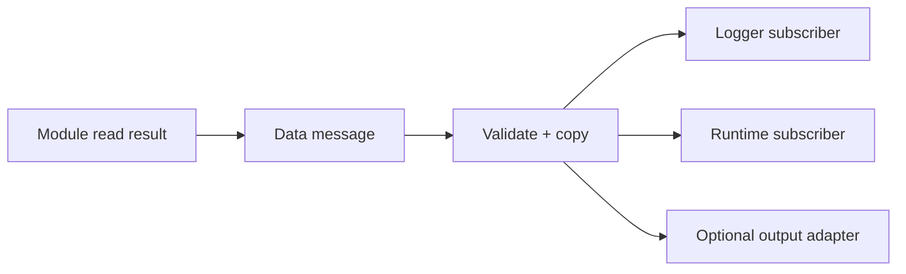

# Data

[← Project README](../../README.md) · [Architecture](../../ARCHITECTURE.md)

Data defines normalized measurements and events independently of the driver that produced them and the adapter that consumes them.

## What this component owns

- Bounded value/event schemas and validation.
- Source identity, timestamp, sequence, validity, and delivery statistics.
- The selected fan-out mechanism and its overflow policy.

## What this component does not own

- Sensor acquisition, product rules, long-term storage, or transport encoding.
- Pointers to producer stack memory after publish returns.

## Files

| File | Role |
|---|---|
| `include/spaghetti/data.h` | Value/event types and publish/query API. |
| `subsys/data/data.c` | Validation, channels/queues, and statistics. |
| Consumer adapters | Translate generic Data into logs, UI, or transport formats. |

## Data model

| Type / object | Owner | Meaning |
|---|---|---|
| `spaghetti_data_message` | Publisher until copied; Data afterward | Tagged bounded value/event envelope. |
| Electrical sample | Message payload | Source runtime ID and stable key, bus voltage, current, power, timestamp, sequence, and validity. |
| Channel/queue | Data | Bounded delivery resource with explicit full policy. |
| `spaghetti_data_stats` | Data | Published, delivered, dropped, rejected counters. |

## API contract

### `int spaghetti_data_init(void)`

**Purpose:** Initialize channels, subscribers, counters, and initial values.

**Parameters**

| Parameter | Meaning |
|---|---|
| None | No input parameters. |

**Returns:** `0` when Data is ready.

**Errors:** Invalid static channel configuration or subscriber capacity.

**Execution context:** Main thread during boot.

**Calls:** Selected Zephyr zbus/message-queue initialization.

### `int spaghetti_data_validate(const struct spaghetti_data_message *message)`

**Purpose:** Validate type, bounds, source, timestamp, and flags without side effects.

**Parameters**

| Parameter | Meaning |
|---|---|
| `message` | Caller-owned complete message. |

**Returns:** `0` when publishable.

**Errors:** Null, unknown type, invalid source, malformed payload, or inconsistent validity flags.

**Execution context:** Calling thread; pure validation.

**Calls:** None.

### `int spaghetti_data_publish(const struct spaghetti_data_message *message, k_timeout_t timeout)`

**Purpose:** Copy one valid message into the selected bounded delivery path.

**Parameters**

| Parameter | Meaning |
|---|---|
| `message` | Caller-owned message copied before return. |
| `timeout` | Maximum wait according to the channel policy. |

**Returns:** `0` when accepted for delivery.

**Errors:** Validation failure, timeout/full channel, or unavailable subscriber infrastructure.

**Execution context:** Documented thread context; `K_NO_WAIT` for nonblocking producers.

**Calls:** zbus publish or bounded queue API.

### `int spaghetti_data_get_stats(struct spaghetti_data_stats *out)`

**Purpose:** Copy delivery and rejection counters.

**Parameters**

| Parameter | Meaning |
|---|---|
| `out` | Caller-owned destination. |

**Returns:** `0` with coherent counters.

**Errors:** Invalid output or uninitialized Data.

**Execution context:** Calling thread.

**Calls:** None.

## How it works



## Practical example

INA219 key 10 at Port 0/address `0x40` produces 5000 mV and 120 mA. Data publishes
one message containing both its current runtime ID and stable key, timestamp,
sequence, voltage, current, and power. INA219 key 11 at `0x41` produces a separate
stream even though it shares Port 0. Logger, Runtime, and adapters do not include the
concrete driver header.

## Zephyr integration

- Use zbus when one value genuinely needs multiple independent observers.
- Use a bounded `k_msgq` when one ordered stream and explicit backpressure are the real requirement.
- Choose observer/queue sizes from message size and accepted loss/latency behavior.

## Configuration templates

### Message shape

```c
struct spaghetti_electrical_sample {
    spaghetti_module_id_t source_id;
    spaghetti_module_key_t source_key;
    int32_t bus_voltage_mv;
    int32_t current_ma;
    int32_t power_mw;
    int64_t uptime_ms;
    uint32_t sequence;
    uint32_t validity_flags;
};
```

### `prj.conf` for zbus fan-out

```ini
CONFIG_ZBUS=y
CONFIG_ZBUS_MSG_SUBSCRIBER=y
```

### Channel shape

```c
ZBUS_CHAN_DEFINE(spaghetti_electrical_chan,
                 struct spaghetti_electrical_sample,
                 electrical_validator,
                 NULL,
                 ZBUS_OBSERVERS(logger_sub, runtime_sub),
                 ZBUS_MSG_INIT(.source_id = 0, .source_key = 0));
```

## Ownership and concurrency

Publish copies the message before producer storage expires. Every consumer has a documented thread/context and full-queue policy. Statistics updates are atomic or protected by a short lock.

## Contract guarantees

- Consumers never depend on a concrete driver type.
- Source identity is never inferred from Port; key distinguishes sibling Modules on a
  shared bus and ID selects the current live instance.
- Delivery capacity and overflow behavior are bounded and documented.
- A rejected message never appears as valid downstream data.
