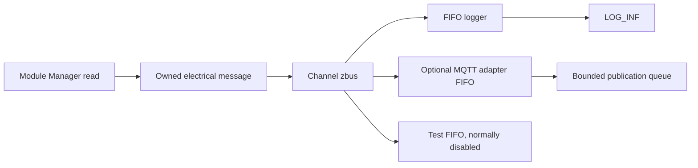

# Data

[← Project README](../../README.md) · [Architecture](../../ARCHITECTURE.md)

Data distributes normalized measurements without exposing the producing driver to
consumers. The logger, tests, and MQTT adapter know the electrical message, not
`ina219.h` or I2C details.

## Responsibilities

Data owns the zbus channel, static observers, and diagnostic counters. It does not
perform acquisitions, own Modules or Ports, or retain publisher pointers.

## File

| File | Role |
|---|---|
| `include/spaghetti/data.h` |Public Message, Statistics and API.|
| `subsys/data/data.c` |Channel, subscriber, logger and publish.|
| `tests/data/` |Fan-out test and full pool.|

## Message

`struct spaghetti_electrical_message` is without pointers and contains:

- `source_id`, handle of the live Module instance;
- `source_key`, the stable Config identity that survives a reboot;
- bus voltage, current signed and power in the same microunits as `struct
  spaghetti_sample`;
- acquisition uptime in milliseconds;
- publisher sequence, with intentional unsigned wrap.

Two Module on the same Port remain distinguished by ID and key. Data does not use the
Port as an identity and does not assume that the source is a INA219.

## API

```c
int spaghetti_data_init(void);
int spaghetti_data_publish_electrical(
	const struct spaghetti_electrical_message *message,
	k_timeout_t timeout);
int spaghetti_data_get_stats(struct spaghetti_data_stats *out);
```

`spaghetti_data_init()` removes counters once. Channel and observer are static objects
that Zephyr prepares before `main`.

`spaghetti_data_publish_electrical()` lends the message to zbus for the duration of the
call. zbus copies the content in the channel and then creates a copy for each enabled
observer. `K_NO_WAIT` is the policy used by the firmware producer.

`spaghetti_data_get_stats()` returns the complete atomic publishing meters, rejected
calls and delivery errors. Counters can wrap.

## zbus and capacity

The FIFO of message subscribers are separated, but in Zephyr 4.4 their messages use a
global pool of `net_buf`. The firmware configures 8 static buffers from 64 bytes:

```ini
CONFIG_ZBUS=y
CONFIG_ZBUS_MSG_SUBSCRIBER=y
CONFIG_ZBUS_PREFER_DYNAMIC_ALLOCATION=n
CONFIG_ZBUS_MSG_SUBSCRIBER_BUF_ALLOC_STATIC=y
CONFIG_ZBUS_MSG_SUBSCRIBER_NET_BUF_POOL_SIZE=8
CONFIG_ZBUS_MSG_SUBSCRIBER_NET_BUF_STATIC_DATA_SIZE=64
```

Heap is not used. Logger and adapter MQTT have subscriber and thread bounded. The MQTT
subscriber is disabled when MQTT is disabled by Config. The test subscriber exists
statically but is disabled in the normal firmware; the test only enables it while
receiving and checking the fan-out.

## Backpressure

If the pool cannot complete all copies, zbus returns `-ENOMEM`. Notifications are
sequential: a previous observer may have already received the message, so the error
represents an incomplete fan-out. Data increases `delivery_errors`; the producer does
not contain and continues. Consumers use `sequence` to recognize holes.



## Ownership and competition

The publisher retains its object only until the return; zbus and subscribers work on
copies. Counters are atomic, stack and pool are static and bounded. Logger and adapter
MQTT are each the only consumer of its FIFO.
