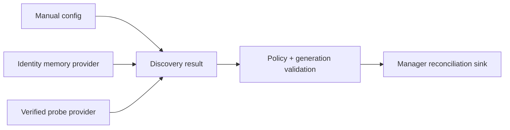

# Discovery

[← Project README](../../README.md) · [Architecture](../../ARCHITECTURE.md)

Discovery is an optional normalization boundary for proposed module identity. Manual configuration, identity memory, or a verified hardware probe can all produce the same result without changing Module Manager.

## What this component owns

- Discovery mode/policy and provider registration.
- Validation, generation, source, confidence, and invalidation of proposals.
- Delivery of accepted normalized results.

## What this component does not own

- Module instances or driver lifecycle.
- A universal assumption that modules contain EEPROM.
- Port bus access outside a provider's explicit capability contract.

## Files

| File | Role |
|---|---|
| `include/spaghetti/discovery.h` | Result/provider/policy types and API. |
| `subsys/discovery/discovery.c` | Validation, generation, and accepted-result routing. |
| Provider adapter | Manual, memory, or hardware-specific identity source. |
| Module Manager | Consumes accepted proposals and owns live instances. |

## Data model

| Type / object | Owner | Meaning |
|---|---|---|
| Discovery result | Discovery after copy | Port, bounded type/config, source, confidence, generation. |
| Provider descriptor | Provider | Immutable operations and capability requirements. |
| Per-Port generation | Discovery | Rejects stale asynchronous results. |
| Policy mode | Config/Discovery | MANUAL, AUTO, or HYBRID selection rules. |

## API contract

### `int spaghetti_discovery_init(spaghetti_discovery_sink_t sink, void *user_data)`

**Purpose:** Initialize empty per-Port state and register the accepted-result sink.

**Parameters**

| Parameter | Meaning |
|---|---|
| `sink` | Callback receiving copied accepted results. |
| `user_data` | Opaque caller context returned to the sink. |

**Returns:** `0` when ready.

**Errors:** Null sink or invalid Port capacity.

**Execution context:** Main thread during boot.

**Calls:** No provider operation.

### `int spaghetti_discovery_submit_manual(const struct spaghetti_discovery_result *result)`

**Purpose:** Validate and submit one manual proposal through the common policy path.

**Parameters**

| Parameter | Meaning |
|---|---|
| `result` | Complete caller-owned proposal copied during the call. |

**Returns:** `0` when accepted and delivered.

**Errors:** Invalid Port/type/config/source, stale generation, or sink rejection.

**Execution context:** Calling thread.

**Calls:** Registered sink, commonly Config/Module Manager reconciliation.

### `int spaghetti_discovery_run(spaghetti_port_id_t port_id, k_timeout_t timeout)`

**Purpose:** Ask the selected automatic provider to produce a proposal for one Port.

**Parameters**

| Parameter | Meaning |
|---|---|
| `port_id` | Physical Port to inspect. |
| `timeout` | Bounded provider completion policy. |

**Returns:** `0` with accepted result, or precise no-result/error status.

**Errors:** Unsupported mode/provider, busy Port, timeout, ambiguous/invalid identity.

**Execution context:** Thread or provider worker; never ISR.

**Calls:** Selected provider and accepted-result sink.

### `int spaghetti_discovery_invalidate(spaghetti_port_id_t port_id, uint32_t generation)`

**Purpose:** Invalidate an exact current proposal when hardware/config changes.

**Parameters**

| Parameter | Meaning |
|---|---|
| `port_id` | Affected Port. |
| `generation` | Expected generation to reject stale invalidation. |

**Returns:** `0` when invalidated.

**Errors:** Unknown Port, stale generation, or no current result.

**Execution context:** Calling thread.

**Calls:** Sink removal/reconciliation path.

## How it works



## Practical example

Manual input proposes `Port 0 = temperature-sensor`, generation 4. Discovery validates and forwards it. A delayed provider response for generation 3 is rejected and cannot replace the current assignment.

## Zephyr integration

- Providers that wait or access buses run in thread/workqueue context.
- Delayed work is appropriate for debounce/retry; cancellation and generation checks prevent stale completion.
- A presence ISR only signals provider work.

## Configuration templates

### Normalized result shape

```c
struct spaghetti_discovery_result {
    spaghetti_port_id_t port_id;
    char type_id[SPAGHETTI_TYPE_ID_MAX];
    uint8_t driver_config[SPAGHETTI_DRIVER_CONFIG_MAX];
    size_t driver_config_size;
    enum spaghetti_discovery_source source;
    uint32_t generation;
};
```

## Ownership and concurrency

Discovery serializes state per Port. Every asynchronous completion carries the generation captured at start. Results are copied before provider storage can expire.

## Contract guarantees

- Manager receives the same result shape from every strategy.
- A provider never creates or owns a live module.
- Stale results and invalidations cannot overwrite current state.
