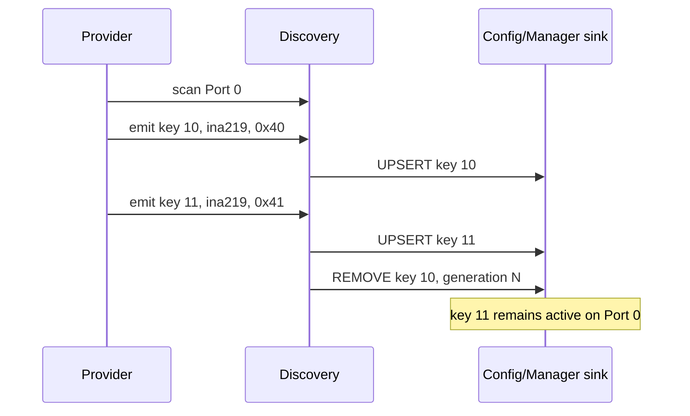

# Discovery

[← Project README](../../README.md) · [Architecture](../../ARCHITECTURE.md) ·
[1:N migration](../../roadmap/PORT-MODULE-1-N-MIGRATION.md)

Discovery normalizes proposed Module identities. One provider scan of a shared Port may
produce zero, one, or many results. Discovery never treats a Port as one proposal slot
and never creates a live Module itself.

## Ownership and model

Discovery owns a fixed-capacity table of
`CONFIG_SPAGHETTI_DISCOVERY_MAX_RESULTS` accepted proposals indexed by stable
`spaghetti_module_key_t`. The capacity cannot exceed the Module Manager capacity.
Generation is tracked per key, not per Port, so a stale response for INA219 `0x40`
cannot invalidate INA219 `0x41` on the same Port.

```c
struct spaghetti_discovery_result {
    spaghetti_module_key_t key;
    spaghetti_port_id_t port_id;
    char type_id[SPAGHETTI_TYPE_ID_MAX];
    uint8_t driver_config[SPAGHETTI_DRIVER_CONFIG_MAX];
    size_t driver_config_size;
    enum spaghetti_discovery_source source;
    uint32_t generation;
};

enum spaghetti_discovery_event_type {
    SPAGHETTI_DISCOVERY_UPSERT,
    SPAGHETTI_DISCOVERY_REMOVE,
};

struct spaghetti_discovery_event {
    enum spaghetti_discovery_event_type type;
    struct spaghetti_discovery_result result;
};
```

The result and event contain owned bounded arrays, not provider pointers. An UPSERT
contains complete identity/config. A REMOVE uses the exact key and expected generation;
it removes only that desired/live instance.

## Provider and sink contracts

```c
typedef int (*spaghetti_discovery_sink_t)(
    const struct spaghetti_discovery_event *event,
    void *user_data);

typedef int (*spaghetti_discovery_emit_t)(
    const struct spaghetti_discovery_result *result,
    void *user_data);

struct spaghetti_discovery_provider_ops {
    int (*scan)(spaghetti_port_id_t port_id,
                spaghetti_discovery_emit_t emit,
                void *emit_user_data,
                k_timeout_t timeout);
};
```

`scan()` may call `emit()` several times before returning. Each call is bounded and the
result is copied. The provider owns neither Config nor Manager slots. A provider must
have a real identity mechanism; probing arbitrary I2C addresses cannot identify an
unknown module type by itself.

## API contract

```c
int spaghetti_discovery_init(spaghetti_discovery_sink_t sink, void *user_data);
int spaghetti_discovery_submit_manual(
    const struct spaghetti_discovery_result *result);
int spaghetti_discovery_scan_port(spaghetti_port_id_t port_id,
                                  k_timeout_t timeout);
int spaghetti_discovery_invalidate(spaghetti_module_key_t key,
                                   uint32_t expected_generation);
```

- `init()` stores a firmware-lifetime sink/context and clears the bounded proposal
  table;
- `submit_manual()` validates and copies one result, rejects a duplicate/stale key, and
  emits UPSERT;
- `scan_port()` validates the Port and currently returns `-ENOTSUP`: the ESP32-C3
  board has no hardware identity provider, and probing an I2C address would not prove
  which driver owns that address;
- `invalidate()` emits REMOVE for one exact key after the generation check. Sibling
  keys on the same Port are unchanged.

All functions run in thread/workqueue context. `timeout` is passed by value and bounds
provider work. Input pointers are borrowed for each call; Discovery copies any data it
retains. Expected errors include `-EINVAL`, `-ENOENT`, `-ENOSPC`, `-ESTALE`,
`-ENOTSUP`, `-EBUSY`, `-ETIMEDOUT`, and sink/provider errors.

The provider operation type is the contract for a future board-specific identity
mechanism. It is deliberately not registered by this phase. The complete Engine adds
the Config/Manager reconciliation sink; Discovery itself remains independent of both
owners.

## Flow



## Contract guarantees

- One Port may appear in many independent proposal records; Discovery owns those
  bounded records.
- Generation and invalidation operate on stable Module keys.
- A scan may emit several Modules and never implies Port exclusivity.
- Discovery normalizes identity; Manager remains the sole owner of live instances.
