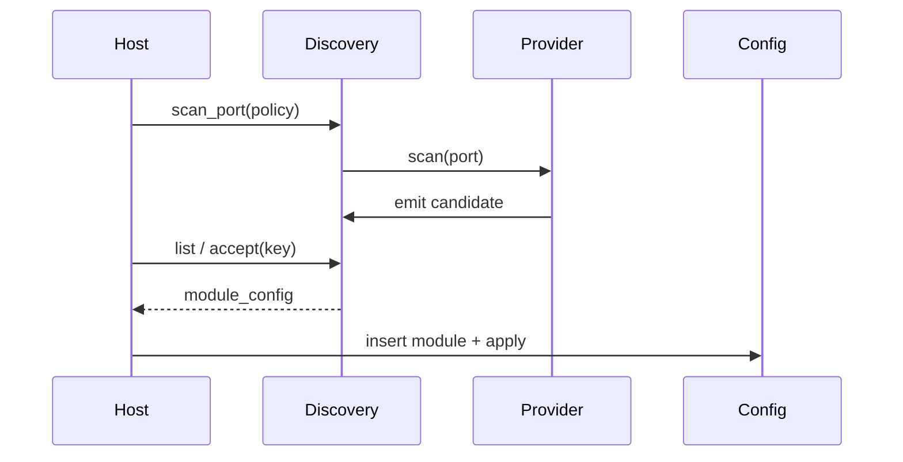

# Discovery

[← Project README](../../README.md) · [Architecture](../../ARCHITECTURE.md) ·
[Providers](providers/README.md)

Discovery collects ephemeral hardware candidates from optional providers. It never
creates live Modules and never applies Config. Manual Modules continue to enter
Config directly and do not consume Discovery slots.

## Ownership and model

Discovery owns a fixed-capacity table of
`CONFIG_SPAGHETTI_DISCOVERY_MAX_RESULTS` candidates. Duplicate keys are
`port + provider_id + identity`. Candidate IDs are ephemeral; generation supports
compare-and-swap accept/reject.

```c
struct spaghetti_discovery_candidate {
    spaghetti_discovery_candidate_id_t id;
    spaghetti_port_id_t port_id;
    spaghetti_flow_id_t flow_id;
    spaghetti_bay_id_t bay_id;
    spaghetti_power_rail_id_t power_rail_id;
    char provider_id[SPAGHETTI_DISCOVERY_PROVIDER_ID_SIZE];
    enum spaghetti_discovery_method method;
    enum spaghetti_discovery_confidence confidence;
    uint32_t probe_flags;
    uint8_t identity_size;
    uint8_t identity[SPAGHETTI_DISCOVERY_IDENTITY_MAX];
    char suggested_type_id[SPAGHETTI_TYPE_ID_MAX];
    struct spaghetti_property_set suggested_properties;
    uint32_t generation;
};
```

HEURISTIC candidates are never auto-applied. AUTHORITATIVE candidates may be
auto-accepted later only by an explicit allowlisted policy. Bay and rail remain
`UNSPECIFIED` when the method cannot observe them.

## Provider registry

Providers self-register with `SPAGHETTI_DISCOVERY_PROVIDER_DEFINE` into a linker
section. Discovery iterates providers whose required Port capabilities match and
whose probe flags are allowed by the caller-owned scan policy. Board V1 links
zero hardware providers. Fake providers exist only under
`tests/discovery_providers/`.

## API contract

```c
int spaghetti_discovery_init(void);
int spaghetti_discovery_scan_port(
    spaghetti_port_id_t port_id,
    const struct spaghetti_discovery_scan_policy *policy);
int spaghetti_discovery_list(
    struct spaghetti_discovery_candidate *out,
    size_t capacity,
    size_t *out_count);
int spaghetti_discovery_accept(
    spaghetti_discovery_candidate_id_t candidate_id,
    spaghetti_module_key_t key,
    uint32_t expected_generation,
    struct spaghetti_module_config *out_module);
int spaghetti_discovery_reject(
    spaghetti_discovery_candidate_id_t candidate_id,
    uint32_t expected_generation);
```

- `init()` clears the candidate table;
- `scan_port()` clears candidates for that Port, runs matching providers, and
  returns `0` with an empty list when no providers match;
- `list(NULL, 0, &count)` is count-only;
- `accept()` copies a Module config ready for Config and removes the candidate;
  it does not apply Config or call Manager;
- `reject()` removes only the candidate.

## Communication

A future Communication event may notify hosts when a scan completes. Until then,
callers poll with `spaghetti_discovery_list()` after a successful scan.

## Flow


