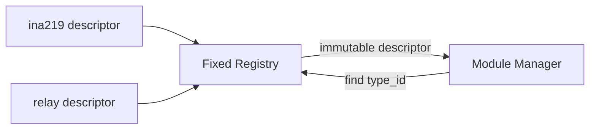

# Driver Registry

[← Project README](../../README.md) · [Architecture](../../ARCHITECTURE.md)

Driver Registry maps a stable module type identifier to an immutable driver descriptor compiled into the firmware. It is a catalog, not a module-instance owner.

One descriptor may serve many simultaneous instances, including several Modules on
the same Port. Address, calibration and context belong to each instance, never to the
Registry entry.

## What this component owns

- The read-only collection of available driver descriptors.
- Type-ID validation, duplicate detection, and lookup.

## What this component does not own

- Module instances or driver-private context.
- Dynamic loading, Port assignment, or lifecycle transitions.

## Files

| File | Role |
|---|---|
| `include/spaghetti/driver_registry.h` | Lookup and enumeration declarations. |
| `subsys/driver_registry/driver_registry.c` | Descriptor table and validation. |
| Concrete module headers | Export immutable descriptors referenced by the table. |

## Data model

| Type / object | Owner | Meaning |
|---|---|---|
| Descriptor pointer table | Registry | Fixed collection valid for firmware lifetime. |
| Type ID | Concrete descriptor | Bounded stable string such as `ina219` or `relay`. |
| Registry count | Registry | Number of validated descriptors. |

## API contract

### `int spaghetti_driver_registry_init(void)`

**Purpose:** Validate every descriptor and reject duplicate type IDs.

**Parameters**

| Parameter | Meaning |
|---|---|
| None | No input parameters. |

**Returns:** `0` when the catalog is coherent.

**Errors:** Null descriptor, empty/duplicate ID, missing operation table, missing pure
`validate_config`/`describe_endpoint` operations, or invalid capability declaration.

**Execution context:** Main thread during boot.

**Calls:** No hardware APIs.

### `const struct spaghetti_module_driver *spaghetti_driver_registry_find(const char *type_id)`

**Purpose:** Resolve an exact type ID.

**Parameters**

| Parameter | Meaning |
|---|---|
| `type_id` | NUL-terminated caller-owned ID valid during the call. |

**Returns:** Immutable descriptor or `NULL`.

**Errors:** Null/empty/unknown ID returns `NULL`.

**Execution context:** Any calling thread after initialization.

**Calls:** Bounded string comparison.

### `size_t spaghetti_driver_registry_count(void)`

**Purpose:** Return descriptor count for diagnostics.

**Parameters**

| Parameter | Meaning |
|---|---|
| None | No input parameters. |

**Returns:** Fixed validated count.

**Errors:** None after initialization.

**Execution context:** Calling thread.

**Calls:** None.

### `const struct spaghetti_module_driver *spaghetti_driver_registry_get(size_t index)`

**Purpose:** Enumerate one descriptor by index.

**Parameters**

| Parameter | Meaning |
|---|---|
| `index` | Zero-based index below count. |

**Returns:** Immutable descriptor or `NULL`.

**Errors:** Out-of-range index returns `NULL`.

**Execution context:** Calling thread.

**Calls:** None.

## How it works



## Practical example

Manager receives type ID `ina219`, calls `find()`, and gets one immutable operation
table. Both address `0x40` and `0x41` use that same descriptor with different Module
contexts. `does-not-exist` returns `NULL`; Registry does not create an instance or
touch hardware.

## Zephyr integration

- A plain const pointer array is deterministic and sufficient.
- Zephyr iterable sections may replace table assembly only if they preserve the same public contract.
- Kconfig may decide which concrete driver source files are compiled.

## Configuration templates

### Fixed registry table

```c
static const struct spaghetti_module_driver *const drivers[] = {
    &spaghetti_ina219_driver,
    &spaghetti_relay_driver,
};
```

The table has one entry per driver type, not one entry per configured instance.

### Conditional source selection in CMake

```cmake
target_sources_ifdef(CONFIG_SPAGHETTI_MODULE_INA219 app PRIVATE
  spaghetti_modules/ina219/ina219.c
)
```

## Ownership and concurrency

After successful initialization the Registry is immutable, so lookup requires no lock. Returned descriptors remain valid for firmware lifetime.

## Contract guarantees

- Type IDs are unique.
- Lookup never transfers ownership.
- Registry contains no live or mutable module state.
- Port sharing never changes Registry lookup or descriptor ownership.
