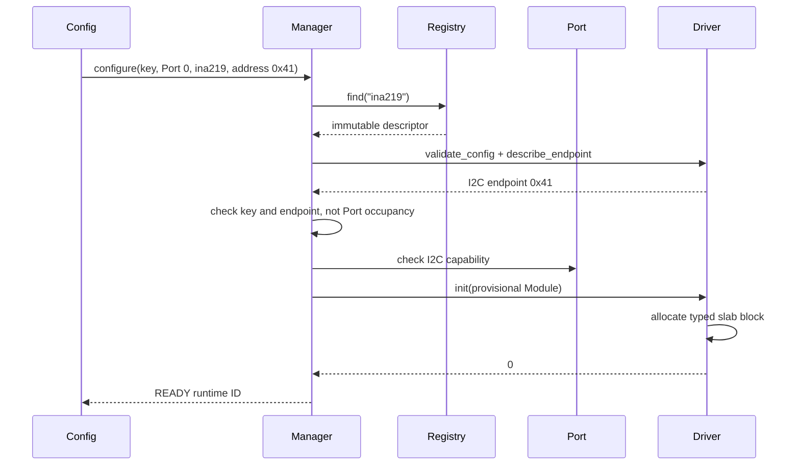

# Module Manager

[← Project README](../../README.md) · [Architecture](../../ARCHITECTURE.md) ·
[1:N migration](../../roadmap/PORT-MODULE-1-N-MIGRATION.md)

Module Manager is the sole owner of live Module instances. A Port is a shared physical
connection, so zero, one, or several Modules may reference the same Port. Manager owns
lifecycle and instance slots; Port owns bus access and serialization.

## What this component owns

- A fixed-capacity pool of Module slots, independent of Port count.
- Runtime IDs, stable Config keys, normalized endpoints, states, and revisions.
- Lifecycle serialization, collision checks, and rollback of one exact instance.

It does not own driver context memory. Each concrete driver owns a fixed typed slab and
stores only an opaque pointer in `module.context`.

## Data model

```c
typedef uint32_t spaghetti_module_key_t;

enum spaghetti_module_endpoint_kind {
    SPAGHETTI_ENDPOINT_PORT_EXCLUSIVE,
    SPAGHETTI_ENDPOINT_I2C_ADDRESS,
    SPAGHETTI_ENDPOINT_SPI_CHIP_SELECT,
};

struct spaghetti_module_endpoint {
    enum spaghetti_module_endpoint_kind kind;
    uint32_t value;
};

struct spaghetti_module_request {
    spaghetti_module_key_t key;
    spaghetti_port_id_t port_id;
    const char *type_id;
    const void *driver_config;
    size_t driver_config_size;
    uint32_t revision;
};
```

`key` is nonzero and stable in Config. `spaghetti_module_id_t` is an ephemeral runtime
handle. `type_id` and `driver_config` are borrowed only for `configure()`; the driver
copies retained bytes into its context. The pure driver `describe_endpoint()` callback
derives the endpoint from those bytes.

Two requests on the same Port are valid unless their hardware endpoints collide. On
one I2C Port, addresses `0x40`, `0x41`, and `0x44` are three valid instances. A second
claim for the same Port/address is rejected. `PORT_EXCLUSIVE` conflicts with every
other endpoint on that Port.

The private slot is deliberately small:

```c
struct spaghetti_module_slot {
    bool used;
    bool reserved;
    bool busy;
    spaghetti_port_id_t port_id;
    uint32_t revision;
    struct spaghetti_module module;
};
```

`reserved` makes an initializing endpoint visible to collision checks. `busy` prevents
read/remove races while the Manager releases its mutex around bounded driver I/O.
Neither flag is public state. There is no `SPAGHETTI_MODULE_CONTEXT_SIZE` and no
context byte array in Manager.

## API contract

### `int spaghetti_module_manager_init(void)`

Clears the fixed slot pool and validates Port/Registry dependencies. Called once by
Core in thread context. Returns `0`, `-EINVAL`, or the dependency error.

### `int spaghetti_module_manager_configure(const struct spaghetti_module_request *request, spaghetti_module_id_t *out_id)`

Creates one exact instance transactionally. `request` is caller-owned and borrowed;
`out_id` is caller-owned and written only after READY commit. Manager validates the
key, resolves Port and driver, calls `validate_config()` and `describe_endpoint()`,
checks key/endpoint uniqueness, reserves one free slot, and calls driver `init()`.

Returns `0`, `-EINVAL`, `-ENOENT`, `-EEXIST` for a duplicate key,
`-EADDRINUSE` for a committed endpoint collision, `-ENOTSUP` for capability mismatch,
`-ENOSPC` for Manager capacity, `-ENOMEM` for an exhausted driver context slab, or a
driver error. `-EBUSY` means a colliding provisional operation; sharing a Port by
itself is never busy.

### `int spaghetti_module_manager_remove(spaghetti_module_id_t id, uint32_t expected_revision)`

Removes only the selected runtime instance. It calls driver `deinit()`, which releases
the driver-owned context slab block, then clears the Manager slot. Sibling Modules on
the same Port remain READY. Returns `0`, `-ENOENT`, `-ESTALE`, `-EBUSY`, or the driver
error.

### `int spaghetti_module_manager_get_by_id(spaghetti_module_id_t id, struct spaghetti_module_snapshot *out)`

Copies one snapshot selected by runtime ID. `out` belongs to the caller and changes
only on success. Returns `0`, `-EINVAL`, or `-ENOENT`.

### `int spaghetti_module_manager_get_by_key(spaghetti_module_key_t key, struct spaghetti_module_snapshot *out)`

Copies one snapshot selected by stable Config key. Config uses this after apply to map
persistent references to current runtime IDs. Returns `0`, `-EINVAL`, or `-ENOENT`.

### `int spaghetti_module_manager_list_by_port(spaghetti_port_id_t port_id, struct spaghetti_module_snapshot *out, size_t capacity, size_t *out_count)`

Copies every Module currently using one Port. `out` is a caller array with `capacity`
elements; `out_count` is mandatory and receives the required/actual count. With
`out == NULL` and `capacity == 0`, the function reports only the count. If capacity is
too small it returns `-ENOSPC`, reports the required count, and does not publish a
partial array. This API replaces the ambiguous singular `get_by_port()`.

### Read and command

```c
int spaghetti_module_manager_read(spaghetti_module_id_t id,
                                  struct spaghetti_sample *out);
int spaghetti_module_manager_command(spaghetti_module_id_t id,
                                     const struct spaghetti_command *command);
```

Both route by exact runtime ID, never by Port. They hold a stable slot reference for
the bounded driver call. The driver then acquires the Port bus/resource transaction;
two sibling Modules cannot interleave one I2C transaction.

## Lifecycle



If any step fails, Manager clears only the provisional slot and the driver releases
only its provisional context. Existing Modules at `0x40` or `0x44` on Port 0 are not
affected.

## Contract guarantees

- Port-to-Module cardinality is 1:N; Port is never an occupancy flag.
- Stable keys and physical endpoints are unique for different reasons.
- No public API returns a writable pointer to a Manager slot.
- No heap or global maximum context byte buffer is required.
- Removing or rolling back one instance cannot remove its siblings.
