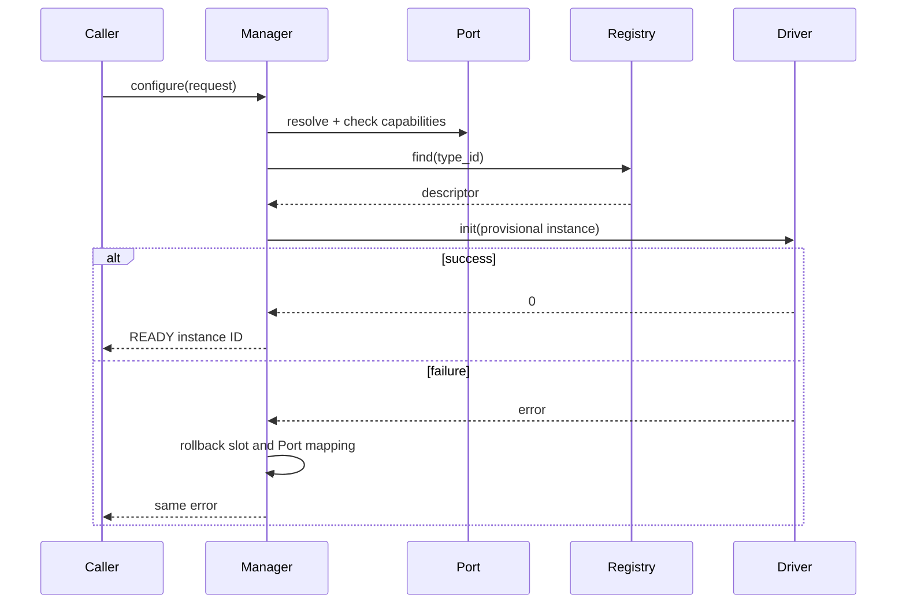

# Module Manager

[← Project README](../../README.md) · [Architecture](../../ARCHITECTURE.md)

Module Manager is the sole owner of live module instances. It turns a validated assignment into a transactional lifecycle: resolve Port, resolve driver, initialize, expose operations, and remove safely.

## What this component owns

- The fixed module pool and Port-to-instance mapping.
- Every live instance ID, state, Port reference, driver descriptor, and private context.
- Lifecycle serialization and rollback.

## What this component does not own

- How module identity was discovered.
- Persistent desired configuration.
- Concrete protocols, board wiring, product rules, or output transports.

## Files

| File | Role |
|---|---|
| `include/spaghetti/module_manager.h` | Lifecycle/query/operation API. |
| `include/spaghetti/module.h` | Instance IDs, states, and snapshots. |
| `subsys/module_manager/module_manager.c` | Pool, mapping, transitions, and rollback. |
| `include/spaghetti/module_driver.h` | Driver callbacks invoked by Manager. |

## Data model

| Type / object | Owner | Meaning |
|---|---|---|
| Module pool | Manager | Fixed-capacity storage for live/provisional instances. |
| Port mapping | Manager | At most one active instance per exclusive Port. |
| `spaghetti_module_snapshot` | Caller after query | Copied ID, Port, type, state, and diagnostics. |
| Driver-private context | Manager storage; concrete driver content | Per-instance mutable protocol state. |

## API contract

### `int spaghetti_module_manager_init(void)`

**Purpose:** Initialize an empty pool and validate Port/Registry dependencies.

**Parameters**

| Parameter | Meaning |
|---|---|
| None | No input parameters. |

**Returns:** `0` when Manager is ready.

**Errors:** Invalid configured capacity or unavailable dependency.

**Execution context:** Main thread during boot.

**Calls:** Port and Driver Registry query APIs.

### `int spaghetti_module_manager_configure(const struct spaghetti_module_request *request, spaghetti_module_id_t *out_id)`

**Purpose:** Create one instance transactionally from a validated request.

**Parameters**

| Parameter | Meaning |
|---|---|
| `request` | Caller-owned Port ID, type ID, bounded driver config, and revision. |
| `out_id` | Caller-owned destination set only on success. |

**Returns:** `0` plus a READY instance ID.

**Errors:** Invalid request, missing/busy Port, unknown driver, incompatible capability, no free slot, stale revision, or driver-init error.

**Execution context:** Calling thread; never ISR.

**Calls:** Port lookup/capability, Registry find, driver `init()`.

### `int spaghetti_module_manager_remove(spaghetti_module_id_t id, uint32_t expected_revision)`

**Purpose:** Deinitialize and free one exact instance.

**Parameters**

| Parameter | Meaning |
|---|---|
| `id` | Live instance ID. |
| `expected_revision` | Revision used to reject stale removal. |

**Returns:** `0` after the Port and pool slot are free.

**Errors:** Unknown/stale/busy instance or driver deinit failure.

**Execution context:** Calling thread.

**Calls:** Driver `deinit()` and optional shared-resource release.

### `int spaghetti_module_manager_get_by_id(spaghetti_module_id_t id, struct spaghetti_module_snapshot *out)`

**Purpose:** Copy one safe diagnostic/query snapshot.

**Parameters**

| Parameter | Meaning |
|---|---|
| `id` | Instance ID. |
| `out` | Caller-owned destination. |

**Returns:** `0` with snapshot.

**Errors:** Invalid output or unknown/stale ID.

**Execution context:** Calling thread.

**Calls:** None.

### `int spaghetti_module_manager_get_by_port(spaghetti_port_id_t port_id, struct spaghetti_module_snapshot *out)`

**Purpose:** Copy the instance assigned to a Port.

**Parameters**

| Parameter | Meaning |
|---|---|
| `port_id` | Logical Port ID. |
| `out` | Caller-owned destination. |

**Returns:** `0` with snapshot.

**Errors:** Invalid output, unknown Port, or no assigned instance.

**Execution context:** Calling thread.

**Calls:** Port mapping lookup.

### `int spaghetti_module_manager_read(spaghetti_module_id_t id, struct spaghetti_sample *out)`

**Purpose:** Route one read to a READY instance.

**Parameters**

| Parameter | Meaning |
|---|---|
| `id` | Source instance. |
| `out` | Caller-owned result destination. |

**Returns:** `0` with a valid sample.

**Errors:** Unknown/not-ready instance, unsupported read, removal conflict, or driver I/O error.

**Execution context:** Thread context.

**Calls:** Driver `read()`; driver calls Port.

### `int spaghetti_module_manager_command(spaghetti_module_id_t id, const struct spaghetti_command *command)`

**Purpose:** Route one bounded command to a READY instance.

**Parameters**

| Parameter | Meaning |
|---|---|
| `id` | Target instance. |
| `command` | Caller-owned validated command. |

**Returns:** `0` after driver acceptance.

**Errors:** Unknown/not-ready instance, unsupported command, removal conflict, or hardware error.

**Execution context:** Thread context.

**Calls:** Driver `command()`; driver calls Port.

## How it works



## Practical example

Config requests a temperature sensor on Port 0. Manager verifies I2C capability and finds the driver. If driver initialization fails, no instance ID is published and Port 0 remains available for a corrected request.

## Zephyr integration

- A `k_mutex` may serialize short Manager-owned state changes in thread context.
- Do not hold the Manager lock across callbacks that can re-enter Manager.
- Use a command queue only when multiple asynchronous producers create a demonstrated need; the public contract remains unchanged.

## Configuration templates

### Request shape

```c
struct spaghetti_module_request {
    spaghetti_port_id_t port_id;
    char type_id[SPAGHETTI_TYPE_ID_MAX];
    const void *driver_config;
    size_t driver_config_size;
    uint32_t revision;
};
```

Manager must copy any config data retained after `configure()` returns.

## Ownership and concurrency

All lifecycle mutations are serialized. Read/command operations hold a stable instance reference for the duration of the call, preventing concurrent removal from invalidating driver context.

## Contract guarantees

- Exactly one component owns and mutates each live instance.
- Configure either commits a complete READY instance or leaves no partial assignment.
- Public getters return snapshots rather than writable internal pointers.
