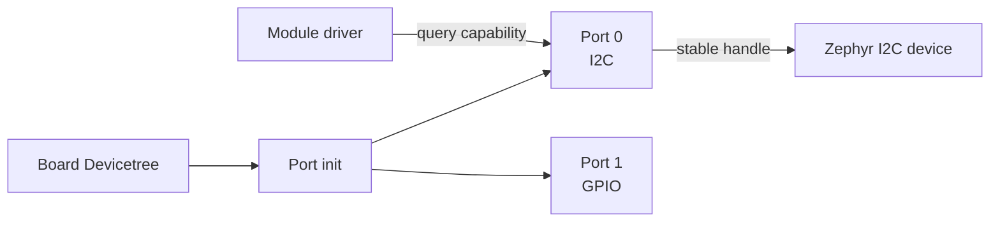

# Port

[← Project README](../../README.md) · [Architecture](../../ARCHITECTURE.md)

Port converts the static board description into stable runtime objects that concrete module drivers can use without knowing controllers, pins, or Core variants.

## What this component owns

- The catalog of physical Ports generated from Devicetree.
- Per-Port capabilities and stable Zephyr device/specifier handles.
- Shared access serialization for a Port resource.

## What this component does not own

- Runtime module identity or lifecycle.
- Sensor/actuator protocols.
- Board-name policy or user configuration.

## Files

| File | Role |
|---|---|
| `include/spaghetti/port.h` | Opaque Port handle, capability flags, access APIs. |
| `subsys/port/port.c` | Devicetree enumeration and private descriptors. |
| Board DTS | Concrete controller/GPIO references validated by bindings. |
| `spaghettilab,port.yaml` | Static Port schema. |

## Data model

| Type / object | Owner | Meaning |
|---|---|---|
| `spaghetti_port_id_t` | Board description | Stable logical Port index. |
| `spaghetti_port_capability` | Port | Bit flags for real supported operations. |
| Opaque `spaghetti_port` | Port | Private descriptor containing device/specifier handles and synchronization. |
| Port snapshot | Caller after query | Copied ID, capabilities, and readiness diagnostics. |

## API contract

### `int spaghetti_port_init_all(void)`

**Purpose:** Create/validate the fixed Port catalog from enabled Devicetree instances.

**Parameters**

| Parameter | Meaning |
|---|---|
| None | No input parameters. |

**Returns:** `0` when every mandatory Port resource is valid.

**Errors:** Invalid generated description, duplicate ID, unavailable controller, or capacity overflow.

**Execution context:** Main thread during Core initialization.

**Calls:** Devicetree-generated accessors, `DEVICE_DT_GET()`, and `device_is_ready()`.

### `size_t spaghetti_port_count(void)`

**Purpose:** Return the number of enabled physical Ports.

**Parameters**

| Parameter | Meaning |
|---|---|
| None | No input parameters. |

**Returns:** Fixed catalog size.

**Errors:** None after initialization.

**Execution context:** Calling thread.

**Calls:** None.

### `const struct spaghetti_port *spaghetti_port_get(spaghetti_port_id_t id)`

**Purpose:** Resolve one stable Port handle.

**Parameters**

| Parameter | Meaning |
|---|---|
| `id` | Logical Port index. |

**Returns:** Provider-owned immutable handle, or `NULL` when unknown.

**Errors:** Unknown ID is represented by `NULL`.

**Execution context:** Calling thread.

**Calls:** None.

### `uint32_t spaghetti_port_get_capabilities(const struct spaghetti_port *port)`

**Purpose:** Return physical capability flags.

**Parameters**

| Parameter | Meaning |
|---|---|
| `port` | Valid provider-owned Port handle. |

**Returns:** Capability bitmask; `0` for invalid input.

**Errors:** Invalid/null handle.

**Execution context:** Calling thread.

**Calls:** None.

### `const struct device *spaghetti_port_i2c_device(const struct spaghetti_port *port)`

**Purpose:** Expose the stable I2C controller for an I2C-capable Port.

**Parameters**

| Parameter | Meaning |
|---|---|
| `port` | Valid Port handle. |

**Returns:** Ready Zephyr device pointer or `NULL`.

**Errors:** Invalid Port, missing capability, or unavailable controller.

**Execution context:** Calling thread.

**Calls:** No transaction; returns the validated handle.

### `int spaghetti_port_acquire(const struct spaghetti_port *port, k_timeout_t timeout)`

**Purpose:** Serialize a multi-step operation on a shared Port resource.

**Parameters**

| Parameter | Meaning |
|---|---|
| `port` | Port to lock. |
| `timeout` | Maximum wait; `K_NO_WAIT` is allowed. |

**Returns:** `0` when acquired.

**Errors:** Invalid Port, timeout, or forbidden execution context.

**Execution context:** Thread only.

**Calls:** Private `k_mutex_lock()`.

### `int spaghetti_port_release(const struct spaghetti_port *port)`

**Purpose:** Release a previously acquired Port resource.

**Parameters**

| Parameter | Meaning |
|---|---|
| `port` | Port acquired by the calling owner. |

**Returns:** `0` on release.

**Errors:** Invalid Port or unbalanced release.

**Execution context:** Thread only.

**Calls:** Private `k_mutex_unlock()`.

## How it works



## Practical example

A sensor driver receives Port 0. It checks the I2C capability, acquires the Port for its command/read sequence, obtains the ready controller, performs the transaction, and releases the Port.

## Zephyr integration

- Devicetree macros create the catalog at build time; Port validates device readiness at boot.
- Use `gpio_dt_spec`, `i2c_dt_spec`, or stable `struct device` handles privately where they match the binding.
- A mutex is for thread context and must not be acquired from ISR.

## Configuration templates

### `prj.conf` capability examples

```ini
# Enable only the bus classes present in the selected board/Port catalog.
CONFIG_I2C=y
CONFIG_SPI=y
CONFIG_GPIO=y
```

### Devicetree iteration shape

```c
#define SPAGHETTI_PORT_DEFINE(node_id) \
    { \
        .id = DT_REG_ADDR(node_id), \
        /* Populate capability and bus fields from validated properties. */ \
    }

static struct spaghetti_port ports[] = {
    DT_FOREACH_STATUS_OKAY(spaghettilab_port, SPAGHETTI_PORT_DEFINE)
};
```

The exact macro shape must follow the final binding properties.

## Ownership and concurrency

Port handles remain valid for firmware lifetime. Catalog data is read-only after initialization. Each shared bus/Port transaction uses one short, documented lock policy.

## Contract guarantees

- Unknown IDs and unsupported capabilities fail safely.
- No caller above Port needs a controller label or pin number.
- Generated catalog size is bounded at compile time.
