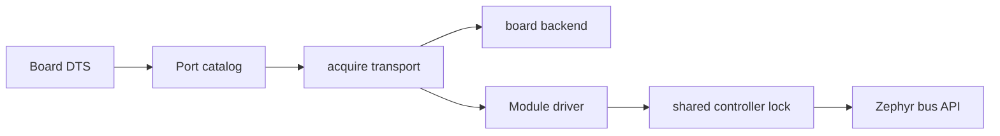

# Port

[← Project README](../../README.md) · [Architecture](../../ARCHITECTURE.md)

Port converts board Devicetree into firmware-lifetime connector objects and serializes
shared controller traffic. Topology describes Flow and Bay; Port describes the
electrical termination and the active transport chosen at runtime.

A Port is a shared hardware access point, not a Module slot. Several Modules may own
the same shareable transport with distinct endpoints. Exclusive UART or
`PORT_EXCLUSIVE` endpoints keep a single owner.

## Ownership

Port owns the descriptor catalog, owner table, active transport, and per-controller
locks. `port_backend_board.c` owns board-default pinctrl/safe transitions and never
retains owners. Module Manager acquires a Port before driver `init()` and releases it
after `deinit()`.

## Files

| File | Role |
|---|---|
| `include/spaghetti/port.h` | Capabilities, acquire/release, and transport APIs. |
| `subsys/port/port.c` | Devicetree catalog, owners, and controller locks. |
| `subsys/port/port_backend.h` | Private board select/safe boundary. |
| `subsys/port/port_backend_board.c` | Current I2C-fixed board backend. |
| `dts/bindings/spaghetti/spaghettilab,port.yaml` | Optional transport phandles/GPIOs. |

## API contract

`spaghetti_port_acquire()` selects the board backend on the first owner and admits later
owners only for the same shareable transport. `spaghetti_port_i2c_transfer()` and the
other bus helpers take a bounded controller lock; `K_FOREVER` is rejected. Core V1
still declares only I2C resources in Devicetree.

## How it works

