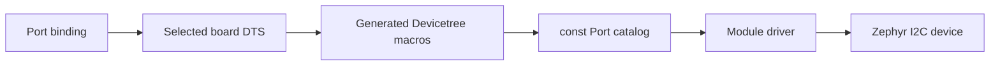

# Port

[← Project README](../../README.md) · [Architecture](../../ARCHITECTURE.md)

Port converts the selected Core board Devicetree into immutable runtime objects.
Module drivers can therefore use a physical connector without knowing its controller
label, GPIO numbers, or board name.

A Port is a shared hardware access point, not a Module slot. Several runtime Modules
may retain the same Port pointer and use different I2C addresses. Port never stores an
`occupied` flag or an owning Module ID.

## Ownership

Port owns the fixed descriptor array generated at build time. Each descriptor owns
only copied IDs/capabilities and borrowed Zephyr device pointers. Zephyr's Device
Model owns the referenced `struct device` objects for the complete firmware lifetime.

Port does not own Module identity, driver contexts, I2C addresses, sensor protocols,
or runtime configuration. The current binding describes I2C Ports. A future digital
output requires an explicit verified GPIO property before the existing output API can
be used on hardware.

## Files

| File | Role |
|---|---|
| `include/spaghetti/port.h` | Opaque Port handle, capability checks and hardware accessors. |
| `subsys/port/port.c` | Devicetree enumeration and immutable private descriptors. |
| `dts/bindings/spaghetti/spaghettilab,port.yaml` | Required Port properties. |
| Board DTS | Concrete Port IDs, controllers and pin routing. |

## API contract

`spaghetti_port_init_all()` checks every referenced I2C device with
`device_is_ready()`. It returns `0` only when the whole static catalog is usable, or
`-ENODEV` when a mandatory controller is unavailable.

`spaghetti_port_count()` returns the number of enabled `spaghettilab,port` instances.
`spaghetti_port_get(id)` searches by the `reg` value copied from Devicetree and returns
an immutable firmware-lifetime pointer, or `NULL` for an unknown ID. IDs therefore do
not depend on array position.

`spaghetti_port_has_capability(port, mask)` checks that every requested bit is present.
The current binding always supplies `SPAGHETTI_PORT_CAP_I2C` because its `i2c` phandle
is mandatory.

`spaghetti_port_i2c_device(port)` returns the borrowed ready controller for an
I2C-capable Port, otherwise `NULL`. Concrete drivers pass that device to Zephyr's I2C
API together with the address received from runtime Config.

`spaghetti_port_set_output(port, high)` drives a raw electrical level only when the
selected Port has a verified digital-output resource. The current V1 and build-only V2
catalogs do not claim that capability, so this call returns `-ENOTSUP` on both.

## How it works



The generated initializer has this shape:

```c
#define SPAGHETTI_PORT_DEFINE(node_id) { \
	.id = DT_REG_ADDR(node_id), \
	.capabilities = SPAGHETTI_PORT_CAP_I2C, \
	.i2c = DEVICE_DT_GET(DT_PHANDLE(node_id, i2c)), \
},

static const struct spaghetti_port ports[] = {
	DT_FOREACH_STATUS_OKAY(spaghettilab_port, SPAGHETTI_PORT_DEFINE)
};
```

`node_id` exists only while compiling. `DT_REG_ADDR()` reads the logical ID,
`DT_PHANDLE()` follows the board's controller reference, and `DEVICE_DT_GET()` creates
the firmware-lifetime pointer later checked during initialization.

## Current variants

- Core V1 generates Port 0 backed by I2C0 on verified GPIO3/GPIO4.
- Core V2 build-only generates Port 0 and Port 1 backed by the same simulated I2C bus.

INA219 instances at `0x40` and `0x41` can share either I2C Port because addresses live
in Module Config, not in Devicetree or the Port descriptor.

## Contract guarantees

- An invalid board node fails during Devicetree validation.
- An unavailable controller fails Core initialization with `-ENODEV`.
- Unknown IDs and unsupported capabilities fail safely.
- Multiple Modules may reference the same Port.
- Common C code contains no board-name conditionals.
- No removable Module type or address is stored in the board catalog.
