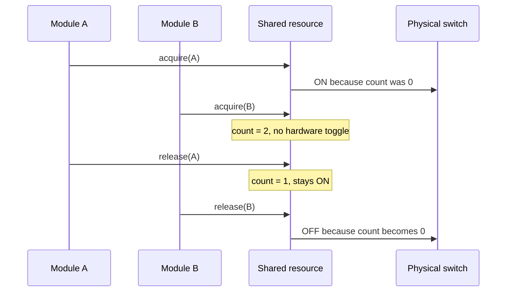

# Optional shared-resource coordination

[← Project README](../../README.md) · [Architecture](../../ARCHITECTURE.md)

This component is used only when a Core exposes a real controllable resource shared by multiple users, such as a switchable Port rail. It is not required for boards whose power is always on or fully owned by a single device.

## What this component owns

- Reference count and state for each declared shared resource.
- First-acquire activation and final-release deactivation.
- Transition serialization, owner diagnostics, and hardware error reporting.

## What this component does not own

- A speculative battery policy or generic system-wide power strategy.
- Resources that do not physically exist in the board description.
- Module lifecycle; Manager only calls this component at defined lifecycle points.

## Files

| File | Role |
|---|---|
| `include/spaghetti/power.h` | Optional resource IDs, states, and acquire/release API. |
| `subsys/power/power.c` | Reference counts and real transition hooks. |
| Board DTS / Port binding | Physical control reference and polarity. |
| Module Manager | Acquires before driver init and releases after deinit/rollback. |

## Data model

| Type / object | Owner | Meaning |
|---|---|---|
| Resource descriptor | Board/Power | Immutable ID, hardware control, and safe state. |
| Resource state | Power | OFF, STARTING, ON, STOPPING, or ERROR. |
| Reference count | Power | Number of current successful owners. |
| Owner diagnostics | Power | Bounded ownership/debug information. |

## API contract

### `int spaghetti_power_init(void)`

**Purpose:** Validate every configured real resource and establish its safe initial state.

**Parameters**

| Parameter | Meaning |
|---|---|
| None | No input parameters. |

**Returns:** `0` when resource states match hardware policy.

**Errors:** Invalid descriptor, unavailable control device, or safe-state write failure.

**Execution context:** Main thread during boot.

**Calls:** Port or Zephyr GPIO/runtime-PM API.

### `int spaghetti_power_acquire(spaghetti_power_resource_id_t id, spaghetti_power_owner_id_t owner)`

**Purpose:** Add one owner and activate hardware only for the first successful owner.

**Parameters**

| Parameter | Meaning |
|---|---|
| `id` | Declared resource ID. |
| `owner` | Stable owner used for balance/diagnostics. |

**Returns:** `0` when the resource is ON and ownership recorded.

**Errors:** Unknown resource/owner, duplicate/overflow, busy transition, or activation failure.

**Execution context:** Thread only.

**Calls:** Real hardware-on hook on count transition 0→1.

### `int spaghetti_power_release(spaghetti_power_resource_id_t id, spaghetti_power_owner_id_t owner)`

**Purpose:** Remove one owner and deactivate only after the final release.

**Parameters**

| Parameter | Meaning |
|---|---|
| `id` | Declared resource ID. |
| `owner` | Previously acquired owner. |

**Returns:** `0` when ownership/state are coherent.

**Errors:** Unknown owner, underflow, busy transition, or deactivation failure.

**Execution context:** Thread only.

**Calls:** Real hardware-off hook on count transition 1→0.

### `int spaghetti_power_get_status(spaghetti_power_resource_id_t id, struct spaghetti_power_status *out)`

**Purpose:** Copy state, count, and last transition error.

**Parameters**

| Parameter | Meaning |
|---|---|
| `id` | Resource ID. |
| `out` | Caller-owned destination. |

**Returns:** `0` with coherent status.

**Errors:** Unknown ID or invalid output.

**Execution context:** Calling thread.

**Calls:** None.

## How it works



## Practical example

Two Ports share one switchable 3.3 V rail. Initializing the first module turns it on; initializing the second only increments ownership. Removing one module keeps the rail on. The final removal turns it off.

## Zephyr integration

- Devicetree describes the real GPIO/regulator reference and polarity.
- A short `k_mutex` protects count/state in thread context.
- Use Zephyr device runtime PM only when the controlled resource maps to that model; do not wrap it without a real requirement.

## Configuration templates

### Optional DTS property

```dts
port0: port@0 {
    compatible = "spaghettilab,port";
    reg = <0>;
    power-gpios = <&gpio0 5 GPIO_ACTIVE_HIGH>; /* Real schematic value. */
};
```

### Optional `prj.conf`

```ini
CONFIG_GPIO=y
# Enable CONFIG_PM / CONFIG_PM_DEVICE_RUNTIME only if the selected design
# actually uses Zephyr system or device runtime power management.
```

## Ownership and concurrency

Acquire/release transitions are serialized. The count changes only after the corresponding hardware transition succeeds. Manager rollback always balances a successful acquire.

## Contract guarantees

- No resource exists without a real board-side control contract.
- Intermediate owners cannot switch off a resource still in use.
- Underflow, duplicate ownership, and hardware failures are observable.
