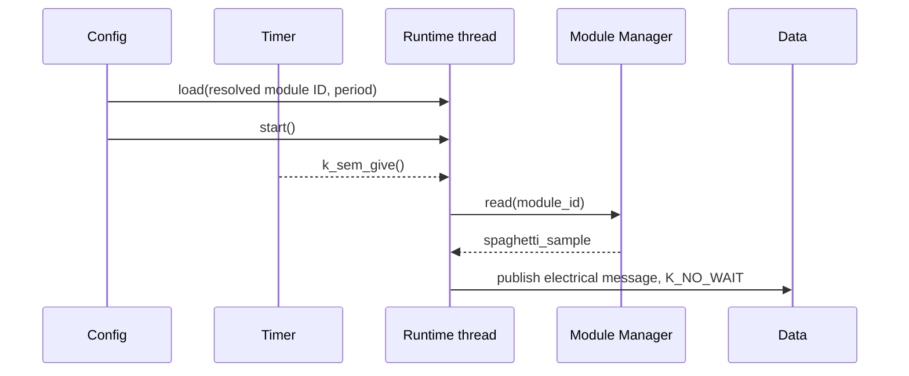

# Runtime

[← Project README](../../README.md) · [Architecture](../../ARCHITECTURE.md)

Runtime V0 owns one periodic sampling task. Config stores the stable Module key;
during apply it resolves that key to the current runtime ID, loads the task, and
starts Runtime. Runtime never selects a Module from its Port because multiple
Modules can share the same physical bus.

## Responsibilities

- Copy one validated `spaghetti_runtime_sampling_task` while stopped.
- Wake a dedicated worker at the configured period.
- Read the exact Module through Module Manager.
- Convert `spaghetti_sample` into `spaghetti_electrical_message` and publish it
  through Data without waiting.
- Stop new ticks and wait, with a caller-selected bound, for an active read to
  finish.

Runtime does not own Module instances, I2C addresses, persistent Config, zbus
consumers, or transport protocols. Runtime V1 will add rules separately; V0 does
not expose placeholder rule or event APIs.

## Files and API

| File | Role |
|---|---|
| `include/spaghetti/runtime.h` | Public task and lifecycle API. |
| `subsys/runtime/runtime.c` | State machine and sampling worker. |
| `include/spaghetti/timer.h` | Internal cross-component Timer contract. |
| `subsys/services/timer/timer.c` | Periodic `k_timer` wrapper. |

The public task is copied by Runtime, so the caller may release its source after
`load` returns:

```c
struct spaghetti_runtime_sampling_task {
	spaghetti_module_id_t module_id;
	uint32_t period_ms;
	bool enabled;
};
```

- `spaghetti_runtime_init()` initializes the stopped worker and Timer once.
- `spaghetti_runtime_load(task)` validates and copies a task only while stopped.
  An all-zero, disabled task clears the current program.
- `spaghetti_runtime_start()` arms the period after a valid enabled task exists.
- `spaghetti_runtime_stop(timeout)` stops new ticks and waits for the worker to
  become quiescent; it returns `-ETIMEDOUT` when that does not happen in time.

See `include/spaghetti/runtime.h` for the precise errno contract.

## Execution flow



The timer callback only gives a semaphore. The semaphore maximum is one, so
multiple expiries coalesce if an I2C read is slower than the requested period;
work cannot accumulate without bound. The Runtime thread owns sequence numbers
and adds `k_uptime_get()` to each successful sample.

Config stops Runtime before changing live Modules. After reconciliation it
resolves `sampling.source_key` with
`spaghetti_module_manager_get_by_key()`, loads the resulting ID, and starts the
new task. On transaction failure Config restores the previous Modules and task.

Stack size, priority, log level, and Config's stop timeout are bounded Kconfig
choices: `CONFIG_SPAGHETTI_RUNTIME_STACK_SIZE`,
`CONFIG_SPAGHETTI_RUNTIME_PRIORITY`,
`CONFIG_SPAGHETTI_RUNTIME_LOG_LEVEL`, and
`CONFIG_SPAGHETTI_RUNTIME_STOP_TIMEOUT_MS`.
