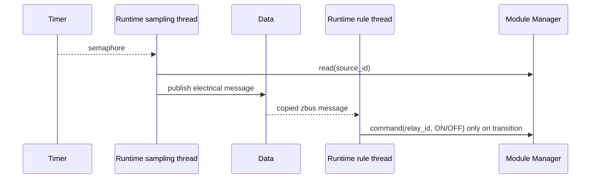

# Runtime

[← Project README](../../README.md) · [Architecture](../../ARCHITECTURE.md)

Runtime V1 owns one periodic sampling task and one current-threshold rule. Config
stores stable Module keys; during apply it resolves them to current runtime IDs.
Runtime never selects a Module from its Port.

## Sampling

The timer callback only gives a semaphore. A bounded sampling thread reads the
configured Module, builds `spaghetti_electrical_message`, adds uptime and sequence,
and publishes through Data with `K_NO_WAIT`. The semaphore maximum is one, so slow
I/O coalesces expiries instead of creating an unbounded backlog.

## Threshold rule

```c
struct spaghetti_runtime_threshold_rule {
	spaghetti_module_id_t source_id;
	int32_t lower_current_microamps;
	int32_t upper_current_microamps;
	spaghetti_module_id_t relay_id;
	bool relay_on_above;
};
```

The Runtime rule thread consumes copied electrical messages from a bounded zbus
message subscriber. It checks both source runtime ID and the privately retained
stable key, so queued data from another Module cannot trigger the Relay.

- `current > upper`: request `relay_on_above`.
- `current < lower`: request the opposite state.
- `lower <= current <= upper`: keep the previous state and issue no command.
- Repeated samples in the same region do not produce duplicate commands.
- A failed command is not cached as successful and can be retried by later data.

Runtime sends only `SPAGHETTI_COMMAND_RELAY_SET` through Module Manager. It has no
Relay or GPIO dependency.

## Lifecycle

- `spaghetti_runtime_load()` copies or clears the sampling task while stopped.
- `spaghetti_runtime_load_threshold_rule()` validates and copies one rule.
- `spaghetti_runtime_clear_threshold_rule()` removes the rule while stopped.
- `spaghetti_runtime_start()` accepts sampling, a rule, or both.
- `spaghetti_runtime_stop(timeout)` stops new sampling and waits for every active
  Manager read or command. It returns `-ETIMEDOUT` without pretending the worker
  is quiescent.

Config stops Runtime before changing live Modules. It then reconciles Modules,
resolves `sampling.source_key`, `threshold_rule.source_key`, and
`threshold_rule.relay_key`, loads the new work, and starts Runtime. If apply fails,
Config restores both the previous Modules and Runtime work.



Both threads, their priorities, stacks, subscriber pool, and stop timeout are
statically bounded through Kconfig. Runtime uses no heap.
