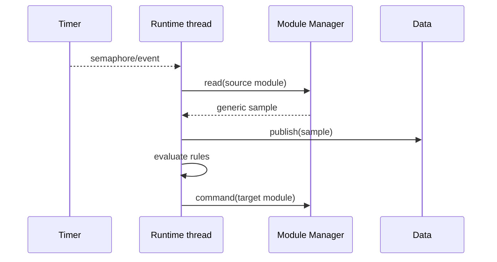

# Runtime

[← Project README](../../README.md) · [Architecture](../../ARCHITECTURE.md)

Runtime executes autonomous product behavior using generic module IDs, Data values, schedules, and commands. It decides when to act; drivers decide how hardware operations work.

## What this component owns

- Validated runtime tasks/rules and their execution state.
- The Runtime worker context and wake-up/event queue.
- Rule evaluation, schedule state, and Runtime diagnostics.

## What this component does not own

- Module instances, bus transactions, persistent Config, or transport protocols.
- Concrete INA219/Relay implementation types or I2C addresses.

## Files

| File | Role |
|---|---|
| `include/spaghetti/runtime.h` | Task/rule schemas and lifecycle API. |
| `subsys/runtime/runtime.c` | Worker loop, evaluation, and Manager/Data integration. |
| Timer service | Produces wake-up signals without executing rules in callback context. |
| Config | Supplies validated tasks/rules by value. |

## Data model

| Type / object | Owner | Meaning |
|---|---|---|
| Sampling task in Config | Config | Stable source module key, period, and enabled flag. |
| Active sampling task | Runtime | Resolved runtime module ID, period, enabled flag, and next execution state. |
| Threshold rule | Runtime | Source value selector, comparison, target module, and command. |
| Runtime event | Queue then Runtime | Bounded timer/data/control event. |
| Runtime status | Runtime | Running state, last error, counters, and queue depth. |

## API contract

### `int spaghetti_runtime_init(void)`

**Purpose:** Initialize empty rule/task storage, worker synchronization, and diagnostics.

**Parameters**

| Parameter | Meaning |
|---|---|
| None | No input parameters. |

**Returns:** `0` when Runtime can accept a load.

**Errors:** Invalid static capacities or worker resource initialization failure.

**Execution context:** Main thread during boot.

**Calls:** Semaphore/message-queue/thread initialization.

### `int spaghetti_runtime_load(const struct spaghetti_runtime_program *program)`

**Purpose:** Validate and copy the complete bounded program while stopped.

**Parameters**

| Parameter | Meaning |
|---|---|
| `program` | Caller-owned tasks/rules copied on success. |

**Returns:** `0` when loaded.

**Errors:** Invalid count, zero period, unknown/stale module IDs, invalid rule references, or called while running.

**Execution context:** Calling thread.

**Calls:** Module Manager snapshot queries for reference validation.

### `int spaghetti_runtime_start(void)`

**Purpose:** Start schedules and enter RUNNING state.

**Parameters**

| Parameter | Meaning |
|---|---|
| None | No input parameters. |

**Returns:** `0` when wake-up sources and worker are active.

**Errors:** No valid program, already running, or Timer start failure.

**Execution context:** Calling thread; worker executes separately.

**Calls:** Timer service start.

### `int spaghetti_runtime_stop(k_timeout_t timeout)`

**Purpose:** Stop new schedules and wait for bounded worker quiescence.

**Parameters**

| Parameter | Meaning |
|---|---|
| `timeout` | Maximum wait for current work to finish. |

**Returns:** `0` when STOPPED.

**Errors:** Timeout or Timer/worker stop error.

**Execution context:** Calling thread, never Runtime worker itself.

**Calls:** Timer stop and worker signalling.

### `int spaghetti_runtime_submit_event(const struct spaghetti_runtime_event *event)`

**Purpose:** Copy one bounded external/Data event to the worker.

**Parameters**

| Parameter | Meaning |
|---|---|
| `event` | Validated event copied before return. |

**Returns:** `0` when queued.

**Errors:** Invalid event, not running, or full queue.

**Execution context:** Thread or explicitly supported nonblocking callback context.

**Calls:** `k_msgq_put(..., K_NO_WAIT)` or equivalent.

### `int spaghetti_runtime_get_status(struct spaghetti_runtime_status *out)`

**Purpose:** Copy worker state and counters.

**Parameters**

| Parameter | Meaning |
|---|---|
| `out` | Caller-owned destination. |

**Returns:** `0` with coherent status.

**Errors:** Invalid output or uninitialized Runtime.

**Execution context:** Calling thread.

**Calls:** None.

## How it works



## Practical example

Config asks to sample stable key 10 every 1000 ms. During apply, Config calls
`spaghetti_module_manager_get_by_key(10, &snapshot)` and writes the current
`snapshot.id` into the active Runtime program. Runtime reads that ID and receives a
generic INA219 sample containing bus voltage, current, and power. A second INA219 on
the same Port has another key and another runtime ID, so the two streams cannot be
confused. Runtime never includes INA219 or relay headers.

## Zephyr integration

- `k_timer` expiry only signals Runtime; it never performs bus I/O.
- One dedicated thread is appropriate when Runtime blocks on events and performs bounded synchronous Manager calls.
- Use a bounded event queue and document behavior when it is full.

## Configuration templates

### Program shape

The persisted/received Config stores `source_key`; it must never persist
`module_id`, because runtime IDs may change after reboot or reconfiguration. Config
resolves the key before calling `spaghetti_runtime_load()`:

```c
struct spaghetti_config_sampling_task {
    spaghetti_module_key_t source_key;
    uint32_t period_ms;
    bool enabled;
};
```

The active Runtime copy stores the already resolved ID:

```c
struct spaghetti_runtime_sampling_task {
    spaghetti_module_id_t module_id;
    uint32_t period_ms;
    bool enabled;
};

struct spaghetti_runtime_threshold_rule {
    spaghetti_module_id_t source_id;
    int32_t threshold;
    spaghetti_module_id_t target_id;
    bool target_state;
};
```

### Thread configuration shape

```c
K_SEM_DEFINE(runtime_wakeup, 0, 1);
K_THREAD_STACK_DEFINE(runtime_stack, CONFIG_SPAGHETTI_RUNTIME_STACK_SIZE);
```

Define stack size and priority through bounded application Kconfig symbols or
constants justified by measurement.

## Ownership and concurrency

Only the Runtime worker mutates execution state. Load/start/stop serialize lifecycle. Events are copied; no producer-owned pointer survives queue insertion.

## Contract guarantees

- Blocking module operations never run in timer callback or ISR context.
- Rules depend only on generic values and Manager operations.
- Persistent references use stable Module keys; active work uses runtime IDs resolved
  by Config for the current Manager generation.
- Stopping has a bounded, observable completion result.
