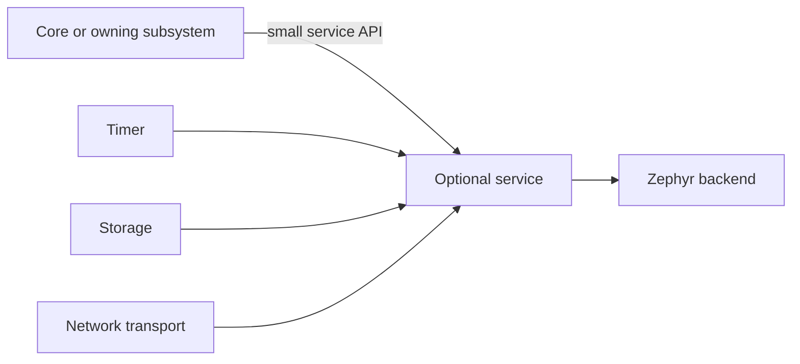

# Optional services

[← Project README](../../README.md) · [Architecture](../../ARCHITECTURE.md)

A service wraps a reusable Zephyr or platform capability behind a small product-level contract. Services are optional: include one only when a consumer needs timing, persistence, networking, or another concrete capability.

## What this component owns

- The lifecycle and private backend state of one reusable capability.
- Bounded resources, error mapping, and service-specific diagnostics.
- A stable API that hides the selected Zephyr backend.

## What this component does not own

- Product policy, module instances, Runtime rules, or the global startup sequence.
- A generic service locator or miscellaneous utility collection.

## Files

| File | Role |
|---|---|
| `timer/` | Bounded scheduling and deferred wake-up capability. |
| `storage/` | Versioned bounded persistence capability. |
| `maintenance_link/` | Board-selected shared-pin UART and restricted SMP commands. |
| `update/` | Exclusive update session, timeout and MCUboot test policy. |
| `ota/` | One-shot authenticated DTLS-PSK adapter for restricted SMP update. |
| `secure_workspace/` | Exclusive secure-session admission over the shared libc heap. |
| `mqtt/` | Optional MQTT transport adapter when selected by a product. |
| Each service header/source | Public product contract and private Zephyr integration. |

## Data model

| Type / object | Owner | Meaning |
|---|---|---|
| Service config | Config then service after copy | Bounded backend-independent settings. |
| Private context | Service | Backend handles, buffers, worker state, and diagnostics. |
| Status snapshot | Caller after query | Copied state and counters. |
| Operation payload | Caller until copied/completed | Bounded service-specific input/output. |

## API contract

### `int spaghetti_<service>_init(const struct spaghetti_<service>_config *config)`

**Purpose:** Validate copied config and construct private bounded resources.

**Parameters**

| Parameter | Meaning |
|---|---|
| `config` | Complete service config copied when retained. |

**Returns:** `0` when READY.

**Errors:** Invalid config, unavailable backend, or resource creation failure.

**Execution context:** Main thread during boot.

**Calls:** Selected Zephyr backend initialization.

### `int spaghetti_<service>_start(void)`

**Purpose:** Start asynchronous behavior only when the service needs it.

**Parameters**

| Parameter | Meaning |
|---|---|
| None | No input parameters. |

**Returns:** `0` when RUNNING.

**Errors:** Not initialized, already running, or backend start failure.

**Execution context:** Calling thread; service worker owns blocking state machines.

**Calls:** Backend-specific start.

### `int spaghetti_<service>_stop(k_timeout_t timeout)`

**Purpose:** Stop new work and reach a defined quiescent state.

**Parameters**

| Parameter | Meaning |
|---|---|
| `timeout` | Maximum wait for bounded completion. |

**Returns:** `0` when STOPPED.

**Errors:** Timeout or backend stop failure.

**Execution context:** Calling thread.

**Calls:** Backend-specific stop.

## How it works



## Practical example

Runtime uses Timer to receive a wake-up signal; Config uses Storage to persist a snapshot; an output adapter may use MQTT. None of these services owns Runtime rules or module instances.

## Zephyr integration

- Wrap Zephyr subsystems rather than duplicating them.
- Do not create a dedicated thread for a service unless it owns a blocking state machine.
- Kconfig enables only services/backends selected by the application.

## Configuration templates

### CMake selection shape

```cmake
target_sources_ifdef(CONFIG_SPAGHETTI_TIMER app PRIVATE
  subsys/services/timer/timer.c
)

target_sources_ifdef(CONFIG_SPAGHETTI_STORAGE app PRIVATE
  subsys/services/storage/storage.c
)
```

### Application Kconfig shape

```kconfig
menu "Spaghetti LAB services"

config SPAGHETTI_TIMER
    bool "Timer service"

config SPAGHETTI_STORAGE
    bool "Storage service"

endmenu
```

## Ownership and concurrency

Each service documents its caller and worker contexts. Inputs retained beyond a direct call are copied. Queue sizes and stop behavior are bounded.

## Contract guarantees

- Removing an optional service does not change central architecture contracts.
- Backend types remain private.
- Every asynchronous service defines start, stop, capacity, and failure behavior.
