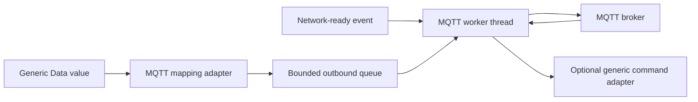

# Optional MQTT adapter

[← Project README](../../../README.md) · [Architecture](../../../ARCHITECTURE.md)

MQTT is one optional output/input adapter for products that communicate through an MQTT broker. It is not part of the central firmware architecture: removing it leaves Port, drivers, Manager, Config, Data, and Runtime unchanged.

## What this component owns

- MQTT client/socket state, keepalive, reconnect, and subscriptions selected by product requirements.
- Copied endpoint/topic config, fixed buffers, bounded outbound queue, and diagnostics.
- Translation between generic Data/commands and MQTT topic/payload formats.

## What this component does not own

- Wi-Fi provisioning policy, module lifecycle, sensor scheduling, Runtime rules, or Data schemas.
- Unlimited offline history or source-code credentials.

## Files

| File | Role |
|---|---|
| `mqtt.h` | Adapter config, lifecycle, publish, and status API. |
| `mqtt.c` | Zephyr MQTT client, socket state machine, queue, and worker. |
| Data adapter/codec | Maps generic values to selected topics/payloads. |
| Config | Supplies copied enabled/endpoint/topic settings. |

## Data model

| Type / object | Owner | Meaning |
|---|---|---|
| MQTT config | MQTT after copy | Enabled flag, host, port, client ID, base topic, security reference. |
| Outbound item | Queue then MQTT worker | Copied topic suffix, payload, QoS, retain flag. |
| Client buffers/context | MQTT | Private fixed Zephyr MQTT state. |
| MQTT status | MQTT | Network/client state, reconnect, queued, published, dropped counters. |

## API contract

### `int spaghetti_mqtt_init(const struct spaghetti_mqtt_config *config)`

**Purpose:** Validate/copy config and create fixed client, queue, and worker resources.

**Parameters**

| Parameter | Meaning |
|---|---|
| `config` | Complete bounded endpoint/topic/client configuration. |

**Returns:** `0` when STOPPED/READY.

**Errors:** Invalid host/topic/port/buffer sizes or worker resource failure.

**Execution context:** Main thread during boot.

**Calls:** Zephyr MQTT client initialization and network-event registration.

### `int spaghetti_mqtt_start(void)`

**Purpose:** Request the worker to connect when usable IP networking is available.

**Parameters**

| Parameter | Meaning |
|---|---|
| None | No input parameters. |

**Returns:** `0` when the start request is accepted.

**Errors:** Disabled/uninitialized, already running, or command queue full.

**Execution context:** Calling thread; socket work occurs in MQTT thread.

**Calls:** Worker command queue.

### `int spaghetti_mqtt_stop(k_timeout_t timeout)`

**Purpose:** Stop reconnect, disconnect, and reach STOPPED within a bound.

**Parameters**

| Parameter | Meaning |
|---|---|
| `timeout` | Maximum wait for worker acknowledgement. |

**Returns:** `0` when stopped.

**Errors:** Timeout, command queue full, or disconnect failure.

**Execution context:** Calling thread.

**Calls:** Worker command queue and Zephyr MQTT disconnect.

### `int spaghetti_mqtt_publish(const struct spaghetti_mqtt_publication *publication)`

**Purpose:** Copy one bounded publication into the outbound queue without network I/O in the caller.

**Parameters**

| Parameter | Meaning |
|---|---|
| `publication` | Topic suffix, payload bytes, QoS, retain policy; all bounded. |

**Returns:** `0` when queued.

**Errors:** Invalid/oversized topic or payload, disabled/disconnected policy, or full queue.

**Execution context:** Calling thread or Data subscriber worker.

**Calls:** `k_msgq_put()`; worker calls Zephyr `mqtt_publish()`.

### `int spaghetti_mqtt_get_status(struct spaghetti_mqtt_status *out)`

**Purpose:** Copy connection state and counters.

**Parameters**

| Parameter | Meaning |
|---|---|
| `out` | Caller-owned destination. |

**Returns:** `0` with coherent snapshot.

**Errors:** Invalid output or uninitialized adapter.

**Execution context:** Calling thread.

**Calls:** None.

## How it works



## Practical example

A generic temperature message becomes topic `devices/core-1/modules/3/temperature` and a bounded payload. The Data publisher only enqueues it. If the broker restarts, the MQTT worker reconnects without blocking Runtime.

## Zephyr integration

- Wait for usable IP address/network events, not only Wi-Fi association.
- One worker thread owns socket poll, `mqtt_input`, keepalive, connect/disconnect, and publish.
- `k_msgq` bounds outbound memory and makes full-queue policy explicit.
- TLS options and credentials are enabled only by the selected product security configuration.

## Configuration templates

### `prj.conf` for an IPv4 MQTT product

```ini
CONFIG_NETWORKING=y
CONFIG_NET_IPV4=y
CONFIG_NET_TCP=y
CONFIG_NET_SOCKETS=y
CONFIG_NET_MGMT=y
CONFIG_NET_MGMT_EVENT=y
CONFIG_MQTT_LIB=y

# Select the actual network interface and address mechanism separately.
# CONFIG_WIFI=y
# CONFIG_NET_DHCPV4=y
# CONFIG_DNS_RESOLVER=y
```

### Bounded adapter config

```c
struct spaghetti_mqtt_config {
    bool enabled;
    char host[SPAGHETTI_MQTT_HOST_MAX];
    uint16_t port;
    char client_id[SPAGHETTI_MQTT_CLIENT_ID_MAX];
    char base_topic[SPAGHETTI_MQTT_TOPIC_MAX];
};
```

MQTT credentials and certificates must be referenced through the selected
secure credential/storage mechanism, not embedded as string literals.

## Ownership and concurrency

The MQTT worker exclusively owns the client/socket. Producers copy into a bounded queue. Network callbacks only update/signal state; they do not connect or publish inline.

## Contract guarantees

- MQTT can be removed without changing central component contracts.
- Network stalls never block Data or Runtime producers.
- Reconnect, queue-full, and disconnected publication policies are explicit and measurable.
