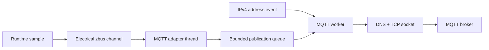

# Optional MQTT adapter

[← Project README](../../../README.md) · [Architecture](../../../ARCHITECTURE.md)

MQTT is an optional Data output adapter. Removing it does not change Port, Module,
Module Manager, Runtime, or the electrical Data schema.

## Responsibilities and files

The service copies its Config, owns the Zephyr `mqtt_client`, DNS lookup, socket,
fixed client buffers, bounded publication queue, reconnect policy, and counters.
The zbus adapter only formats and queues copied data: it never performs network I/O.

| File | Role |
|---|---|
| `include/spaghetti/mqtt.h` | Public bounded configuration, lifecycle, publication, and status API. |
| `subsys/services/mqtt/mqtt.c` | Network callback, zbus adapter, MQTT worker, queue, and reconnect state. |
| `subsys/services/mqtt/mqtt_internal.h` | Private formatter exposed only to native tests. |
| `tests/mqtt/` | Native lifecycle, queue, topic, JSON, and zbus adapter tests. |

`struct spaghetti_mqtt_config` contains `enabled`, a copied host of at most 63
characters, a TCP port, and a copied base topic of at most 95 characters. An enabled
configuration requires non-empty host and base topic, a non-zero port, and no leading
or trailing slash in the base topic. The disabled canonical form has zero/empty fields.

`struct spaghetti_mqtt_publication` contains a relative topic suffix and at most 128
payload bytes. It has no borrowed pointers. The service copies the whole object into
a static `k_msgq`; when that queue is full, the newest publication is dropped and
`spaghetti_mqtt_publish()` returns `-ENOMSG`.

## Flow



The network callback only updates an atomic readiness flag and wakes the worker after
`NET_EVENT_IPV4_ADDR_ADD` or `NET_EVENT_IPV4_ADDR_DEL`. The MQTT worker alone calls
`zsock_getaddrinfo()`, `mqtt_connect()`, `zsock_poll()`, `mqtt_input()`, `mqtt_live()`,
`mqtt_publish()`, and disconnect. Failed connections retry after 1 second, doubling
up to 30 seconds. Runtime and Data producers therefore never wait for DNS or a broker.

Each electrical sample becomes:

```text
topic:   <base_topic>/modules/<source_key>/electrical
payload: {"module_key":10,"bus_uv":12000000,"current_ua":125000,"power_uw":1500000}
```

The stable Module key distinguishes two devices on the same Port. QoS is currently
0, retain is false, transport is unencrypted TCP, and the development port is normally
1883. TLS and broker authentication are not implemented in this phase.

## API and ownership

```c
int spaghetti_mqtt_init(const struct spaghetti_mqtt_config *config);
int spaghetti_mqtt_start(void);
int spaghetti_mqtt_stop(k_timeout_t timeout);
int spaghetti_mqtt_publish(
	const struct spaghetti_mqtt_publication *publication);
int spaghetti_mqtt_get_status(struct spaghetti_mqtt_status *out);
```

`init()` validates and copies borrowed Config; it also enables or disables the zbus
observer. Reconfiguration is accepted only while stopped. `start()` asks the worker
to wait for IPv4 and connect. `stop()` stops reconnect, disconnects, purges queued
publications, and waits up to `timeout`. `publish()` validates and copies without
socket I/O. `get_status()` copies a coherent caller-owned snapshot. All persistent
MQTT objects and buffers are static; status counters intentionally wrap as `uint32_t`.

## Development Wi-Fi and broker test

The ESP32-C3 build uses Wi-Fi station mode, DHCPv4, DNS, and Zephyr's MQTT library.
Credentials are entered at runtime through the Zephyr shell and are never stored in
the repository. With a WPA2 access point, run on the serial shell:

```text
wifi scan
wifi connect -s "YOUR_SSID" -p "YOUR_PASSWORD" -k 1
```

`-k 1` selects WPA2-PSK in Zephyr 4.4. Use `wifi status` to check association and
`net iface` to verify that DHCP added an IPv4 address. Do not paste a real password in
committed logs or Markdown files.

Apply a Config V1 payload with `mqtt.enabled=true`, the reachable broker hostname or
IPv4 address, port `1883`, and a base topic such as `spaghetti/dev`. On a development
machine subscribed to the broker, for example:

```sh
mosquitto_sub -h BROKER_HOST -p 1883 -t 'spaghetti/dev/modules/+/electrical' -v
```

Disconnect Wi-Fi or stop the broker to verify that Runtime continues sampling; after
connectivity returns the worker reconnects automatically. The bounded queue is not an
offline-history store, so samples may be dropped while disconnected.
