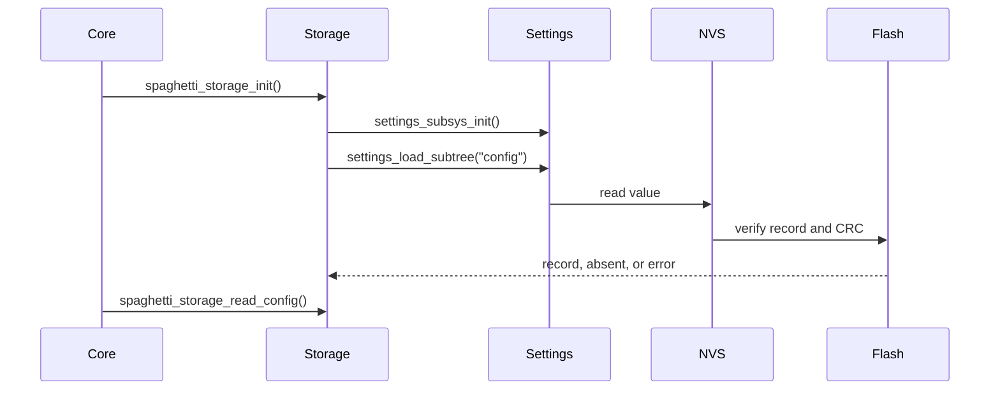

# Storage

[← Project README](../../../README.md) · [Architecture](../../../ARCHITECTURE.md)

Storage is the adapter that saves on flash the latest Config snapshot successfully
applied. Other components do not see Settings, NVS, flash offset or physical records.

## Responsibilities

Storage owns a RAM copy of the loaded record, its envelope with magic/version, the
one-shot maintenance marker, and backend status. It validates Config but does not save
runtime Module IDs, pointers, driver contexts, measurements, or secrets. The Wi-Fi
credentials belong to the [Wi-Fi Profiles](../wifi_profiles/README.md) separate service,
which uses authenticated and encrypted PSA ITS records on the same Settings/NVS
infrastructure.

## File

| File | Role |
|---|---|
| `include/spaghetti/storage.h` |API public used by Core and Config.|
| `subsys/services/storage/storage.c` |Private record and adapter Settings/NVS.|
| `prj.conf` |Enable Flash, Settings, NVS and CRC data.|
| `tests/storage/` |Backend RAM simulated and contract test.|

## API

```c
int spaghetti_storage_init(void);
int spaghetti_storage_read_config(struct spaghetti_config *out);
int spaghetti_storage_write_config(const struct spaghetti_config *config);
int spaghetti_storage_request_maintenance_once(void);
int spaghetti_storage_consume_maintenance_once(bool *requested);
```

`spaghetti_storage_init()` initializes Settings/NVS and loads the `config` key. An absent or
corrupt record does not make Storage unusable: a later read returns `-ENOENT` or
`-EBADMSG` respectively, so Core can remain in the safe empty state.

`spaghetti_storage_read_config()` returns a copy owned by the caller and does not access
the flash again. The output remains unchanged in case of error.

`spaghetti_storage_write_config()` builds a fully zero-initialized record, copies only
the used fields and bytes, and calls `settings_save_one()` synchronously. Update the RAM copy only
after the success of the backend.

`spaghetti_storage_request_maintenance_once()` saves the separate byte
`maintenance/boot_once`; it does not change the Config. An authenticated future adapter
uses it before reboot. Core calls `spaghetti_storage_consume_maintenance_once()` once
during boot. Storage deletes the record before returning `requested=true`, so crash and
reset cannot create a boot loop. A malformed value is eliminated and treated as an
absent request.

## Record and flow

The private record contains:

- magic `0x53504754`, which identifies a Spaghetti record;
- a version equal to `SPAGHETTI_CONFIG_VERSION` (currently `3`);
- a `struct spaghetti_config` complete and without pointers, including the Config MQTT
  bounded with host, port and topic base.



The first Core start continues without Config. `main` applies the initial Config with
two INA219 devices on Port 0 and saves it only after success. On later boots, Core
loads, validates, and applies the snapshot, including MQTT startup when enabled, before
becoming READY. Keys are
restored; runtime IDs are not persisted and can change. A record created with a previous
Config version is safely rejected with `-EBADMSG`.

## Zephyr and partition

Zephyr Settings is the key/value façade; NVS is the flash backend selected at build
time. In the DTS generated ESP32-C3 the backend automatically finds `storage_partition`
offset `0x3b0000`, `0x30000` size. The region ends at `0x3e0000`, where
`scratch_partition` begins, so it was not necessary to change the overlay.

`CONFIG_NVS_DATA_CRC=y` adds CRC-32 data verification. Magic, version, exact size and
semantic Config validation cover other incompatible cases.

## Ownership and competition

Inputs and outputs are borrowed only for the duration of the call. Storage retains only owned
and bounded copies. A mutex serializes init, read and write; heap is not used and API
are not called by ISR.
