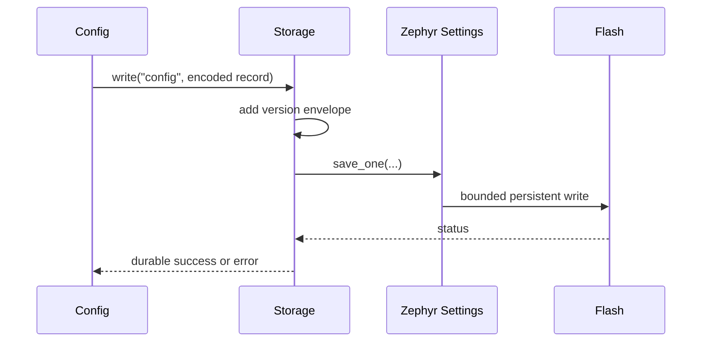

# Storage service

[← Project README](../../../README.md) · [Architecture](../../../ARCHITECTURE.md)

Storage is an optional persistence adapter for small bounded records such as Config snapshots. Its API is independent of the selected flash backend and never exposes Zephyr Settings/NVS internals to callers.

## What this component owns

- Record namespace, version envelope, size limits, and backend serialization.
- Atomic write/replace behavior and corruption diagnostics.
- Private Zephyr Settings or other backend context.

## What this component does not own

- Config semantics, module instances, measurement history, credentials policy, or flash partition placement.
- Writes from ISR or unbounded blobs.

## Files

| File | Role |
|---|---|
| `storage.h` | Bounded read/write/delete/status contract. |
| `storage.c` | Backend adapter, version envelope, and synchronization. |
| Board partition DTS | Real non-overlapping storage region. |
| `prj.conf` | Selected Zephyr Settings backend options. |

## Data model

| Type / object | Owner | Meaning |
|---|---|---|
| Record key | Caller/Storage contract | Bounded stable namespace key. |
| Record envelope | Storage | Magic/schema version, payload length, generation, checksum when used. |
| Backend state | Storage | Initialized/mounted/error state and private handler context. |
| Storage status | Storage | Read/write/delete/corruption counters and last error. |

## API contract

### `int spaghetti_storage_init(void)`

**Purpose:** Initialize the selected backend and load its metadata/handlers.

**Parameters**

| Parameter | Meaning |
|---|---|
| None | No input parameters. |

**Returns:** `0` when reads/writes are available.

**Errors:** Missing/overlapping partition, backend mount/init failure, or invalid static limits.

**Execution context:** Main thread during boot.

**Calls:** Zephyr Settings/backend initialization and load.

### `int spaghetti_storage_read(const char *key, void *buffer, size_t capacity, size_t *out_size)`

**Purpose:** Read one complete bounded record into caller storage.

**Parameters**

| Parameter | Meaning |
|---|---|
| `key` | NUL-terminated key below maximum length. |
| `buffer` | Caller-owned destination. |
| `capacity` | Destination capacity. |
| `out_size` | Actual decoded payload size. |

**Returns:** `0` on a valid record.

**Errors:** Invalid args/key, not found, insufficient capacity, corruption, unsupported version, or backend I/O error.

**Execution context:** Calling thread.

**Calls:** Selected backend read.

### `int spaghetti_storage_write(const char *key, const void *data, size_t size)`

**Purpose:** Atomically replace one bounded versioned record.

**Parameters**

| Parameter | Meaning |
|---|---|
| `key` | Bounded key. |
| `data` | Caller-owned payload copied during the call. |
| `size` | Payload bytes up to configured maximum. |

**Returns:** `0` only after durable backend acceptance.

**Errors:** Invalid args/size, no space, wear/backend failure, or serialization conflict.

**Execution context:** Calling thread; may block on flash.

**Calls:** Selected backend save/write.

### `int spaghetti_storage_delete(const char *key)`

**Purpose:** Remove one record idempotently according to the documented policy.

**Parameters**

| Parameter | Meaning |
|---|---|
| `key` | Bounded record key. |

**Returns:** `0` when absent after the call.

**Errors:** Invalid key or backend delete failure.

**Execution context:** Calling thread.

**Calls:** Selected backend delete.

### `int spaghetti_storage_get_status(struct spaghetti_storage_status *out)`

**Purpose:** Copy backend state and diagnostics.

**Parameters**

| Parameter | Meaning |
|---|---|
| `out` | Caller-owned destination. |

**Returns:** `0` with coherent status.

**Errors:** Invalid output or uninitialized Storage.

**Execution context:** Calling thread.

**Calls:** None.

## How it works



## Practical example

Config encodes generation 12 into a bounded record and writes key `config`. At boot, Storage reads and validates the envelope; Config then validates semantics before applying it. A corrupt record yields an error and safe default path.

## Zephyr integration

- Zephyr Settings is the key/value facade; NVS is one possible non-filesystem flash backend.
- Settings load callbacks provide bytes in the loading thread; copy/decode them into bounded Storage state.
- Flash partition layout is static Devicetree and must be verified against firmware regions.

## Configuration templates

### `prj.conf` using Settings + NVS

```ini
CONFIG_FLASH=y
CONFIG_FLASH_MAP=y
CONFIG_NVS=y
CONFIG_SETTINGS=y
CONFIG_SETTINGS_NVS=y
```

### Fixed partition example

```dts
&flash0 {
    partitions {
        compatible = "fixed-partitions";
        #address-cells = <1>;
        #size-cells = <1>;

        storage_partition: partition@f8000 {
            label = "storage";
            reg = <0x000f8000 0x00008000>;
        };
    };
};
```

The numeric address and size are an example, not portable defaults. Replace
them with values checked against the selected board's generated flash layout.

## Ownership and concurrency

Storage serializes backend operations in thread context. Callers retain input ownership until a synchronous write returns. No flash call occurs from ISR or timer callback.

## Contract guarantees

- A successful read returns one complete, version-compatible record.
- A failed/corrupt record is never presented as valid Config.
- Record sizes and keys are bounded.
