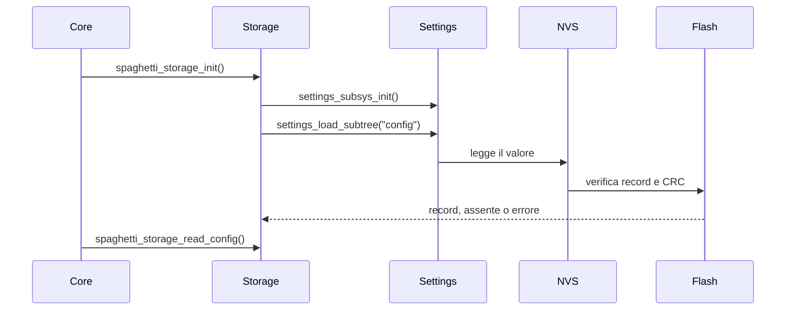

# Storage

[← Project README](../../../README.md) · [Architecture](../../../ARCHITECTURE.md)

Storage è l'adapter che conserva su flash l'ultimo snapshot Config applicato con
successo. Gli altri componenti non vedono Settings, NVS, offset flash o record fisici.

## Responsabilità

Storage possiede una copia RAM del record caricato, il suo envelope con magic/versione
e lo stato del backend. Non valida il significato hardware della Config e non salva
Module ID runtime, puntatori, context dei driver, misure o segreti. Le credenziali
Wi-Fi appartengono invece al servizio separato
[Wi-Fi Profiles](../wifi_profiles/README.md), che usa record PSA ITS autenticati e
cifrati sulla stessa infrastruttura Settings/NVS.

## File

| File | Ruolo |
|---|---|
| `include/spaghetti/storage.h` | API pubblica usata da Core e Config. |
| `subsys/services/storage/storage.c` | Record privato e adapter Settings/NVS. |
| `prj.conf` | Abilita Flash, Settings, NVS e CRC dei dati. |
| `tests/storage/` | Backend RAM simulato e test del contratto. |

## API

```c
int spaghetti_storage_init(void);
int spaghetti_storage_read_config(struct spaghetti_config *out);
int spaghetti_storage_write_config(const struct spaghetti_config *config);
```

`spaghetti_storage_init()` inizializza Settings/NVS e carica la chiave `config`.
Record assente o corrotto non rendono inutilizzabile Storage: una successiva read
restituisce rispettivamente `-ENOENT` o `-EBADMSG`, così Core può restare nello stato
vuoto sicuro.

`spaghetti_storage_read_config()` restituisce una copia posseduta dal chiamante e non
accede nuovamente alla flash. L'output resta invariato in caso di errore.

`spaghetti_storage_write_config()` costruisce un record completamente azzerato, copia
solo campi e byte usati e chiama `settings_save_one()` in modo sincrono. Aggiorna la
copia RAM soltanto dopo il successo del backend.

## Record e flusso

Il record privato contiene:

- magic `0x53504754`, che identifica un record Spaghetti;
- versione uguale a `SPAGHETTI_CONFIG_VERSION` (attualmente `3`);
- una `struct spaghetti_config` completa e senza puntatori, inclusa la Config MQTT
  bounded con host, porta e base topic.



Al primo avvio Core continua senza Config. `main` applica la Config iniziale con due
INA219 sulla Port 0 e solo dopo il successo la salva. Ai boot successivi Core carica,
valida e applica lo snapshot, compreso l'avvio MQTT quando abilitato, prima di diventare
READY. Le key vengono ripristinate; gli ID runtime non sono persistiti e possono
cambiare. Un record creato con una versione Config precedente viene rifiutato in modo
sicuro con `-EBADMSG`.

## Zephyr e partizione

Zephyr Settings è la facciata key/value; NVS è il backend flash selezionato a
build-time. Nel DTS generato della ESP32-C3 il backend trova automaticamente
`storage_partition` a offset `0x3b0000`, dimensione `0x30000`. La regione termina a
`0x3e0000`, dove comincia `scratch_partition`, quindi non è stato necessario modificare
l'overlay.

`CONFIG_NVS_DATA_CRC=y` aggiunge la verifica CRC-32 dei dati. Magic, versione,
dimensione esatta e validazione semantica Config coprono gli altri casi incompatibili.

## Ownership e concorrenza

Input e output sono prestati soltanto per la durata della chiamata. Storage conserva
esclusivamente copie owned e bounded. Un mutex serializza init, read e write; non viene
usato heap e le API non sono chiamabili da ISR.
