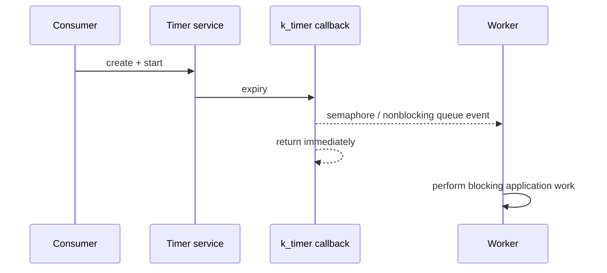

# Timer service

[← Project README](../../../README.md) · [Architecture](../../../ARCHITECTURE.md)

Timer provides bounded one-shot or periodic wake-up events. It controls when work becomes eligible; it never performs the consumer's blocking work inside a timer callback.

## What this component owns

- Fixed-capacity timer slots and stable timer IDs.
- Period/deadline state, generation, and missed-expiry diagnostics.
- Minimal callback-to-consumer signalling.

## What this component does not own

- Runtime rules, sensor reads, module IDs beyond opaque callback data, or wall-clock time synchronization.
- Blocking work in expiry context.

## Files

| File | Role |
|---|---|
| `timer.h` | Timer IDs, modes, callback/event contract, lifecycle API. |
| `timer.c` | `k_timer` wrappers, slots, and expiry signalling. |
| Consumer subsystem | Owns semaphore/queue/work item and performs real work. |

## Data model

| Type / object | Owner | Meaning |
|---|---|---|
| Timer slot | Timer service | ID, mode, period, generation, callback/signal target. |
| `k_timer` | Timer service | Private Zephyr timer object. |
| Expiry event | Consumer after copied/queued | Timer ID, generation, and timestamp. |
| Timer status | Timer service | Running flag and expiry/drop counters. |

## API contract

### `int spaghetti_timer_init(void)`

**Purpose:** Initialize an empty fixed timer pool.

**Parameters**

| Parameter | Meaning |
|---|---|
| None | No input parameters. |

**Returns:** `0` when timers can be created.

**Errors:** Invalid configured capacity.

**Execution context:** Main thread during boot.

**Calls:** Zephyr timer object initialization.

### `int spaghetti_timer_create(const struct spaghetti_timer_config *config, spaghetti_timer_id_t *out_id)`

**Purpose:** Allocate one timer slot and copy its bounded delivery config.

**Parameters**

| Parameter | Meaning |
|---|---|
| `config` | Mode, period, and nonblocking delivery target. |
| `out_id` | Caller-owned new ID destination. |

**Returns:** `0` with stopped timer ID.

**Errors:** Invalid period/mode/target, no slot, or invalid output.

**Execution context:** Calling thread.

**Calls:** `k_timer_init()`.

### `int spaghetti_timer_start(spaghetti_timer_id_t id, k_timeout_t delay, k_timeout_t period)`

**Purpose:** Arm one stopped timer.

**Parameters**

| Parameter | Meaning |
|---|---|
| `id` | Valid timer ID. |
| `delay` | Initial delay. |
| `period` | Repeat interval or `K_NO_WAIT` for one-shot. |

**Returns:** `0` when armed.

**Errors:** Unknown/stale ID, invalid timing, or already running.

**Execution context:** Calling thread.

**Calls:** `k_timer_start()`.

### `int spaghetti_timer_stop(spaghetti_timer_id_t id)`

**Purpose:** Disarm one timer and invalidate pending generation where required.

**Parameters**

| Parameter | Meaning |
|---|---|
| `id` | Valid running/stopped ID. |

**Returns:** `0` when stopped.

**Errors:** Unknown/stale ID.

**Execution context:** Calling thread.

**Calls:** `k_timer_stop()`.

### `int spaghetti_timer_destroy(spaghetti_timer_id_t id)`

**Purpose:** Stop and free one timer slot.

**Parameters**

| Parameter | Meaning |
|---|---|
| `id` | Valid timer ID. |

**Returns:** `0` when ID is no longer usable.

**Errors:** Unknown/stale ID or busy delivery contract.

**Execution context:** Calling thread.

**Calls:** Timer stop and slot cleanup.

## How it works



## Practical example

Runtime creates a periodic 1000 ms timer. Each expiry gives a semaphore. Runtime's thread wakes and reads a module; the timer callback never touches I2C.

## Zephyr integration

- `k_timer` expiry executes in a restricted context and must not block.
- Use `k_sem_give`, `k_work_submit`, or `k_msgq_put(..., K_NO_WAIT)` for delivery.
- Generation values prevent a queued expiry from acting on a destroyed/reused timer ID.

## Configuration templates

### Simple semaphore delivery

```c
static void timer_expiry(struct k_timer *timer)
{
    struct k_sem *target = k_timer_user_data_get(timer);
    k_sem_give(target);
}
```

The callback performs no logging that can block, allocation, bus access, or
product rule evaluation.

## Ownership and concurrency

Timer slot mutation is serialized in thread context. Expiry uses only ISR-safe/nonblocking primitives. Destroy/stop defines how already queued generation events are rejected.

## Contract guarantees

- No blocking consumer work runs in timer callback context.
- Timer IDs become detectably stale after destroy/reuse.
- Capacity and missed-event behavior are bounded.
