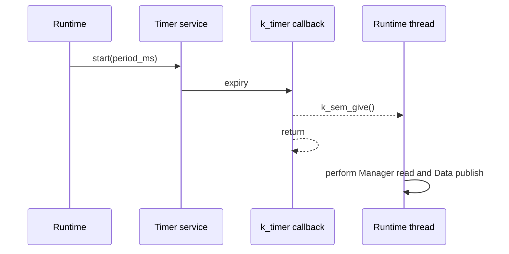

# Timer service

[← Project README](../../../README.md) · [Architecture](../../../ARCHITECTURE.md)

Timer V0 is the small timing boundary used by Runtime. It owns one periodic
Zephyr `k_timer`; it never owns sampling logic or hardware access.

## Responsibilities

- Retain one firmware-lifetime semaphore supplied by Runtime.
- Start a periodic timer with a positive millisecond period.
- Stop future expiries idempotently.
- Give the semaphore from the expiry callback and return immediately.

## Files and API

| File | Role |
|---|---|
| `include/spaghetti/timer.h` | Contract used by Runtime. |
| `subsys/services/timer/timer.c` | `k_timer`, state, and serialization. |

- `spaghetti_timer_init(struct k_sem *tick_sem)` borrows and retains the
  semaphore for the entire firmware lifetime.
- `spaghetti_timer_start(uint32_t period_ms)` schedules the first expiry after
  one complete period and then repeats at that period.
- `spaghetti_timer_stop()` prevents future expiries. A signal already delivered
  remains for Runtime's stop protocol to consume.

## Execution flow

Zephyr executes a `k_timer` expiry in a restricted context. The callback
therefore calls only `k_sem_give()`—no logging, allocation, Manager call, I2C
transfer, or Data publication. All blocking work belongs to the Runtime thread.
