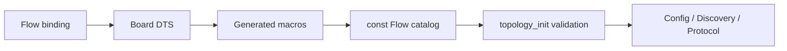

# Topology

[← Project README](../../README.md) · [Architecture](../../ARCHITECTURE.md)

Topology turns board Devicetree into immutable Flow and Function Bay descriptors.
A Flow is the five-signal physical path between the field connector and the Core.
A Function Bay is an ordered position along that path. The Port is only the
firmware-controllable termination and may still host several Modules on one bus.

## Ownership

Topology owns the const Flow catalog generated at build time. Bay descriptors are
caller-owned copies filled by `spaghetti_topology_bay_get()`. Topology does not own
GPIO numbers, Module identity, Config decisions, or runtime occupancy.

## Files

| File | Role |
|---|---|
| `include/spaghetti/topology.h` | Public IDs, descriptors, and lookup API. |
| `subsys/topology/topology.c` | Devicetree catalog and validation. |
| `dts/bindings/spaghetti/spaghettilab,flow.yaml` | Required Flow properties. |
| Board DTS | Concrete Flow IDs, Port phandles, direction, and Bay counts. |

## API contract

`spaghetti_topology_init()` validates unique Flow IDs, a single Flow per Port,
existing Ports, `signal_count == 5`, and profile limits. Lookups return borrowed
const Flow pointers or `NULL`. `bay_get()` copies ordinals counted from the field
connector (`0` nearest the field), independent of electrical direction.

## How it works



## Practical example

```c
const struct spaghetti_flow_descriptor *flow =
	spaghetti_topology_flow_for_port(0U);

if (flow != NULL) {
	LOG_INF("flow=%u direction=%u signals=%u bays=%u",
		flow->id, flow->direction, flow->signal_count,
		flow->function_bay_count);
}
```

## Zephyr integration

- Compatible token in C macros is `spaghettilab_flow`.
- `direction` uses a string enum mapped with `DT_ENUM_IDX`.
- Core calls `spaghetti_topology_init()` immediately after `spaghetti_port_init_all()`.
